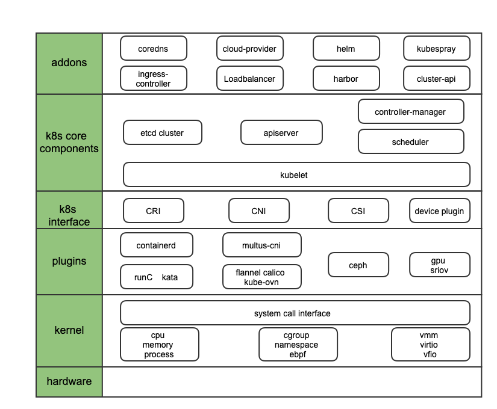

# k8s/云原生 技术总结

## 内容说明

- 云原生是一个很大的话题, 技术栈可以从上层应用深入到底层操作系统+智能硬件, 而且在不断演进. 该repo结合笔者日常工作, 聚焦k8s核心功能，涉及到的内容如下图.
- 具体内容会包括相关的 基础知识、领域知识、对原理/技术的理解和思考、以及工作中解决具体问题的奇技淫巧.
- 笔者尝试通过落笔的方式构建更扎实的知识体系, 写得不好对自己是个备忘录，写好了希望对其他人有帮助.

## 网络
- [`Linux网络包接收过程`](network/RX.md)
- [`Linux网络包发送过程`](network/TX.md)
- [`网络基础`](network/network-basic.md)  
- [`虚机中的网络`](network/network-in-vm.md)
- [`CNI调用机制`](network/CNI.md)
- [`multus-cni/容器多网卡`](network/multiple-cni.md)
- [`容器使用SR-IOV网卡`](network/sriov.md)
- [`kuryr-kubernetes`](network/kuryr.md)
- [`ovs/ovn`](network/ovn.md)
- [`ovs/ovn 常用命令`](network/ovn-cheat-sheet.md)  
- [`kube-ovn`](network/kube-ovn.md)
- [`cni-comparison`](network/cni-comparison.md)
- [`vpc CNI`](network/vpc-cni.md)
- `LoadBalancer (TODO)`
- `multiple ingress-controller (TODO)`
- `coreDNS localdns  (TODO)`

## kata-container
- [`kata简介`](kata-container/kata-container.md)
- [`安全容器云产品设计概述`](kata-container/ecr.md)
- [`云原生GPU`](kata-container/GPU.md)
- [`kata-虚拟化`](kata-container/virtualization.md)
- [`kata block volume 热插拔`](kata-container/hot-plug.md)

## kubernetes
- [`kubelet 启动流程`](kubernetes/kubelet/startup.md)
- [`operator deep dive`](kubernetes/operator.md)
- [`kube-apiserver crash 故障分析`](kubernetes/kube-apiserver-crash.md)
- [`kube-apiserver pprof 性能分析`](kubernetes/kube-apiserver-pprof.md)
- [`kube-apiserver 简述`](kubernetes/kube-apiserver.md)

## 计算
- [`docker/basic`](docker/basic)
- [`CRI调用机制`](compute/ContainerRuntime.md)
- [`容器如何设置内核参数`](compute/sysctls.md)
- `deep drive container image (TODO)`
- `what is containerd snapshot (TODO)`

## etcd
- [`etcd/存储`](etcd/storage.md)
- [`etcd/断网恢复重新加入集群`](etcd/rejoin.md)

## Operating System
- [`进程问题 -- D vs. Z vs. orphan`](operating-system/process.md)
- [`system-slowness`](operating-system/system-slowness.md)

## k8s 安装部署升级
- [`deployment tools`](cluster-lifecycle)
- `cluster-api (TODO)`

## 存储
- `bind mount, mount propagation (TODO)`
- `rbd intree migrate to ceph csi (TODO)`
- `CSI 0 to 1 (TODO)`

## Service Mesh
## SRE
## golang
## rust

*********************************
# 广告位招租
*********************************