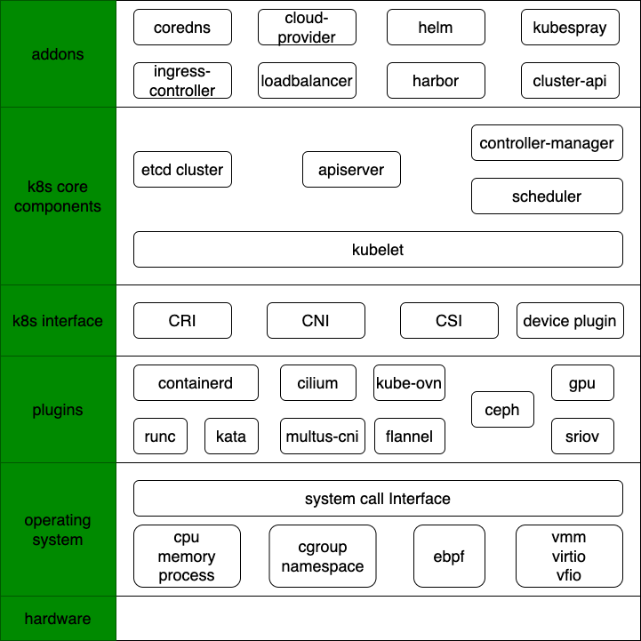

# k8s/云原生 技术总结

## 内容说明

- 云原生是一个很大的话题, 技术栈可以从上层应用深入到底层操作系统+智能硬件, 而且在不断演进. 该repo结合笔者日常工作, 聚焦k8s核心功能，涉及到的内容如下图.
- 具体内容会包括 计算机基础知识、领域知识、对原理/技术的理解和思考、以及工作中解决具体问题的实操经验.
- 笔者尝试通过落笔的方式构建更扎实的知识体系, 写得不好对自己是个备忘录，写好了希望对其他人有帮助.

## 网络
- [`Linux网络包接收过程`](network/RX.md)
- [`Linux网络包发送过程`](network/TX.md)
- [`虚机中的网络`](network/network-in-vm.md)
- [`vpc-cni 调研`](network/vpc-cni-survey.md)
- [`vpc-cni 方案`](network/vpc-cni-architecture.md)
- [`vpc-cni powered by cilium`](network/vpc-cni-cilium.md)
- [`vpc-cni 技术细节`](network/vpc-cni-details.md)
- [`kube-ovn 简介`](network/kube-ovn.md)
- [`ovs/ovn`](network/ovn.md)
- [`ovs/ovn 常用命令`](network/ovn-cheat-sheet.md)
- [`CNI调用机制`](network/CNI.md)
- [`multus-cni/容器多网卡`](network/multiple-cni.md)
- [`容器使用SR-IOV网卡`](network/sriov.md)
- [`kuryr-kubernetes`](network/kuryr.md)
- [`cni-comparison`](network/cni-comparison.md)
- [`网络基本概念`](network/network-basic.md)

  ### case study
- [`kubernetes service负载不均衡, 问题排查`](network/k8s-svc-lb.md)

## kubernetes
- [`kubelet<->CRI<->Runtime 调用机制`](kubernetes/CRI.md)
- [`kubelet 功能框架`](kubernetes/kubelet/startup.md)
- [`operator deep dive`](kubernetes/operator.md)
- [`kube-apiserver 简述`](kubernetes/kube-apiserver.md)

  ### case study
- [`kube-apiserver pod crash, 问题排查`](kubernetes/kube-apiserver-crash.md)
- [`kube-apiserver pod cpu load飙高, pprof问题排查`](kubernetes/kube-apiserver-pprof.md)

## containerd
- [`容器 受限制的进程`](containerd/basic.md)
- [`containerd存储机制 - snapshot`](containerd/snapshot.md)
- [`NRI 实践`](containerd/nri.md)

  ### case study
- [`停掉containerd服务导致容器hang住, 问题排查`](containerd/pipe.md)

## etcd
- [`etcd 存储机制`](etcd/storage.md)
- [`etcd运维 - 压缩备份`](etcd/maintain.md)

  ### case study
- [`etcd follower 断网恢复无法重新加入集群, 问题排查`](etcd/rejoin.md)

## kata-container
- [`kata简介`](kata-container/kata-container.md)
- [`kata block volume 热插拔`](kata-container/hot-plug.md)
- [`云原生GPU`](kata-container/GPU.md)
- [`kata-虚拟化`](kata-container/virtualization.md)
- [`安全容器云产品设计概述`](kata-container/ecr.md)

## Operating System
- [`Linux系统启动过程`](operating-system/linux-startup.md)
- [`进程问题 -- D vs. Z vs. orphan`](operating-system/process.md)
- [`system-slowness`](operating-system/system-slowness.md)
- [`容器如何设置内核参数`](operating-system/sysctls.md)  
- [`ebpf`](operating-system/ebpf.md)

## kubernetes cluster management
- [`deployment tools`](cluster-lifecycle)
- `cluster-api (TODO)`

## Service Mesh
- [`merbridge`](service-mesh/merbridge.md)
- [`cilium service mesh`](service-mesh/cilium-service-mesh.md)
- `Ambient mesh (TODO)`

*********************************
# 广告位招租
*********************************