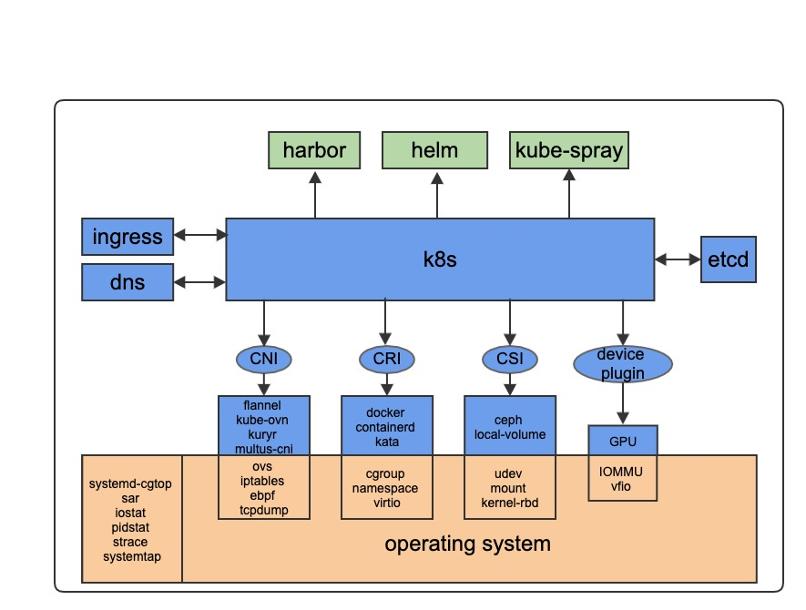

# k8s/云原生 知识总结
	
# 技术栈

k8s平台整个技术栈包含从上面的应用到下面的硬件，是一个很大的话题。该repo聚焦(呵呵)k8s核心功能，即下图中的内容。

# 内容说明

- 本文目录对应上图，图中每一部分都是一个细分领域，每个领域都有不只一个CNCF project的开源实现。
- 本文内容包括，每一部分的基础知识、原理、领域知识，以及工作中解决的具体问题。

## 安装部署
- [`deployment tools`](cluster-lifecycle)
- [`kubespray`](cluster-lifecycle/kubespray)

## Kubernetes
- [`k8s/kubelet`](kubernetes/kubelet)
- [`k8s/controller-manager`](kubernetes/controller-manager)

## etcd
- [`etcd/存储`](etcd/storage.md)
- [`etcd/断网恢复重新加入集群`](etcd/rejoin.md)

## Operator
- [`operator deep dive`](operator.md)

## 计算
- [`docker/basic`](docker/basic)
- [`CRI调用机制`](ContainerRuntime.md)

## 网络
- [`网络基础`](network/network-basic.md)
- [`CNI调用机制`](network/CNI.md)
- [`multus-cni/容器多网卡`](network/multiple-cni.md)
- [`kuryr-kubernetes`](network/kuryr.md)
- [`kube-ovn`](network/kube-ovn.md)
- [`cni-comparison`](network/cni-comparison.md)
- [`DNS`](network/DNS.md)
- [`ingress`](network/ingress.md)

## 存储
- [`local-volume`](storage/local-volume.md)
- [`mount-propagation`](storage/mount-propagation.md)
- [`why-bind-mount`](storage/bind-mount.md)
- [`ceph-rbd 问题排查`](storage/ceph-rbd.md)

## kata-container
- [`kata简介`](kata-container/kata-container.md)
- [`kata-虚拟化`](kata-container/virtualization.md)
- [`kata-启动过程`](kata-container/startup.md)
- [`kata-网络`](kata-container/network.md)
- [`kata-存储`](kata-container/storage.md)
- [`kata-资源管理`](kata-container/resource.md)
- [`安全容器云产品设计概述`](kata-container/ecr.md)  
- [`云原生GPU`](kata-container/GPU.md)

## Operating System
- [`进程问题 -- D vs. Z vs. orphan`](operating-system/process.md)
- [`iowait 高`](operating-system/iowait.md)
- [`strace`](operating-system/strace.md)
- [`systemtap`](operating-system/systemtap.md)

## SRE

## golang

*********************************
# 广告位招租
*********************************