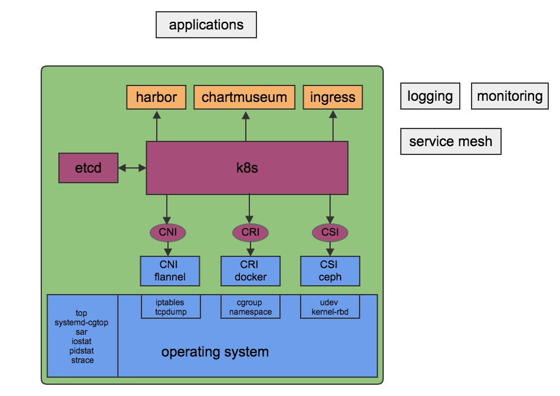

# k8s/container 知识总结
tech articles about kubernetes/container/cloud computing	
 # 技术栈

 如下图，云平台整个技术栈包含从上面的应用到下面的硬件，是一个很大的话题。该Repo聚焦在k8s平台本身，即图中绿色矩形框里的内容。

  

 # 内容目录

 绿色框内其实已经包含了大量内容，其中每个方框都是一个知识领域，都需要大量的技术积累。
 - 每个领域又可以细分成不同的功能模块/组件
 - 每个功能模块又包含了很多开源实现

 这里结合工作中遇到的实际问题，记录组件遇到的问题和相关的基础知识两部分内容

 ## Kubernetes

 - [`k8s/kubelet`](kubernetes/kubelet)
- [`k8s/controller-manager`](kubernetes/controller-manager)

 ## etcd

 ## Docker

 - [`docker/rootfs`](docker/rootfs)