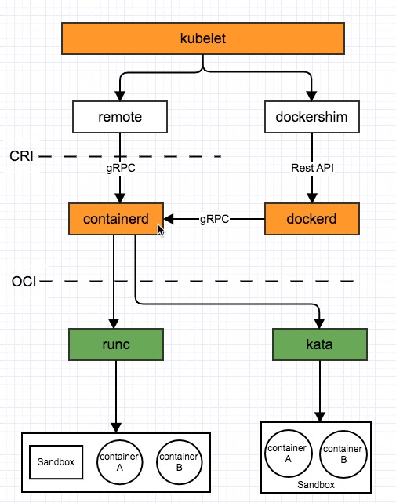
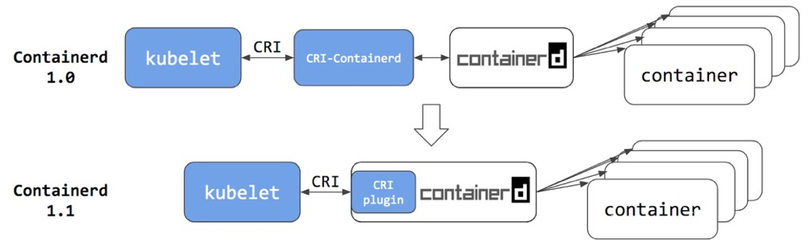
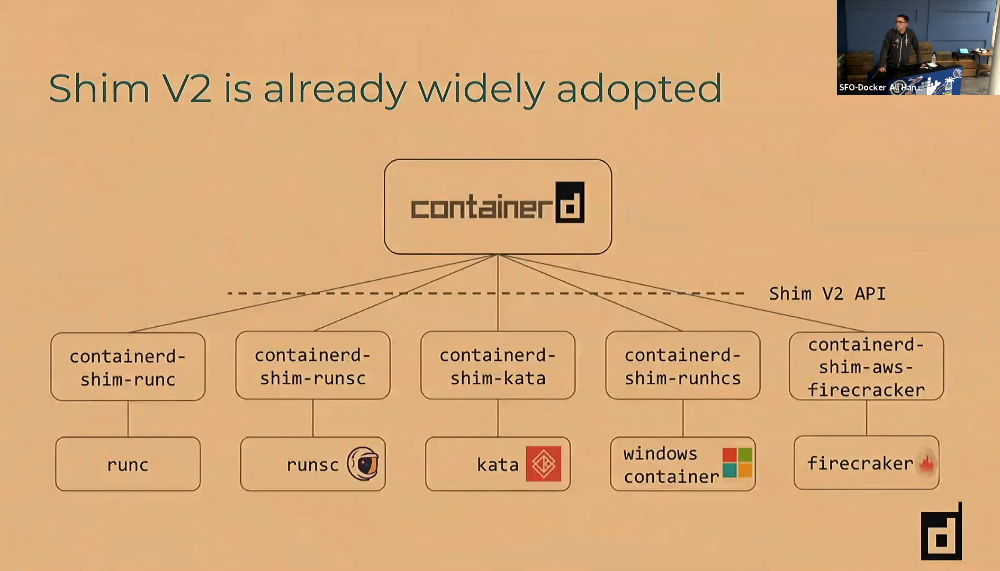
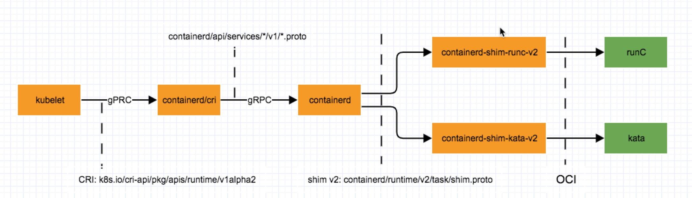

## 梳理 Container Runtime 调用机制

从kubectl apply 到 Pod Running，想要搞清楚这个过程，需要搞懂一堆名词：kubelet，CRI，CNI，containerd，OCI, runC<br>
这还只是主调用流程，算上不同的技术实现还有：CRI-O，rkt，gVisor，firecracker，kata-contianer...<br><br>


#### Container Runtime： high-level(container manager) vs low-level

到底什么是Container Runtime？ docker/containerd/runC 都是Container Runtime，但containerd --> runC之间又是调用关系。<br><br>
Container Runtime确实没有明确的定义，不想CRI、OCI这些明确的spec。Container相关的功能除了最核心的cgroup，namespace，启动进程，还包括：镜像，snapshot等等。
不同的Container Runtime实现的功能集合不同，解决的问题也不同，按这个维度可以把Container Runtime分为high-level和low-level, 具体可参照[[1]]。
有一些文章里也会把high-level的Container Runtime叫做 container manager。


### 本文重点是梳理组件间的调用流程，具体包括:

- gRPC是什么
- 组件间调用代码
- gRPC vs Rest API vs Message Queue

先来一张整体调用关系图(黄色表示daemon，绿色表示二进制可执行文件)

 

如上图，组件间调用过程gRPC出现频率很高，所以先说说什么是gRPC。<br>
gRPC helloworld [[2]]，没有比官网的helloworld更好的例子了。一些理解：
- gRPC默认使用protocol buffers 协议做IDL，做结构化数据的序列化/反序列化。
- gRPC负责建立连接，发生数据，实现跨语言、跨平台的方法调用。
- gPRC有各种语音的实现，gPRC-C、gRPC-go、gRPC-java。
.proto文件作为IDL定义service，message，rpc方法；protoc是一个compiler通过指定具体语言的gRPC plugin生成代码


### kubelet --> dockershim/remote

kubelet作为k8s agent管理node上Pods的生命周期，向下调用的Container Runtime可以分为两类：
- DockerContainerRuntime
- RemoteContainerRuntime

对应代码在 pkg/kubelet/kubelet.go
```
 switch containerRuntime {
    case kubetypes.DockerContainerRuntime:...
    case kubetypes.RemoteContainerRuntime:...
    default:
        return nil, fmt.Errorf("unsupported CRI runtime: %q", containerRuntime)
```
默认还是dockershim，对应代码在 pkg/kubelet/dockershim/docker_sandbox.go <br>
调用方式：dockerclient --> docker daemon


containerd是RemoteContainerRuntime的例子，kubelet里的配置方式: <br>
``` --container-runtime=remote --runtime-request-timeout=15m --container-runtime-endpoint=unix:///run/containerd/containerd.sock```
对应代码在 pkg/kubelet/remote/remote_runtime.go <br>
```
runtimeapi "k8s.io/cri-api/pkg/apis/runtime/v1alpha2"

// RemoteRuntimeService is a gRPC implementation of internalapi.RuntimeService.
type RemoteRuntimeService struct {
	timeout       time.Duration
	runtimeClient runtimeapi.RuntimeServiceClient
	...
}

```

这里我们了CRI的gRPC细节(k8s.io/cri-api/pkg/apis/runtime/v1alpha2):
- api.proto 是IDL，定义了两个service：RuntimeService 和 ImageService
- kubelet是CRI gRPC的client端，代码在：pkg/kubelet/remote/remote_runtime.go
- containerd是CRI gRPC的server端，代码在：containerd/cri/pkg/server


### containerd

我们产品里用containerd替换docker的原因：
- overlayfs替换devicemapper，且containerd benchmark测试结果更好
- 使用containerd更容易对接kata提供安全容器的能力
- 稳定性问题，解决之前产品中出现的dockerd和containerd之间状态不一致问题
- 作为开源社区 containerd要比Moby看起来更靠谱，也更有未来

  
 
containerd为什么会有上面这种架构演进？<br>
CRI是k8s为了解决对接各种Runtime提出的规范，k8s是大佬，想要一起玩耍的Runtime就要实现CRI的定义。
可以在CRI提出之前就已经有了containerd这个项目，现在要实现大佬提出的CRI，所以很自然的有了CRI-containerd这样一个daemon来做CRI shim[[3]]
(像软件领域里很多名字一样，单词用的很精准，理解清楚了单词对于理解组件的作用会很有帮助。理解了**shim**这个词，就很容易理解为什么有这么多shim了)<br><br>
为了简化架构，containerd1.1开始CRI server作为containerd的plugin集成进containerd的daemon，作为用户这样确实简化了很多。

### CRI plugin如何调用containerd的呢？又是gRPC
- client端: containerd/vendor/github.com/conatinerd/cri/pkg/server
- server端: containerd/api/services/containers/v1/containers.proto


### containerd ---> runC/kata

  

##### containerd-shimv2[[5]]

containerd向下如何对接runC，kata，gVisor等各种low-level Runtime？containerd-shim[[4]] <br>
kubelet向下提出了CRI标准，containerd向下对接面临同样的问题，提出了shim V2 API:<br>
```containerd/runtime/v2/task/shim.proto```<br>
containerd-shim负责containers的生命周期管理

为什么在task目录下面？[[6]]

简单理解: container是存在数据库里的metadata信息，runtime真正管理的是process，在shimV2里叫Task.<br>


shimV2的gRPC代码，以create Task为例:
- 启动server, containerd/runtime/v2/manager.go:
```
	b := shimBinary(ctx, bundle, opts.Runtime, m.containerdAddress, m.containerdTTRPCAddress, m.events, m.tasks)
	shim, err := b.Start(ctx, topts, func() {...
```
- client端，containerd/runtime/v2/shim.go:
```
func (s *shim) Create(ctx context.Context, opts runtime.CreateOpts) (runtime.Task, error) {
    response, err := s.task.Create(ctx, request)
```
containerd-shim-*-v2是server端，根据不同的runtime：
- containerd-shim-runc-v2，代码实现在 containerd/runtime/v2/runc/v2/service.go (runC江湖地位的体现)
- containerd-shim-kata-v2，代码实现在 kata-containers/runtime/containerd-shim-v2/service.go


## 组件间gRPC调用总结

 
  

[1]: https://www.ianlewis.org/en/container-runtimes-part-1-introduction-container-r
[2]: https://www.grpc.io/docs/quickstart/go/
[3]: https://stackoverflow.com/questions/2116142/what-is-a-shim
[4]: https://groups.google.com/forum/#!topic/docker-dev/zaZFlvIx1_k
[5]: https://github.com/containerd/containerd/issues/2426
[6]: https://containerd.io/docs/getting-started/#creating-a-running-task
[7]: https://github.com/kata-containers/runtime/pull/572
[8]: https://github.com/containerd/containerd/tree/master/runtime/v2#ttrpc