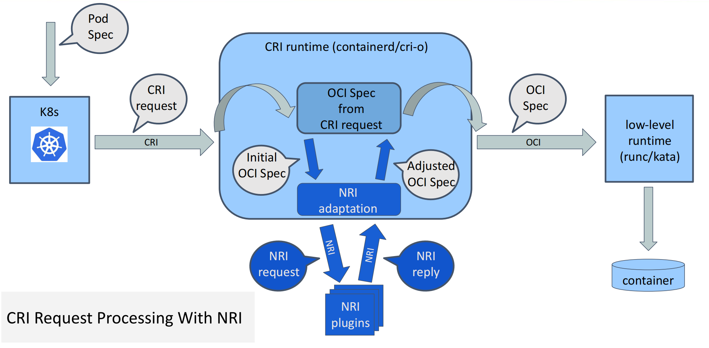
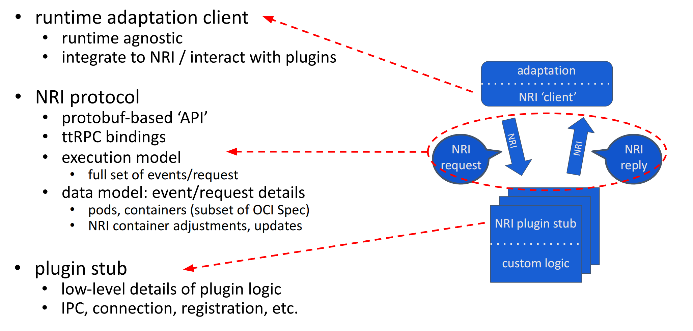

### NRI原理

NRI, Node Resource Interface. containerd1.7版本开始支持的一类插件, 配置方式和其他插件类似, 即: config.toml 中配置使用NRI, 主要是配置containerd 和 NRI通信的socke path

NRI在contianerd中的架构图


如上图, NRI plugins主要作用是可以修改containers的config.json, 这其实是一个'法力大无边'的技能. 以CreateContainer为例, 大概的代码流程如下:

- 没有NRI的情况下, containerd中的流程是 CreateContainer --> Create(task_manager.go) --> NewBundle --> config.json
- 有NRI的情况下, CreateContainer --> c.nri.WithContainerAdjustment --> nri.CreateContainer --> Create(task_manager.go)

上面是NRI在containerd整个工作流程中的位置, 聚焦到NRI本身, 更细粒度的工作机制如下



NRI的目的是, containerd在container的生命周期的关键阶段 和 用户自定义的plugins交互, 允许plugins按需更新container的定义满足业务需求. 为实现这个目标, NRI主要做了如下事情

- [NRI protocol](https://github.com/containerd/nri/blob/main/pkg/api), 两边通信要有协议/规则, NRI定义了基于protobuf的协议, 使用containerd的ttRPC 基于UDS通信.
- 除了上面的protobuf-based'API', contianerd/nri 这个项目还直接提供了 containerd和plugins完成需要通信的一些基础底层代码。具体如上面的图
  - containerd/nri/adaptation目录是 containerd的功能需要的代码, containerd里直接应用, 最终build到containerd二进制中
  - containerd/nri/plugins目录是plugins需要的一些功能对应的代码, 包括初始化 ttrpc通信, 注册/启动plugin, 收到container事件完成对 plugin中自定义方法的调用.
  - 除以上两个关键目录外，还有像 containerd/nri/runtime-tools, 用于将 pulings修改后返回的 container adjustment 应用到 config.json里.

总之, containerd/nri 很贴心, 已经屏蔽和封装了很多基础代码, 用户需要完成自定义pluin的逻辑部分, 有点像使用operator脚手架后 只需要实现reconcile()方法.


除了CreateContainer, 以下container/sandbox的阶段, NRI plugin都可以做事情
```
type API interface {
	RunPodSandbox(context.Context, PodSandbox) error
	StopPodSandbox(context.Context, PodSandbox) error
	RemovePodSandbox(context.Context, PodSandbox) error
	CreateContainer(context.Context, PodSandbox, Container) (*nri.ContainerAdjustment, error)
	PostCreateContainer(context.Context, PodSandbox, Container) error
	StartContainer(context.Context, PodSandbox, Container) error
	PostStartContainer(context.Context, PodSandbox, Container) error
	UpdateContainer(context.Context, PodSandbox, Container, *nri.LinuxResources) (*nri.LinuxResources, error)
	PostUpdateContainer(context.Context, PodSandbox, Container) error
	StopContainer(context.Context, PodSandbox, Container) error
	NotifyContainerExit(context.Context, PodSandbox, Container)
	RemoveContainer(context.Context, PodSandbox, Container) error
}
```

### NRI实践

我们的场景是kata-container使用virtiofs带来的存储稳定性问题, 借助NRI 可以修改kata-container config.json中默认的 mounts配置, 使得kata-container创建过程可以 绕过默认的viritofs做映射的逻辑.

这个存储问题借助NRI的好处是, 修改逻辑可以放到NRI plugins里面实现, 不依赖CSI的修改, 可以一处plugin修改for所有存储, 无需所有对接的CSI plugins都做修改.

社区提出NRI 最初的动机没有仔细研究过, 搜索NRI相关的应用经验, 很多是用于解决 devices resources相关的配置问题.

如前面所说, 因为NRI是可以修改config.json的高级技能; 且protobuf-based API, 底层代码封装带来的便利性, 相信会有更多基于NRI的高手在民间的最佳实践.


- [NRI Readme on github](https://github.com/containerd/nri)
- [NRI: Extending Containerd and CRI-O With Common Plugins](https://www.youtube.com/watch?v=BOaW99BFbdA)