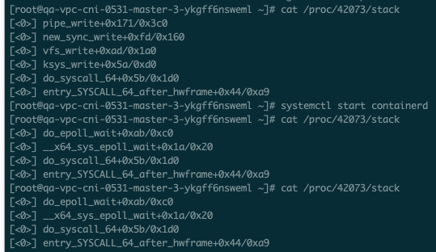

##  停掉containerd.service后, 容器应用hang住不响应请求


### 问题描述

场景, client端通过service访问多副本服务, 停掉其中一个副本'pod1'所在节点'nodeA'的containerd.service 做高可用测试.

预期结果, 在一段时间内(合理阈值时间), endpoints不会更新, 流量依然会load到‘pod1’，直到pods被evicted 'pod1'迁移.

实际结果, 两个现象不符合预期
- endpoints过长时间(>节点NotReady的40s阈值) 未移除'pod1'
- nodeA上pod1网络正常能访问(ping通), 但client端多次http请求后 容器不再响应返回


### 问题分析

#### endpoints更新时间问题

停掉 kubelet.serivce, 40s阈值之后节点变为NotReady, 同时 service对应的endpoints中移除'pod1', 流量即不会再load到'pod1'. 

对于停掉containerd.service, 没加思考/没加测试的觉得 kubernetes处理逻辑应该一样。而实际现象不是这样的, 40s后节点变为NotReady, 但endpoints不会更新.

代码逻辑在 kubernetes/pkg/controller/nodelifecycle/node_lifecycle_controller.go, 简化之后的关键代码如下

```
func (nc *Controller) monitorNodeHealth(ctx context.Context) error {
...
    _, observedReadyCondition, currentReadyCondition, err = nc.tryUpdateNodeHealth(ctx, node)
...
    switch {
    case currentReadyCondition.Status != v1.ConditionTrue && observedReadyCondition.Status == v1.ConditionTrue:
        // Report node event only once when status changed.
        controllerutil.RecordNodeStatusChange(logger, nc.recorder, node, "NodeNotReady")
        fallthrough
    case needsRetry && observedReadyCondition.Status != v1.ConditionTrue:
        if err = controllerutil.MarkPodsNotReady(ctx, nc.kubeClient, nc.recorder, pods, node.Name); err != nil {
            utilruntime.HandleError(fmt.Errorf("unable to mark all pods NotReady on node %v: %v; queuing for retry", node.Name, err))
            nc.nodesToRetry.Store(node.Name, struct{}{})
            return
        }
    }
}        
```

大概逻辑如下
- node controller 会持续获取Node Ready状态，比对判断是否执行 controllerutil.MarkPodsNotReady(), 执行这一句后才会触发endpoints的移除.
- 正常情况下, Node Ready状态是'true', 停掉kubelet之后 会变为 'unknown', 停掉containerd之后会变为'false'
- 上面 node controller的代码, 对于 ’true‘ -- > 'unknown' 的转换, 会触发controllerutil.MarkPodsNotReady(); 但对于 ’true‘ --> 'false' --> 'unkonwn' 的转换, 不会处理.
- [社区issue](https://github.com/kubernetes/kubernetes/issues/109998)

以上, 搞清楚了 endpints更新时间问题, 即使endpoints更新, container不响应请求继续分析.

#### 容器不响应请求问题抓包

停掉了containerd之后, 做了最简单的 ping, telnet port 这些操作, 这些都是正常的, 也就是容器的网络路径不受containerd影响, 这个符合预期.

- tcpdump 

在容器网卡抓包, 分析不响应之后的一次http请求和正常情况下区别, 发现 client <--> server TCP建立握手的过程是顺利完成的, hang在server端继续回复数据包的过程, 即tcpdump看 没有继续的 [P.] 包

根据现象, 猜测是容器里TCP相关的配置可能有问题, 关于最大连接数, TCP链接维持和关闭时间等等, 对比/调整配置 没发现异常.

- /proc/<pid>/stack



柳暗花明, 容器进程hang在`pipe_write`, 这下很容易想到 容器stdout的日志是写到pipe文件, pipe文件依赖containerd 转存到 host目录。

pipe cache大小应该有限制, 停掉containerd之后 cache范围内的日志依然可以写入, 但超出cache大小后, 如果容器进程处理请求是依赖写日志完成的就会hang住.

- pipe capacity

对于一个因pipe日志问题hang住的container, 如下方法可以修改 pipe buffer capacity，验证 该问题。[Can I increase the system pipe buffer max?](https://unix.stackexchange.com/questions/353728/can-i-increase-the-system-pipe-buffer-max)
```
import os
import fcntl


# !!48f48e*** change to containerdid!!
fifo_path='/run/containerd/io.containerd.grpc.v1.cri/containers/48f48e88df839027d2118e6dc3b10d553117262489d31750720447eee93c745f/io/2607120679/48f48e88df839027d2118e6dc3b10d553117262489d31750720447eee93c745f-stdout'

fifo_fd = os.open(fifo_path, os.O_RDONLY | os.O_NONBLOCK)
F_GETPIPE_SZ = 1032
pipe_size = fcntl.fcntl(fifo_fd, F_GETPIPE_SZ)
print('Pipe buffer size: {} bytes'.format(pipe_size))

F_SETPIPE_SZ = 1031
new_size = 1048576
pipe_size = fcntl.fcntl(fifo_fd, F_SETPIPE_SZ, new_size)
print('New pipe buffer size: {} bytes'.format(pipe_size))


os.close(fifo_fd)
```

### 修复方案
- 调整container readiness探针, 通过httpProbe 检查服务端口可返回结果. 注: execProbe此时无法工作; 探针不能只看端口是否响应 需要判断工作与否.
- 修改应用代码, 业务逻辑不依赖日志输出完成
- 修改kubernetes代码, 调整node controller对 Node Ready状态的处理逻辑