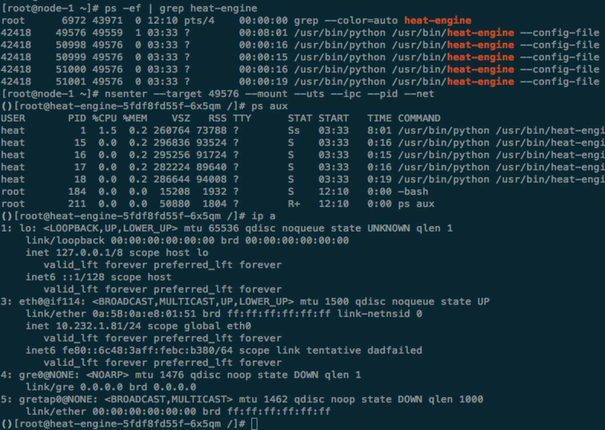

# 容器 -- 受限制的进程

简单讲，容器是通过一些技术手段做了限制的一组进程，这些技术包括：rootfs，chroot，unshare，nsenter。下面我们从0开始，通过命令启动容器，这有助于我们理解容器的核心原理。<br>

这篇文章主要参照 https://ericchiang.github.io/post/containers-from-scratch/， 会结合一些自己产品里的例子做展示

### rootfs && chroot

在同一个host上为什么能同时运行 Ubuntu/CentOS的容器呢？ 首先要说的是：rootfs 和 chroot 

- 什么是rootfs，rootfs是Linux系统中基本的文件目录组织结构。<br>
- chroot, 修改进程的/目录

Ubuntu/CentOS/busybox三个docker images包含的rootfs是不同的，容器运行起来时执行了chroot，所以不同的容器能看到的rootfs不同，可以使用的命令行工具也是不同的。

docker image本质是tar包，如上面 containers-from-scratch 文章里的例子，我们可以
- 下载tar包
- 解压得到rootfs目录
- sudo chroot rootfs /bin/bash 改变当前进程能看到的rootfs

但是docker image一定需要一个rootfs吗？<br>
其实不需要，我们可以构建一个最小的hello world docker image，这个image里面只包含 helloworld的二进制文件，大概的步骤如下

```c
#include <stdio.h>
#include <stdlib.h>

int main(int argc,char *argv[])
{
  printf("Hello, World\n");
}
```

```gcc -static -o hello hello.c```

```
FROM scratch
COPY hello /
CMD ["/hello"]
```
```
docker build -t hello .

docker run --rm hello
Hello, World
```
整个hello这个docker image只有8k，docker save hello | tar xvf - 能看到image里只包含了hello这个二进制文件。<br>
更多的坑参照：https://www.sweharris.org/post/2017-06-18-buildcontainer/


同样，有了上面的helloworld二进制，我们也可以不build docker image，直接chroot run helloworld
```$xslt
[root@node-1 ~]# ll unrootfs/
total 12
-rwxr-xr-x 1 root root 8512 Jul 10 15:08 hello
drwxr-xr-x 2 root root   51 Jul 10 15:09 lib64
[root@node-1 ~]# chroot unrootfs /hello
Hello, World
```

### unshare
“受限制的进程”，其实只要是指namespace隔离和cgroup的资源限制。cgroup是一个比较大的话题之后再介绍，这里简单介绍下
- 创建namespace: unshare
- 进入namespace: nsenter

unshare 这个命令如字面的意思，不共享-即在新的namespace运行进程<br>

- pid namespace
```$xslt
[root@node-1 ~]# sudo unshare -p -f --mount-proc ps aux
USER       PID %CPU %MEM    VSZ   RSS TTY      STAT START   TIME COMMAND
root         1  0.0  0.0 148908  1464 pts/0    R+   15:50   0:00 ps aux
```

- mount namespace

*下面是两个termina中执行的命令，上面的是host上，下面的是unshare -m bash的进程，demo mount namespace隔离。*

1. 在host创建mnt1 mnt2两个目录
2. 另开一个terminal，执行unshare -m bash
3. host上mount mnt1，unshare上mount mnt2
4. 分别查看各自能看到的mount info

```$xslt
[root@node-1 ~]# mkdir -p mnt1
[root@node-1 ~]# mkdir -p mnt2
[root@node-1 ~]#
[root@node-1 ~]# mount -n -o size=1m -t tmpfs tmpfs mnt1
[root@node-1 ~]#
[root@node-1 ~]# df -hT | grep mnt
tmpfs               tmpfs     1.0M     0  1.0M   0% /root/mnt1
[root@node-1 ~]# df -hT | grep mnt
tmpfs               tmpfs     1.0M     0  1.0M   0% /root/mnt1
```

```$xslt
[root@node-1 ~]# unshare -m bash
[root@node-1 ~]#
[root@node-1 ~]# df -hT | grep mnt
[root@node-1 ~]#
[root@node-1 ~]# mount -n -o size=1m -t tmpfs tmpfs mnt2
[root@node-1 ~]# df -hT | grep mnt
tmpfs               tmpfs     1.0M     0  1.0M   0% /root/mnt2
```

- chroot + unshare

前面例子 docker run --rm hello的过程，就可以通过chroot + unshare来运行

```$xslt
[root@node-1 ~]# unshare -p -f chroot unrootfs /hello
Hello, World
```

### nsenter

nsenter 如字面意思，进入namespace<br>

如下图，以环境中heat-engine这个container为例，可以通过nsenter命令进入container，在container里面执行命令可以看到namespace的隔离
 

上面是指定了 mount uts ipc pid net 这几个namespaces，如果不指定net 指定user, 能看到host上的所有网络设备，container中的用户是指定的userid
 