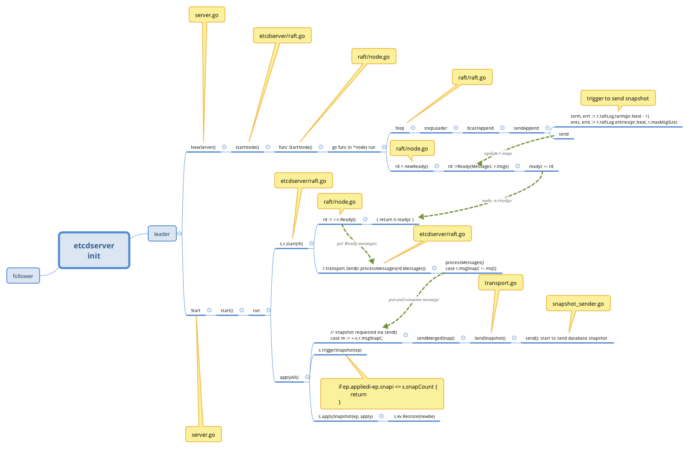
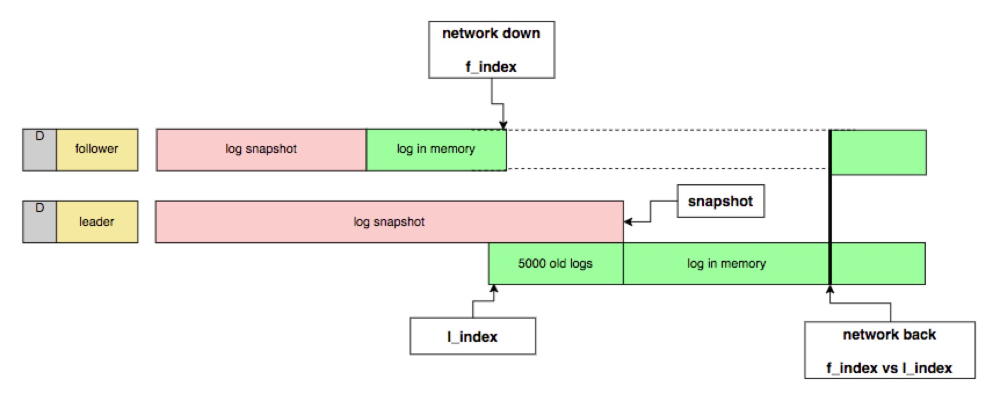

### 写在开始前
比起正面撸代码，我更倾向于带着具体问题看代码，尤其是面对海量代码的大型软件。将代码按调用关系分块/分层，屏蔽暂时不必搞清楚的，先定位导致问题root cause的代码，再回头将之前不理解的地方各个击破。

下面通过一个etcd的具体问题，整理下etcd一些数据存储/数据同步相关的内容


## 问题现象
k8s集群，HA场景，一个master断开网络较长时间恢复网络之后，该节点上的Pods没有恢复。

## 问题分析
- 现象，该节点上该迁移走的Pods(deployment)没有删除，该重建的Pods(sts、static)没有重建。
- Log，对比正常HA恢复节点kubelet的log，出问题的节点kubelet里没有恢复的动作
- 初步判断两个可能的原因:
  1. kubelet因为某种原因恢复的goroutine deadlock不工作了；
  2. kubelet没有获取到集群中最新的events

- 排查分析
  * 因为kubelet没有像dockerd一样 kill -SIGUSR1 $(pidof dockerd) 打印stacktrace的机制，所以需要dlv debug判断是否deadlock，相对难度较大。 
  * 根据k8s的components消息通信方式，apiserver是唯一获取events的入口，所以可以简单的手动重启apiserver来根据结果判断是kubelet的原因还是events的原因。
  
- 缩小问题范围
  * 重启apiserver，节点恢复，排除kubelet的嫌疑，是apiserver <—> etcd <—> etcd cluster 这条线上出了问题。
  
- 继续排查apiserver的log和etcd的log：
  * etcd里能看到节点网络恢复之后，以follower的身份同步到了leader发过来的最新数据 
  * apiserver里没有看到获取数据的迹象
  * 最后靠着google，翻到了issue [[1]]，现象一致，原因解释的通，大概理解了是etcd恢复数据时的bug [[3]] 导致的。 
  * backport代码，reproduce，果然修复了，happy，下班。
    
## Two days later...

- 没过几天，客户环境又出了这个问题，不一样的是这次只是断网了半个小时左右，在之前结论是需要断网5个小时以上才能稳定复现，断网较短时间不会复现。啪，打脸了！
- 再次理解了一下root cause，etcd会对集群数据做snapshot持久化，这样可以节省空间也可以保证不丢数据，触发snapshot的条件是SnapCount [[2]]。follower网络恢复之后，leader向其同步数据，如果需要同步snapshot则会出现该问题。
- 所以，断网5个小时是必现的方法，真正原因是requests达到snapCount 导致做了snapshot.
- 不需要断网5个小时，只要
  1. follower断网
  2. leader做snapshot
  3. follower恢复按顺序发生
  
- 其中第二步leader snapshot，有两种方式：1. 手动对etcd操作达到SnapCount；2. 集群正常运行，根据etcd log判断etcd下次做snapshot的时间。而客户环境复现的属于第二种，日志符合上面的三个步骤，稳了！
- 啪，另一边脸！按照上面的步骤在自己的环境里没有复现。

## Fuck，疼，心疼。撸代码，撸清楚。



关键数据结构/关键代码：
```cgo
	srv = &EtcdServer{
		readych:     make(chan struct{}),
		Cfg:         cfg,
		lgMu:        new(sync.RWMutex),
		lg:          cfg.Logger,
		errorc:      make(chan error, 1),
		v2store:     st,
		snapshotter: ss,
		r: *newRaftNode(
			raftNodeConfig{
				lg:          cfg.Logger,
				isIDRemoved: func(id uint64) bool { return cl.IsIDRemoved(types.ID(id)) },
				Node:        n,
				heartbeat:   heartbeat,
				raftStorage: s,
				storage:     NewStorage(w, ss),
			},
		),
```

etcdserver: server.go run(), s.r.start(rh)

node.go, run(), 调用raft的step()方法
有几个channel：readyc，propc，recvc，作为etcdserver 和 raft library之间信息交互用

raft —> node —> raftNode —> etcdserver

readyc里面的Ready struct{Messages.type}

log.go
```cgo
type raftLog struct {
// storage contains all stable entries since the last snapshot.
storage Storage

	// unstable contains all unstable entries and snapshot.
	// they will be saved into storage.
	unstable unstable

	// committed is the highest log position that is known to be in
	// stable storage on a quorum of nodes.
	committed uint64
	// applied is the highest log position that the application has
	// been instructed to apply to its state machine.
	// Invariant: applied <= committed
	applied uint64

	logger Logger
}
```


代码搞清楚之后，之前的分析还遗漏了两个关键点：
1. leader会根据follower当前的index信息，选择发送snapshot(MsgSnap)还是发送内存中的log(MsgApp)，具体代码 [[4]]
2. leader会因为SnapCount触发做snapshot，并压缩内存中的log信息，但依然会保留一些信息在内存中(5000条) [[5]]
   结合 [[4]] 和 [[5]] 两处代码逻辑，leader根据follower的index判断其落后的信息是否还在自己的内存中，如果不在则只能发送snapshot。

抽象一下即:
- T1=follower断网时间点
- T2=leader做snapshot时间点
- T3=follower网络恢复时间点
- i1=follower断网时index值
- i2=leader内存中index值
所以复现方法需满足两个条件：(T2<T3) && (i1<i2)




etcd log日志：
- leader log：
```cgo
2019-05-06 10:27:22.087446 I | etcdserver: start to snapshot (applied: 200002, lastsnap: 100001)
2019-05-06 10:27:22.109158 I | etcdserver: saved snapshot at index 200002
2019-05-06 10:27:22.109590 I | etcdserver: compacted raft log at 195002

2019-05-06 11:24:02.381763 I | raft: raft.node: 51f0b28b735ef9d0 elected leader 51f0b28b735ef9d0 at term 948
2019-05-06 11:24:02.394317 I | rafthttp: start to send database snapshot [index: 224082, to 172d74c509086d76]...
2019-05-06 11:24:02.673272 I | etcdserver: wrote database snapshot out [total bytes: 25772032]
2019-05-06 11:24:02.733722 I | rafthttp: database snapshot [index: 224082, to: 172d74c509086d76] sent out successfully
```
follower log:
```cgo
2019-05-06 09:28:07.364279 I | raft: 172d74c509086d76 [logterm: 3, index: 173315] sent MsgVote request to 51f0b28b735ef9d0 at term 4
2019-05-06 09:28:07.364301 I | raft: 172d74c509086d76 [logterm: 3, index: 173315] sent MsgVote request to 96fe6f95518fd3dd at term 4
```


[1]: https://github.com/etcd-io/etcd/issues/8411
[2]: https://github.com/etcd-io/etcd/blob/v3.2.4/etcdserver/server.go#L63
[3]: https://github.com/etcd-io/etcd/blob/v3.2.4/etcdserver/server.go#L788-L819
[4]: https://github.com/etcd-io/etcd/blob/v3.2.4/raft/raft.go#L376-L404

[5]: https://github.com/etcd-io/etcd/blob/v3.2.4/etcdserver/server.go#L1455-L1460


