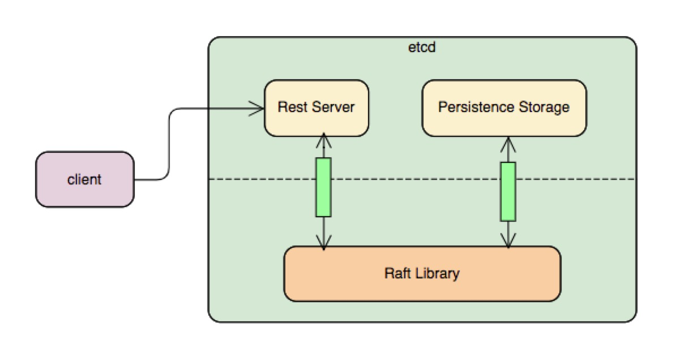

## etcd 简介

- Raft：一致性算法，类似于协议，有各种语言的实现
- Etcd：分布式KV数据库
- Etcd和Raft的关系:  
  * etcd作为一个分布式数据库需要多个功能模块，节点间的数据一致是其中重要的底层功能。
  * etcd中包含了Raft的golang实现并作为一个相对独立的raft library，除此以外加上其他功能，作为一个分布式数据库。

- raft library(对应etcd/raft/目录下面的代码) [[2]] 主要负责 [[4]]:
  * leader选举；
  * 日志一致性；
  * 日志同步；

- etcd server 主要负责：
  * 数据持久化；
  * 节点间数据网络传输；
  * mvcc；
  * RestAPI

- raft example [[1]], 基于raft library，是个demo版本的etcd

## etcd 数据存储机制 [[3]] 搬运工

在上图中，一个请求与一个etcd集群交互的主要流程分为两大部分：
1. 写数据到某个etcd server中。
2. 该etcd server与集群中的其他etcd节点进行交互，当确保数据已经被存储之后应答客户端。
   请求流程划分为了以下的子步骤：
* 1.1：etcd server收到客户端请求。
* 1.2：etcd server将请求发送给本模块中的raft.go，这里负责与etcd raft模块进行通信。
* 1.3：raft.go将数据封装成raft日志的形式提交给raft模块。
* 1.4：raft模块会首先保存到raftLog的unstable存储部分。
* 1.5：raft模块通过raft协议与集群中其他etcd节点进行交互。
  注意在以上流程中，假设这里写入数据的etcd是leader节点，因为在raft协议中，如果提交数据到非leader节点的话需要路由到etcd leader节点去。
  而应答步骤如下：
* 2.1：集群中其他节点向leader节点应答接收这条日志数据。
* 2.2：当超过集群半数以上节点应答接收这条日志数据时，etcd raft通过Ready结构体通知etcd server中的raft该日志数据已经commit。
* 2.3：raft.go收到Ready数据将首先将这条日志写入到WAL模块中。
* 2.4：通知最上层的etcd server该日志已经commit。
* 2.5：etcd server调用applierV3模块将日志写入持久化存储中。
* 2.6：etcd server应答客户端该数据写入成功。
* 2.7：最后etcd server调用etcd raft，修改其raftLog模块的数据，将这条日志写入到raftLog的storage中。

[1]: https://github.com/etcd-io/etcd/tree/master/contrib/raftexample
[2]: https://github.com/etcd-io/etcd/tree/master/raft
[3]: https://www.codedump.info/post/20181125-etcd-server/
[4]: https://www.codedump.info/post/20180922-etcd-raft/
