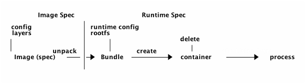
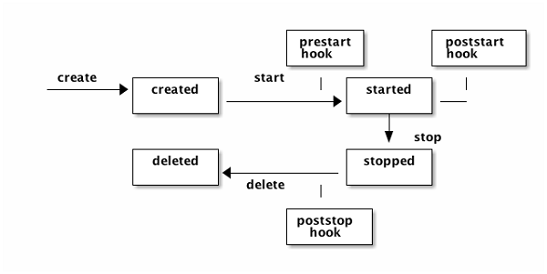
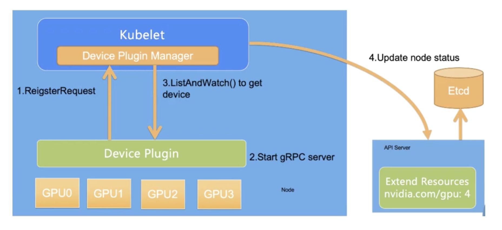
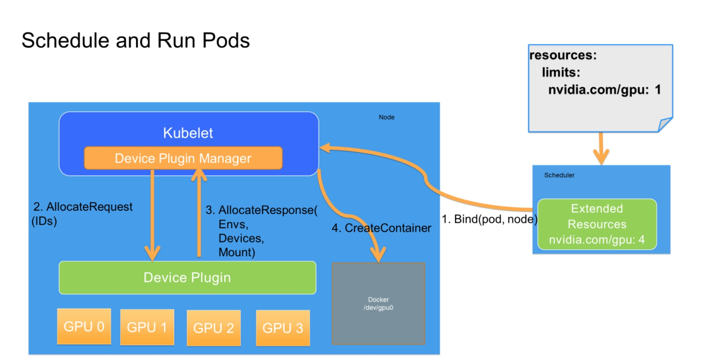
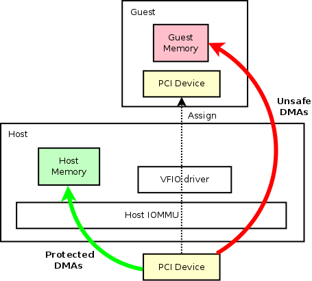
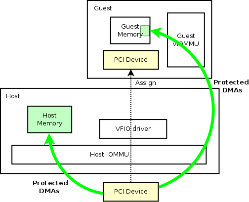

## 云原生GPU(GPU/gpushare/vGPU)

- 容器使用GPU
- Pod使用GPU
- 虚机使用GPU


### 容器使用GPU: 依赖的工具及调用关系 [[1]]

 

#### 关键点:

- 确认GPU的driver是 nvidia-driver.  ```lspci -knn```
  * Disable nouveau [[2]]
  * Turn off secure boot [[3]].  ```grub2-mkconfig -o /boot/grub2/grub.cfg``` 


- OCI runtime-spec hooks [[14]][[15]]

  
  
  
   
  * nvidia-container-runtime, 调用runC 生成prestart hook指向nvidia-container-toolkit的config.json
  * 基于config.json, runC create container(namespace创建，network初始化) 
  * nvidia-container-toolkit，调用libnvidia-container执行hook动作(脚本)
  * libnvidia-container，调用driver的CLI，获取GPU相关的信息
  * start container，运行应用进程


### Pod使用GPU: devcie-plugin [[4]]

 

 

- github.com/NVIDIA/k8s-device-plugin 代码介绍 [[5]]
- 待优化问题，device-plugin依赖default runtime配置为nvidia
```$xslt
    [plugins."io.containerd.grpc.v1.cri".containerd]
      snapshotter = "overlayfs"
      default_runtime_name = "nvidia"
      ...
        [plugins."io.containerd.grpc.v1.cri".containerd.runtimes.nvidia]

         runtime_type = "io.containerd.runc.v2"

         [plugins."io.containerd.grpc.v1.cri".containerd.runtimes.nvidia.options]

           BinaryName = "/usr/bin/nvidia-container-runtime"
```


#### github.com/AliyunContainerService/gpushare-scheduler-extender [[6]]

 

- 目前ali-gpushare只实现了共享，没实现隔离. 保证节点GPU不超卖，但不保证单个container不多用
- 隔离依赖nvidia本身功能: Nvidia vGPU、MPS，和vCUDA. 阿里云的cGPU支持隔离


### 虚机使用GPU [[10]]

- GPU pass-through
  * Intel VT-d [[13]]，intel从硬件层面解决IO虚拟化的方案
  
  
  
   
  
  * IOMMU[[11]]: 虚机使用GPU的DMA，就是用户态qemu进程访问到主机上的内存,要保证DMA的安全性，DMA重映射.
    MMU，Intel的硬件内存管理单元，虚拟地址转换为物理地址。IOMMU的功能与MMU类似，不同的是它的使用这者不是CPU，而是IO设备，IOMMU因此得名
  * VFIO: 一套完整的用户态驱动(userspace driver)方案，利用IOMMU安全地把设备I/O、中断、DMA等能力呈现给用户空间
  * 操作举例
  ```$xslt
  modprobe vfio-pci
  
  $ lspci -nn -D | grep -i nvidia
  0000:04:00.0 3D controller [0302]: NVIDIA Corporation Device [10de:15f8] (rev a1)
  0000:84:00.0 3D controller [0302]: NVIDIA Corporation Device [10de:15f8] (rev a1)
  
  #PCI address 0000:04:00.0 is assigned to the hardware GPU device. 10de:15f8 is the device ID of the hardware GPU device.

  $ echo 0000:04:00.0 > /sys/bus/pci/devices/0000:04:00.0/driver/unbind
  $ echo 10de 15f8 > /sys/bus/pci/drivers/vfio-pci/new_id
  
  $ readlink -e /sys/bus/pci/devices/0000:04:00.0/iommu_group
  /sys/kernel/iommu_groups/23
  $ ctr run --device /dev/vfio/23 centos /bin/bash```
  ```
  
- vGPU/Mediated passthrough/Nvidia GRID vGPU
  * vfio-mdev [[12]]


### 产品中的场景

- EOS集群容器使用GPU
  * GPU/gpushare可以支持，目前产品暂不需要, 纳管EOS集群可能需要
  * vGPU工具和nvidia-driver不兼容问题 [EAS-58343](https://easystack.atlassian.net/browse/EAS-58343)


- EKS集群容器使用GPU
  * 分两步: 虚机直通GPU; 虚机host上Pod使用GPU
  * 创建EKS集群虚机挂载GPU -- magnum改动 [EAS-58599](https://easystack.atlassian.net/browse/EAS-58599)
  * EKS虚机镜像预安装nvidia工具及driver
  * EKS集群预安装gpushare-scheduler extender/gpushare-device-plugin, containerd预配置
  * vGPU资源较少，给集群使用意义不大


- 安全容器使用GPU[[7]]
  * 分三步：host上k8s为安全容器Pod调度GPU; Pod启动虚机挂载GPU; 虚机里启动container使用GPU
  * k8s为runtimeClass==rune类型的Pod调度GPU: 依赖device-plugin ---> 依赖nvidia drvier
  * Pod启动虚机挂载GPU: 依赖vfio-pci作为GPU设备的driver
  * k8s创建Pod，GPU的分配/调度走dm逻辑，ecr调用dm(或其他agent)修改container的config.json, 虚机启动挂载GPU
  * Guest镜像预安装nvidia工具及driver [EAS-58346](https://easystack.atlassian.net/browse/EAS-58346)
  * Guest OS里的kata-agent支持 container启动前执行prestart hook [[8]]
  * 安全容器使用vGPU, Pod启动虚机挂载vGPU, 其他逻辑和使用GPU一样


[1]: https://docs.nvidia.com/datacenter/cloud-native/container-toolkit/arch-overview.html
[2]: https://docs.nvidia.com/cuda/cuda-installation-guide-linux/index.html#runfile-nouveau
[3]: https://forums.fedoraforum.org/showthread.php?317947-NVIDIA-driver-fails-to
[4]: https://www.alibabacloud.com/blog/getting-started-with-kubernetes-|-gpu-management-and-device-plugin-implementation_596306
[5]: https://my.oschina.net/jxcdwangtao/blog/1793656
[6]: https://github.com/AliyunContainerService/gpushare-scheduler-extender
[7]: https://github.com/kata-containers/documentation/blob/master/use-cases/Nvidia-GPU-passthrough-and-Kata.md#nvidia-gpu-pass-through-mode-with-kata-containers
[8]: https://github.com/kata-containers/agent/pull/365
[10]: https://juniorprincewang.github.io/2018/06/18/%E7%A1%AC%E4%BB%B6%E6%94%AF%E6%8C%81%E7%9A%84GPU%E8%99%9A%E6%8B%9F%E5%8C%96%E6%8A%80%E6%9C%AF/
[11]: https://www.codenong.com/cs106179145/
[12]: https://developer.aliyun.com/article/599189
[13]: https://wiki.qemu.org/Features/VT-d
[14]: https://github.com/opencontainers/runtime-spec/blob/master/config.md#posix-platform-hooks
[15]: https://www.alibabacloud.com/blog/open-container-initiative-oci-specifications_594397
