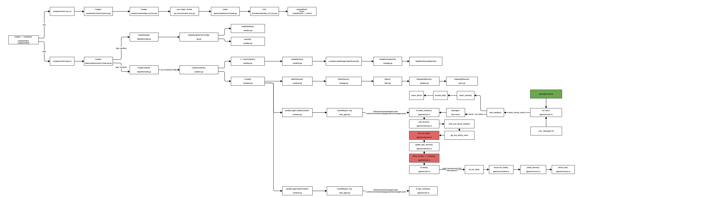

## kata-container block volume 热插拔

### 需求背景

- [JIRA](https://easystack.atlassian.net/browse/EAS-109561)
- [kata-dev-book](https://github.com/liubin/kata-dev-book)


- 实现
```cgo
ecr-runtime block-volume hot-plug --sandbox <sid> --container <cid> --block-volume <block path on host> --device-path <block path in container>
```

- 社区类似功能 
  * [direct-assigned volume](https://github.com/kata-containers/kata-containers/pull/3406)
  * [add ability to interact with IPTables within the guest](https://github.com/kata-containers/kata-containers/pull/4159)
    
### 代码调用路径梳理
  


- 关于 kubelet --> CRI --> containerd 的调用路径参照 [`CRI调用机制`](../ContainerRuntime.md)
- 对比 runC容器, kata的实现分为两段: host部分的实现、guest部分的实现, host部分的VM涉及到了[虚拟化](./virtualization.md)相关的领域知识
- guest里面主要是 kata-agent组件, 这部分可以理解为一个rust 版本的runC. 代码分析可以对比runC的实现[[1]][[2]]做比较和参照
- 阅读agent部分的代码, 有助于理解 oci runtime spec的定义, 例如 devices、mounts、hook 这些内容在 create container中是如何工作的


### unix socket && vsock
- kata-runtime --> kata-shim, 复用了 ```shim-monitor.sock```, 环境上可以通过 ```netstat -ap --unix```找到shim 监听的unix socket.
- kata里多处用到了 UNIX domain socket 来实现本地IPC, 分别在 ```/run/vc/sbs/<id>/``` 和 ```/run/vc/vm/<id>/``` 下面
- kata-shim --> kata-agent, 使用了vhost-sock-pci qemu 提供的一种host和guest的通信机制. [vsock](https://github.com/kata-containers/kata-containers/blob/main/docs/design/VSocks.md), 这个也就是很多文章里提到的"打洞"


### grpc vs. ttrpc
- why grpc，为什么grpc被广泛使用, 优势在哪里？[[3]][[4]]
  * transport protocl(传输部分): http/2，multiplexing(多个http streams  on one tcp)、header encoding(binary messages and trailers.)
  * playload protocal(编解码部分): protobuf，size，encode/decode 的速度

- why ttrpc, ttrpc 又是个啥东西？
  * ```GRPC for low-memory environments. We do this by eliding the net/http, net/http2 and grpc package used by grpc replacing it with a lightweight framing protocol. ```
  * containerd --> containerd-shim 只涉及单机交互，不涉及走网络，且单机container数量较多，有节省资源的需求，优化出了 ttrpc
  * kata-container 借鉴了containerd 的ttrpc, 实现了ttrpc-rust, 推动技术迭代向好, 点赞

### 具体问题
- host to guest，复用 qmp.sock, 复用createsandbox的代码
  * 坑，[scsi_scan_mod](https://github.com/kata-containers/runtime/pull/2561). 有效帮助: dmesg, 求助系统工程同事(找对人, 事半功倍)

- agent in guest
  * ```setns(mnt_fd, 0); mknod_dev(&dev, path)```
  * 坑1，rust unsafe，有效帮助: strace 有助于发现系统调用的问题.
  * 坑2，setns 不能associate mnt_namespace [[5]], 有效帮助 manual page 内容详实. 

- 好物推荐: [manual page](https://www.kernel.org/doc/man-pages/) 很好用
  * 清晰列出 user commands, system calls, rust libc库都是源于manual page
  * 解释了 nsenter == setns + clone
  * 阐述了 fork vs clone
  * 操作系统 vs. 云操作系统 类比 [[6]] [[7]]
    
    | Linux | kubernetes |
    | :-----| ----: | 
    | shell | kubectl |
    | glibc | client-go |
    | systemcall | k8s API |

[1]: https://terenceli.github.io/%E6%8A%80%E6%9C%AF/2021/12/23/runc-internals-2
[2]: https://juejin.cn/post/6903527508784873485
[3]: https://medium.com/swlh/grpc-fundamental-and-concept-93414d7956df
[4]: https://thenewstack.io/grpc-a-deep-dive-into-the-communication-pattern/
[5]: https://man7.org/linux/man-pages/man2/setns.2.html
[6]: https://medium.com/meatandmachines/what-really-happens-when-you-type-ls-l-in-the-shell-a8914950fd73
[7]: https://cloud.tencent.com/developer/article/1357674
