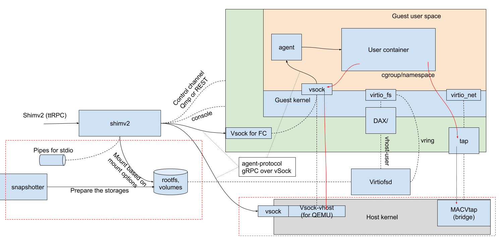

## kata container 简介

- 推荐阅读 kata作者王旭写的kata系列文章(三篇) 英文版 [[1]] 中文版 [[2]]
  
- The slogan of the project “the security of VMs, the speed of containers”

## kata container 架构

### 关键技术点
- [`调用机制梳理`](../ContainerRuntime.md)
  * pod/sandbox <--> CRI <--> containerd <--> containerd-shim-kata-v2 <--> kata <--> VM
  
- 一入虚拟化深似海, 进屋细说[`kata 涉及到的虚拟化相关知识的梳理`](./virtualization.md)

- “我们的使命就是去为云原生开发新的虚拟化技术，这和传统的虚拟机不尽相同"
  * 需要在沙箱间去共享资源，但同时也要保持沙箱边界仍然清晰。
  * 即时、动态地按需为沙箱提供资源，而不是像 partition 那样进行固定的资源分配。
  * 主机的用户态工具、VMM、乃至应用的内核联合起来，彼此协同为沙箱中的应用提供服务。
  
### 社区技术方向/kata v2
- 隔离性
  * 对于qemu，vsock在host kernel上，理论上说，用户App可能会构造一些有问题的包来从此攻击host kernel
  * “允许将全部的应用内容，也就是说不仅是运行时的进程，也包括镜像/根文件系统封装进沙箱中“ --- 疑问: 挂载数据盘的Pod依然要通过virtio_fs将host上的文件共享给guest
- 敏捷性
  * 启动时间，"通过采用 DAX、模板、轻量级虚拟机这些技术"
- 降低虚拟化的开销
  * agent 协议的承载从 gRPC 替换成 ttRPC, 节省很agent 和 shim 的内存 [[3]]
  * agent内存开销, "rust-agent，将 agent 的内存开销降低到了 1MB 级"
- 支持cloud-hypervisor(rust-vmm)

## 安全容器云产品v1遗留问题

- 启动方式
  * 社区: guest kernel + guest image(initrd and rootfs)
  * 云产品: root_disk [[4]], 问题:
    - boot.log x86环境上不工作，原因是需要的console 配置和 socat需要的console配置冲突 [[5]]
    - 影响启动速度
- 启动速度
  * kuryr CNI导致Pod网卡创建速度太太太慢, kube-ovn-neutron解决
  * 未enable DAX(理论瞎猜), 导致未利用社区的 "一个启动好内核和Agent并被暂停住的空的虚拟机，之后再要启动新虚机的时候，就做一次到本机的“live-migration”"
  * 修改启动方式, 未验证
- 存储性能
  * 未enable DAX, fio测试结果较差 [[6]]
  * [`kata-存储原理`](./storage.md)
- 资源管理
  * 容器使用内存不会自动release [[7]]
  * 容器内fio测试(压内存)会导致host上对应qemu进程oom [[8]]
  * 既要enable sandbox_cgroup提供监控数据, 又要workaround保证qemu进程不退出 [[9]]
  * Overhead的CPU和内存占用应该纳入已分配配额 [[10]]
  * [`kata-资源管理原理`](./resource.md)
- 网络连接
  * qemu 不能直接使用 veth-pair [[11]], 导致vm+container的网络拓扑比较复杂且容易有性能问题, kubevirt同样的问题
  * 问题及方案, 详见社区的讨论 [[12]]
  * [`kata-网络原理`](./network.md)
- GPU使用
  * 多块GPU卡(large bar space)挂载问题 [[13]]
  * [`云原生GPU`](./GPU.md)
  
[1]: https://medium.com/kata-containers/the-two-years-of-kata-containers-ac0b51caf1ff
[2]: https://mp.weixin.qq.com/s?__biz=MzUzOTk2OTQzOA==&mid=2247483874&idx=1&sn=cdc118f8c76a6bed6a6bd15153f5cb10&chksm=fac11313cdb69a055a2a200883b348a30f4d80f219b2f33a628efeccbfd6fd54efc7f7706f93&scene=21#wechat_redirect
[3]: https://mp.weixin.qq.com/s?__biz=MzUzOTk2OTQzOA==&mid=2247483911&idx=1&sn=28eb395482fd7e6835b3fd6f1e5af3a0&chksm=fac110f6cdb699e02d9d7ae6d2197183fb5d9415f0624c0e47fbb24dba3a26ef4a6184fcfb53&scene=21#wechat_redirect
[4]: https://easystack.atlassian.net/browse/EAS-43850
[5]: https://easystack.atlassian.net/browse/EAS-48966
[6]: https://easystack.atlassian.net/browse/EAS-68959
[7]: https://easystack.atlassian.net/browse/EAS-66530
[8]: https://easystack.atlassian.net/browse/EAS-66342
[9]: https://easystack.atlassian.net/browse/EAS-66423
[10]: https://easystack.atlassian.net/browse/EAS-66329
[11]: https://lists.gnu.org/archive/html/qemu-discuss/2015-10/msg00002.html
[12]: https://github.com/kata-containers/kata-containers/issues/1922
[13]: https://easystack.atlassian.net/browse/EAS-62341