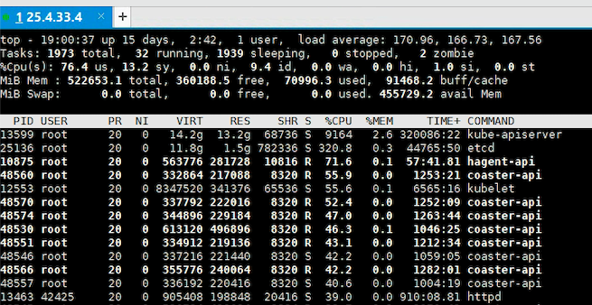
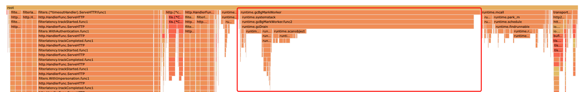
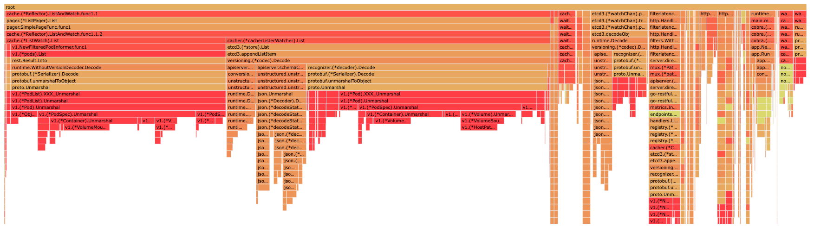
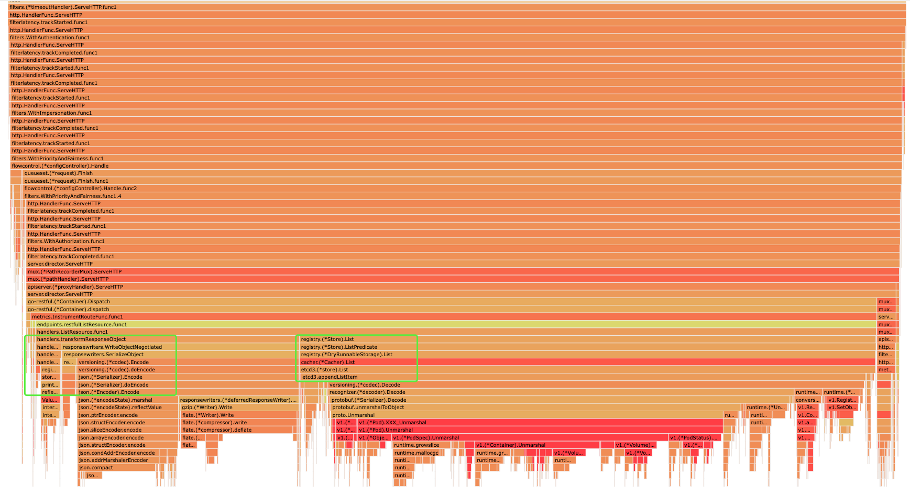

## kube-apiserver 性能问题

### 问题背景

s2500环境, 1k节点规模k8s集群 kube-apiserver cpu使用率飙高 [JIRA](https://easystack.atlassian.net/browse/EAS-91610)

讲道理 1k节点规模 不算大集群, 但遇上s2500 cpu这个坑货 就是没有问题制造问题。有问题对研发是好事, 尤其是性能问题 总会有点意思

### 问题现象



图中能看出来
- 问题集中在 apiserver 和 etcd 两个组件，也就是 k8s 读写数据这条链路上
- cpu usage 高, load 也高(load的本质 -- R状态+D状态的task数量和). usage高说明cpu确实已经很忙ing了, 但无奈性能差(2500)每个Task执行要更耗时，导致Task累积

### 问题分析 pprof -- golang profiling 利器

pprof 想必大家都听说过, 这次正好有机会上手试下这个利器, 两篇推荐的博文 [[3]] [[4]]

- pprof 原理理解

    - pprof 本质就是**采样**当前程序的goroutines相关数据(调用栈、内存)记录, 同时支持对采样数据的量化分析. 
    - pprof 名字, prof 是 profiling, p 是数据格式 Protocol Buffer 
    - golang程序能够采用依赖两个库, 所以pprof导出的数据也能看出是 runtime 和 http两个入口
      ```cgo
      - runtime/pprof：采集程序（非 Server）的运行数据进行分析
      - net/http/pprof：采集 HTTP Server 的运行时数据进行分析
      ```
  
- pprof 可以做什么
  ```cgo
  - cpu 分析: runtime 会每 10ms 就暂停一下，记录当前运行的 goroutine 的调用堆栈及相关数据
  - heap 分析, 从名字能看出来, 这个只对heap 堆上内存做采用
  - groutine 分析, 记录当前程序有哪些goroutines 
  ```

  上面几个是分析该case用到的数据, pprof里还支持其他数据 在其他场景里会用到

  ```cgo
  - trace, 指定时间周期, 记录goroutines 同时记录goroutines每个调用消耗的时间, 更精细的看到程序执行情况
  - block，阻塞分析
  - mutex, 互斥分析
  ```

- pprof 实操

以 kubernetes 为例, 前置准备
```cgo
- 根据上面分析golang有支持pprof的库, k8s代码使里了这两个库，所以支持pprof采样
- 配置 --profiling == true, 如果程序启动未配置 需要重启, 对于泄露问题可能导致问题现象丢失, k8s 里默认也是打开的. 最佳实践配置里也有建议关闭 [redhat](https://cloud.redhat.com/blog/12-kubernetes-configuration-best-practices) [[2]]
- kubectl proxy, 开启之后, 访问组件的api即可拿到pprof数据, 因为kube-apiserver 和 kubelet 两个组件是 https访问的, 所以 kubectl proxy 之后, 可以比较方便拿数据
- cm 和 scheduler是有http端口的, 所以不需要 kubectl proxy 加持, 可以直接  curl http://127.0.0.1:10252/debug/pprof/
```

以 kube-apiserver 为例
```cgo
- curl http://127.0.0.1:8001/debug/pprof/profile > node1-profile
- curl http://127.0.0.1:8001/debug/pprof/goroutine > node1-goroutine,  这地方 ?debug=2是 人可读的输出, 不加debug 是pprof可读的格式 即 profile.proto 格式
```

以 kubelet 为例, kubelet 也是常出问题的组件, 且路径稍有差异
```cgo
- curl http://127.0.0.1:8001/api/v1/nodes/node-1/proxy/debug/pprof/heap > node1-heap
- curl http://127.0.0.1:8001/api/v1/nodes/node-1/proxy/debug/pprof/trace?seconds=60 > node1-trace, trace采样时间会比较长, 导出数据比较大
```

containerd && etcd, 作为k8s集群的三根柱子
```cgo
- ctr pprof heap > node1-containerd-heap
- ctr pprof profile > node1-containerd-profile
- etcd 参照 https://etcd.io/docs/v3.5/op-guide/monitoring/
```


pprof数据解析
```cgo
- 终端交互模式: go tool pprof node1-profile
- web浏览器方式: go tool pprof -http=127.0.0.1:8000 node1-profile
- 上面是pprof数据, 对于trace数据: go tool trace -http=127.0.0.1:8000 node1-trace
```

根据目前使用经验来看, web方式结果的会更直观，推荐 +1, 左上角选视图, 推荐 top、graph、flame graph 三个视角, 有助于发现问题，另外 sample选项可以切换 samples、cpu 这个可以理解 pprof 采样的工作原理, 而且samples数据和 load数据是可以对应上的


pprof top/graph 视图

- flat, 当前函数上运行耗时
- cum 是 cumulative 的简写, 当前函数 + 该函数调用其他函数的总耗时, 简单理解为经过函数的总耗时
- 虚线、实线、回调、深红、浅红... 没搞明白
- pprof [official blog](https://go.dev/blog/pprof), 这里还有 Using pprof with Linux Perf 的介绍
  > pprof can read perf.data files generated by the Linux perf tool

pprof top/graph 火焰图



- what is ```runtime.gcBgMarkWorker```, 简单理解gc 用于标记(mark)可回收对象的函数
- golang gc机制不了解, 但该mark函数cpu usage占用高, 应该是程序申请heap(gc 触发条件之一)的速度大于回收的速度, 所以疯狂在标记



根据上面的分析, gcMark也是源自list request的触发, 所以基本确定是 ```client --> apiserver --> etcd``` 这条链路太忙导致cpu的问题,

### 代码白盒分析



结合上面的火焰图, 代码分析就更容易了, 大致路径

```Dispatch —> restfulListResource —> ListResource —> List --> ListPredicate --> cacher.List --> etcd3.List```

List 走apiserver cache 还是走 etcd的关键代码如下，关于 API Resource RESTStorage的初始化以及路由的注册、dispatch调用链,  参照[apiserver 代码分析](kube-apiserver.md)

```cgo
func (c *Cacher) List(ctx context.Context, key string, opts storage.ListOptions, listObj runtime.Object) error {

	if resourceVersion == "" || hasContinuation || hasLimit || opts.ResourceVersionMatch == metav1.ResourceVersionMatchExact {
		// If resourceVersion is not specified, serve it from underlying
		// storage (for backward compatibility). If a continuation is
		// requested, serve it from the underlying storage as well.
		// Limits are only sent to storage when resourceVersion is non-zero
		// since the watch cache isn't able to perform continuations, and
		// limits are ignored when resource version is zero.
		return c.storage.List(ctx, key, opts, listObj)
	}

	// If resourceVersion is specified, serve it from cache.
	// It's guaranteed that the returned value is at least that
	// fresh as the given resourceVersion.
	listRV, err := c.versioner.ParseResourceVersion(resourceVersion)
	if err != nil {
		return err
	}

	if listRV == 0 && !c.ready.check() {
		// If Cacher is not yet initialized and we don't require any specific
		// minimal resource version, simply forward the request to storage.
		return c.storage.List(ctx, key, opts, listObj)
	}

	trace := utiltrace.New("cacher list", utiltrace.Field{"type", c.objectType.String()})
    defer trace.LogIfLong(500 * time.Millisecond)
    
	// List elements with at least 'listRV' from cache.
	listPtr, err := meta.GetItemsPtr(listObj)
	if err != nil {
		return err
	}
	trace.Step("Listed items from cache", utiltrace.Field{"count", len(objs)})
}

```

- 以上代码可以比较清晰的看到 list 的处理逻辑, 其中有助于debug的Log信息 ```defer trace.LogIfLong(500 * time.Millisecond)``` 在走etcd 和 cache两条路径上都有, 做功能验证的时候可以调低这里的默认阈值
- **强烈建议** client list操作, 设置 ``` resourceVersion=='0' ``` , 关于 kubectl 不支持该配置 [Support for setting resourceVersion in kubectl get ](https://github.com/kubernetes/kubectl/issues/965)
- 推荐 blog [list分析](https://arthurchiao.art/blog/k8s-reliability-list-data-zh/)


### watch-cache-size

上面提到了 list 走 apiserver cache, 接下来的问题就是 watchcachesize 如何设置.

- 当前产品中 k8s版本已经支持了 [Use dynamic size watch-cache](https://github.com/kubernetes/kubernetes/pull/90091)
- ```--watch-cache-sizes``` 不在需要配置 [[5]], 且支持CRD 资源 [[6]]
- 推荐 blog [apisever 优化实践](https://www.sofastack.tech/blog/climbing-to-the-top-of-scale-ant-groups-large-scale-sigma-cluster-apiserver-optimization-in-practice/) 


### kube-apisever 调试补充

- 拿metrics数据, curl http://127.0.0.1:8001/metrics
- 热更新日志级别, curl -X PUT http://127.0.0.1:8001/debug/flags/v -d “4”

### pprof 精彩定位问题案例

- cpu/内存问题: https://www.infoq.cn/article/f69uvzjuomq276hbp1qb
- goroutine 泄露问题: https://coder.com/blog/go-leak-mysteries#key-takeaways
- block && mutex


[1]: https://cloud.redhat.com/blog/12-kubernetes-configuration-best-practices
[2]: https://docs.datadoghq.com/security_platform/default_rules/cis-kubernetes-1.5.1-1.2.21/
[3]: https://eddycjy.com/posts/go/tools/2018-09-15-go-tool-pprof/
[4]: https://www.cnblogs.com/qcrao-2018/p/11832732.html
[5]: https://github.com/kubernetes/kubernetes/pull/91818/files
[6]: https://github.com/kubernetes/kubernetes/issues/75677


