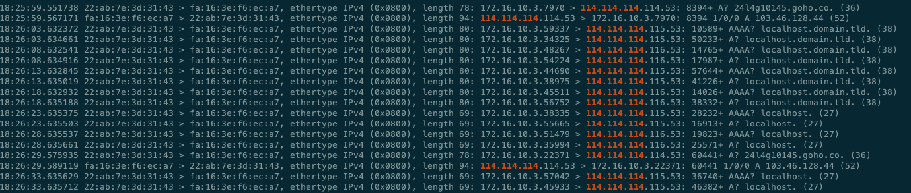
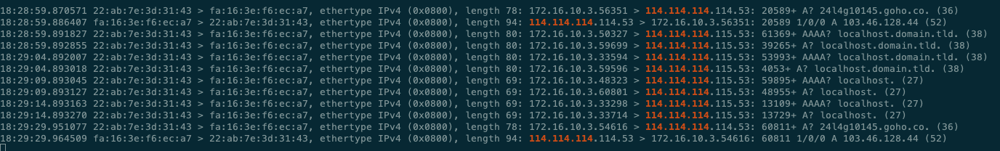

## kube-apiserver 无法启动

### 问题背景

客户环境高频出现master节点关机, kube-apiserver 无法启动 [JIRA](https://easystack.atlassian.net/browse/EAS-107807)

### apiserver 日志
```
I0614 19:56:31.263446       1 secure_serving.go:202] Serving securely on [::]:6443
... 上连 etcd
... 启动goroutines
...
E0614 19:57:01.264713       1 reflector.go:138] k8s.io/client-go/informers/factory.go:134: Failed to watch *v1.Pod: failed to list *v1.Pod: Get "https://localhost:6443/api/v1/pods?limit=500&resourceVersion=0": dial tcp: i/o timeout
E0614 19:57:01.265024       1 reflector.go:138] k8s.io/client-go/informers/factory.go:134: Failed to watch *v1.Namespace: failed to list *v1.Namespace: Get "https://localhost:6443/api/v1/namespaces?limit=500&resourceVersion=0": dial tcp: i/o timeout

F0614 19:57:01.269085       1 controller.go:161] Unable to perform initial IP allocation check: unable to refresh the service IP block: Get "https://localhost:6443/api/v1/services": dial tcp: i/o timeout
goroutine 2648 [running]:
k8s.io/kubernetes/vendor/k8s.io/klog/v2.stacks(0xc00000e001, 0xc012bccd80, 0xcc, 0x11a)
	/home/runner/work/build/build/kubernetes/_output/local/go/src/k8s.io/kubernetes/vendor/k8s.io/klog/v2/klog.go:1026 +0xb9
...
```

### 问题总结
根据日志报错, 问题点清晰，即 apiserver代码逻辑里使用了informer访问6443(自己)上连etcd读数据，但同时有超时fatal退出的逻辑

[社区相关问题](https://github.com/kubernetes/kubernetes/issues/82067) ```net.ipv6.conf.all.disable_ipv6 = 0``` workaround 把问题指向了ipv6

疑点
- 产品已经配置了 ```--bind-address=0.0.0.0```，无论disable/enable ipv6, 日志都是打印 ```secure_serving.go:202] Serving securely on [::]:6443```
- 日志显示 访问```localhost:6443``` 超时，informer为啥会访问 localhost 不是 127.0.0.1, 即使访问localhost 为啥会超时呢

变量
- 客户环境遇到, 内部没遇到过
- 611 代码做了哪些改动

### 问题分析
- 疑点1, listen on ```[::]:6443```, golang net.Listen()的默认行为, ```net.Listen('tcp', '0.0.0.0:6443')```可复现, 虽然指定了```0.0.0.0```, 但这里默认是```tcp```不是```tcp4``` 参照 [[1]]

- 疑点2, apisever 中初始化client 连接自己的代码如下
```cgo
func getLoopbackAddress(wantIPv6 bool) string {
	addrs, err := net.InterfaceAddrs()
	if err == nil {
		for _, address := range addrs {
			if ipnet, ok := address.(*net.IPNet); ok && ipnet.IP.IsLoopback() && wantIPv6 == netutils.IsIPv6(ipnet.IP) {
				return ipnet.IP.String()
			}
		}
	}
    return "localhost"
}
```
抽取上面apiserver中代码, 到单个function 本地调试如下

- disable ipv6
```cgo
[root@node-3 main]# sysctl -w  net.ipv6.conf.all.disable_ipv6=1
net.ipv6.conf.all.disable_ipv6 = 1
[root@node-3 main]# GODEBUG=netdns=go+2 go run net-test.go
GOOS: linux
net addrs: [127.0.0.1/8 10.35.1.6/24 172.35.0.4/24 35.168.10.4/24 192.168.50.3/24 35.168.20.3/24 35.168.30.3/24 35.168.40.3/24 10.232.1.1/24 100.64.0.2/16] err: <nil>
tttt:  localhost
```

- enable ipv6
```cgo
[root@node-3 main]# sysctl -w  net.ipv6.conf.all.disable_ipv6=0
net.ipv6.conf.all.disable_ipv6 = 0
[root@node-3 main]# GODEBUG=netdns=go+2 go run net-test.go
GOOS: linux
net addrs: [127.0.0.1/8 10.35.1.6/24 172.35.0.4/24 35.168.10.4/24 192.168.50.3/24 35.168.20.3/24 35.168.30.3/24 35.168.40.3/24 10.232.1.1/24 100.64.0.2/16 ::1/128 fe80::f6b7:8dff:fea8:97de/64 fe80::f6b7:8dff:fea8:97df/64 fe80::2a11:ecff:feed:c6ab/64 fe80::2a11:ecff:feed:c6ac/64 fe80::2a11:ecff:feed:c6c1/64 fe80::2a11:ecff:feed:c6c2/64 fe80::dc31:f2ff:fed3:343/64 fe80::3c45:48ff:fe51:a641/64 fe80::9c0a:94ff:feb8:ca44/64 fe80::d816:6ff:fe5d:8841/64 fe80::983a:f0ff:fea4:224b/64 fe80::3c70:6ff:fe55:ec41/64 fe80::7836:f6ff:fe42:cf41/64 fe80::858:aff:fee8:101/64 fe80::8c8d:c0ff:fee9:4792/64 fe80::800e:32ff:fec1:f2b9/64 fe80::a82a:b5ff:feef:35d8/64 fe80::fc16:3eff:fe6c:19a3/64 fe80::a0a8:78ff:fe94:73d9/64 fe80::5ca7:54ff:fee1:dfdf/64 fe80::a445:1cff:fe7e:d5d1/64 fe80::8c1a:a9ff:fe4d:9be7/64 fe80::cb4:b3ff:fe2b:f154/64 fe80::6887:54ff:fe01:85f9/64 fe80::9cff:15ff:fe99:b4ca/64 fe80::8dc:59ff:fef8:a0dc/64 fe80::e8ad:f6ff:fe64:de1e/64 fe80::8c65:84ff:feda:3953/64 fe80::4cf2:66ff:fec2:9392/64 fe80::18ad:2dff:fe96:e2a3/64 fe80::b087:b8ff:fe22:21b/64 fe80::c85:63ff:fe64:a693/64 fe80::3412:51ff:fef2:f75c/64 fe80::7caf:a1ff:fe3c:9ba2/64 fe80::e0ca:1cff:fe8d:da08/64 fe80::108a:7cff:fef5:c834/64 fe80::90f4:f5ff:febf:abdf/64 fe80::e828:efff:fe69:bbbe/64 fe80::a4ed:94ff:fece:67db/64 fe80::8096:c7ff:fe60:2258/64 fe80::84f7:c4ff:fea3:180d/64 fe80::407d:ffff:fe4b:d37d/64 fe80::6cea:a3ff:fea4:b13e/64 fe80::f02c:b7ff:fe78:4996/64 fe80::a4b6:2dff:fefa:d346/64 fe80::cca6:41ff:fe21:c0d/64 fe80::7813:3cff:fe40:7324/64 fe80::b828:ecff:fef5:7041/64 fe80::70d8:c4ff:fed9:6eb4/64 fe80::8c74:39ff:fe08:1c8e/64 fe80::888a:a4ff:fee0:6d46/64 fe80::5c6c:a8ff:fe34:ecb9/64 fe80::3036:41ff:feb7:9ef5/64 fe80::c843:95ff:fe51:96dd/64 fe80::70eb:4dff:fe99:b582/64 fe80::c41:44ff:fe1c:3a95/64 fe80::3833:c1ff:feb1:ac68/64 fe80::9015:c6ff:fe6b:e109/64 fe80::5421:efff:fe26:d94b/64 fe80::942f:74ff:fe7a:72e8/64 fe80::64ab:c5ff:fe54:1a3e/64 fe80::5cae:e8ff:fe08:7ba/64 fe80::a4f2:30ff:fea5:8f17/64 fe80::807f:89ff:fea3:e73/64 fe80::cc8e:cdff:fe43:f8db/64 fe80::a821:2ff:fe58:7e2a/64 fe80::649d:5eff:feb1:9c60/64 fe80::4ccc:7bff:fe4b:a2d8/64 fe80::d88e:e4ff:fe7b:98e7/64 fe80::88cc:13ff:fedb:3b55/64 fe80::1cd2:daff:fe14:97c4/64 fe80::c01f:93ff:fec1:be7a/64 fe80::9c3f:13ff:fe44:ba3/64 fe80::10d6:f0ff:fe2a:e59d/64 fe80::8840:8fff:fed6:a143/64 fe80::d431:a0ff:fe29:69e2/64 fe80::2469:91ff:fe2c:70b8/64 fe80::fc16:3eff:fe80:ff5e/64 fe80::2c7e:2dff:fe5d:5d1e/64 fe80::fc16:3eff:fe03:4063/64 fe80::f850:54ff:fe45:d605/64 fe80::fc16:3eff:fef9:359/64 fe80::4025:61ff:fe21:ce36/64 fe80::54c7:84ff:feac:85ee/64 fe80::4ea:bfff:fe7f:7162/64 fe80::200:ff:fe7b:9bd8/64 fe80::3826:e7ff:fe22:b786/64 fe80::2c7a:4bff:fe71:c3ba/64 fe80::7420:80ff:fe58:7998/64 fe80::7c51:e6ff:feff:cf29/64 fe80::4c01:93ff:fef1:d651/64 fe80::9cc5:6fff:fe59:9fb8/64 fe80::41d:e1ff:fe4d:98d1/64 fe80::fc16:3eff:fefd:806d/64 fe80::80c:10ff:fe8d:6cb1/64 fe80::f4de:86ff:fe5b:a26/64 fe80::fc16:3eff:feb0:244b/64 fe80::242b:3fff:fe3b:3958/64 fe80::fc16:3eff:feb4:2540/64 fe80::1c56:b7ff:febf:3ee3/64 fe80::6808:85ff:fe97:6573/64 fe80::fc16:3eff:fec7:f281/64 fe80::d46b:c0ff:fe56:967c/64] err: <nil>
!!!!!!!!! ::1/128 ipnet: ::1
tttt:  ::1
```

- 根据以上现象, 大概有两个思路
  * 全面disable ipv6 [[2]], listen的地方设置 ```tcp4```, 这样上面getAddress会返回 ```127.0.0.1```, 但总一天需要 enable ipv6
  * 返回 localhost，连接loalhost为啥会超时呢，是域名解析超时 还是 建立连接超时

### 新进展

某次客户环境复现, 发现了新现象, 进一步缩小了问题范围
- 现象, 问题是否出现和 /etc/resolv.conf 里配置的条目相关, 具体见JIRA
- 通过这个发现，能确定是 域名解析 ```localhost``` 的问题，不是建立连接


### 可复现 == 不是疑难问题

- 控制变量, 611切换到了alpine作为base镜像，换回602的base镜像 + 611的hyperkube 问题 **不复现了, 不复现，不复现了**!
- alpine - musl libc vs. glibc

### cgo

golang 域名解析是 net包, net包涉及到cgo, 所以一定是hyperkube 运行是依赖glibc的库, 但musl libc中没有

BUT... 很多技术听说过没见过, you know '深入理解...', hyperkube 是静态编译的, 不依赖动态链接库
```cgo
[root@node-4 ~]# ldd kube-apiserver
	not a dynamic executable
```

推荐: 关于cgo、静态编译 [也谈Go的可移植性](https://tonybai.com/2017/06/27/an-intro-about-go-portability/), 博主其他文章也推荐

### nsswitch
这东西干啥的？不知道说不清楚, 但能确定 这个配置影响了 访问localhost 是先读 /etc/hosts 还是 先做域名解析

一顿翻找, 结论
- alpine think that it's golang bug [[3]]
- golang think it's not be compatible with glibc [[4]]
- golang is waiting changes of glibc [[5]]
- maybe glibc is making change: 28700 [[6]]

So currently, it still needs ```RUN [ ! -e /etc/nsswitch.conf ] && echo 'hosts: files dns' > /etc/nsswitch.conf``` as workaround to use alpine image as base image to run golang binary.

### ClusterFirstWithHostNet

结论, kube-apiserver dnsPolicy 改成 ```ClusterFirstWithHostNet``` 不能解决该问题

- 因为 search 和 options，也会尝试多次解析， 效果上类似多条nameservers
  ```cgo
  search kube-system.svc.cluster.local svc.cluster.local cluster.local
  nameserver 10.222.0.3
  options ndots:5
  ```
- 环境上如果测试， 需要模拟route不在(可以关机 刷掉routes 或者 停掉flannel + 然后手动删routes)，否则 '10.222.0.3' 还是通的，不会复现

### 验证
```cgo
tcpdump -i br-pub -nne -vv | grep localhost

tcpdump -i br-mgmt -nne port 53 -vv | grep localhost
```

- 加上nsswitch, apisever 启动不会做 localhost的域名解析
- disable_ipv6=0 通过 tcpdump 能看到 没有尝试解析 localhost
- 为什么 /etc/resolve.conf里 多余两条记录 会出问题, 没有找到根因, 根据tcpdump 结果看，猜测 每条nameserver 都会尝试，多条nameserver 触发 apiserver 连接超时时间






### 总结
- 问题拆解, 抽取apisever中问题代码 本地调试验证
- 理解了cgo, disable/enable, 静态编译
- nsswitch, 初次见面
  * 聚焦主路径, 深度优先
- tcpdump, 千里马常用
- apline musl libc 很倔强
  >Isn't GO one of the main reasons to use Alpine, especially in Kubernetes? [[3]]


[1]: https://gist.github.com/aojea/94f6f483173641647c731f582e52f0b0
[2]: https://github.com/kubernetes/kubernetes/pull/110970/files
[3]: https://github.com/gliderlabs/docker-alpine/issues/367
[4]: https://github.com/golang/go/issues/35305
[5]: https://github.com/golang/go/issues/33019
[6]: https://sourceware.org/bugzilla/show_bug.cgi?id=28700
