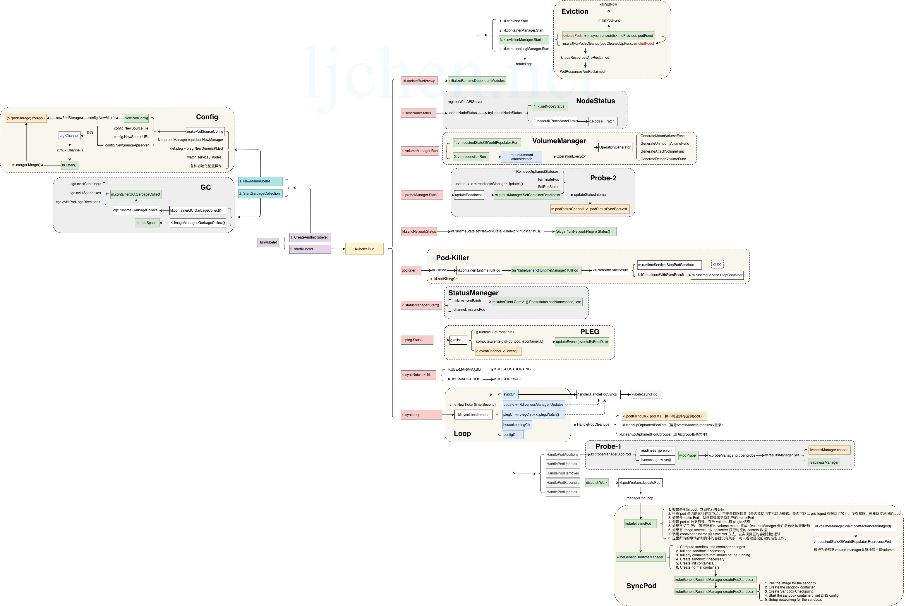

# kubelet 启动过程

kubelet 作为每个节点的agent，负责维护：node的状态，pod的声明周期管理，GC，volume的管理，非常关键。 
尤其是pod的生命周期管理，涉及到不同的channel，不同的逻辑路径，最为复杂。

### kubelet启动

kubelet涉及的内容比较多，本文只介绍kubelet的启动过程，重点包括启动哪些goroutine，每个goroutine负责什么事情。

网上有一些介绍kubelet的blog，下面是笔者觉得总结的最好的一个，启动流程图如下： 
转载自: http://www.ljchen.net/2018/10/28/kubelet%E6%BA%90%E7%A0%81%E6%9E%B6%E6%9E%84%E7%AE%80%E4%BB%8B/

### goroutines

### channel