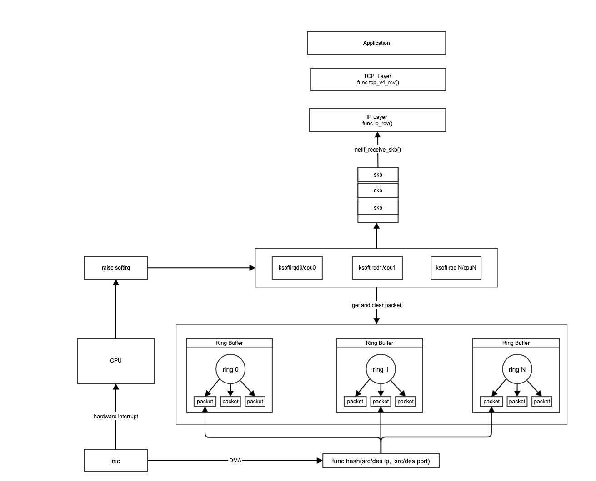
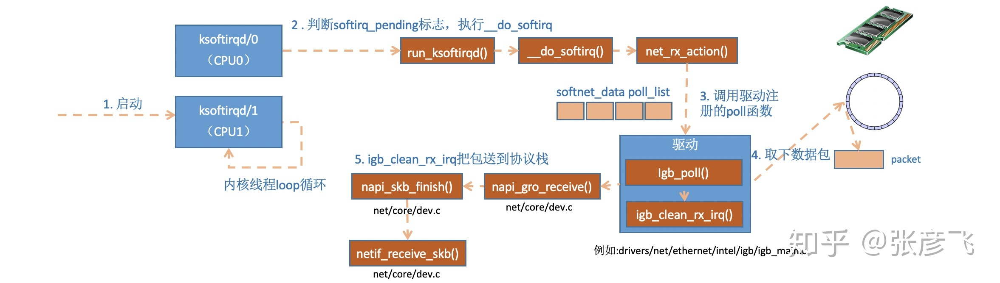
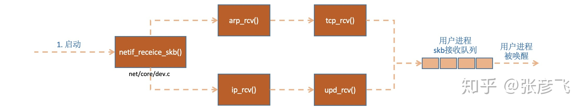
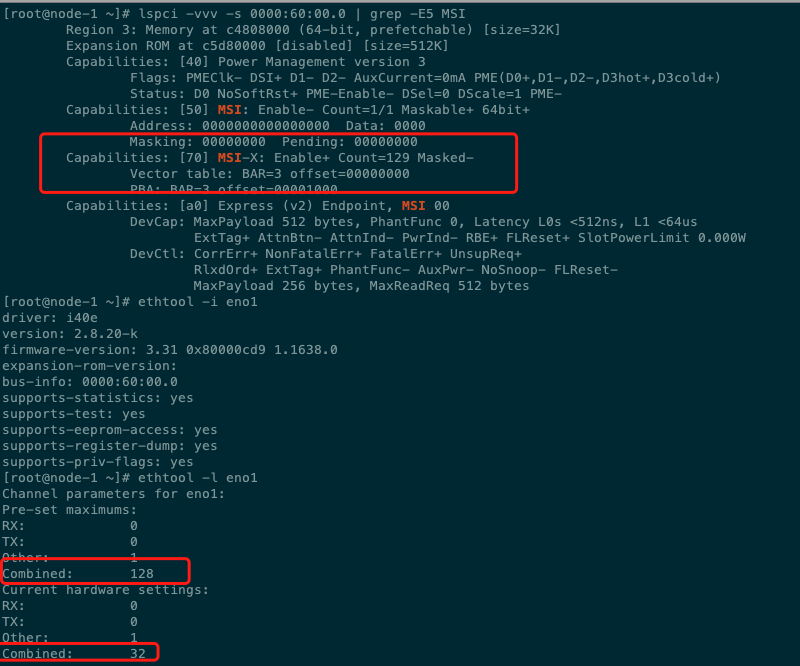
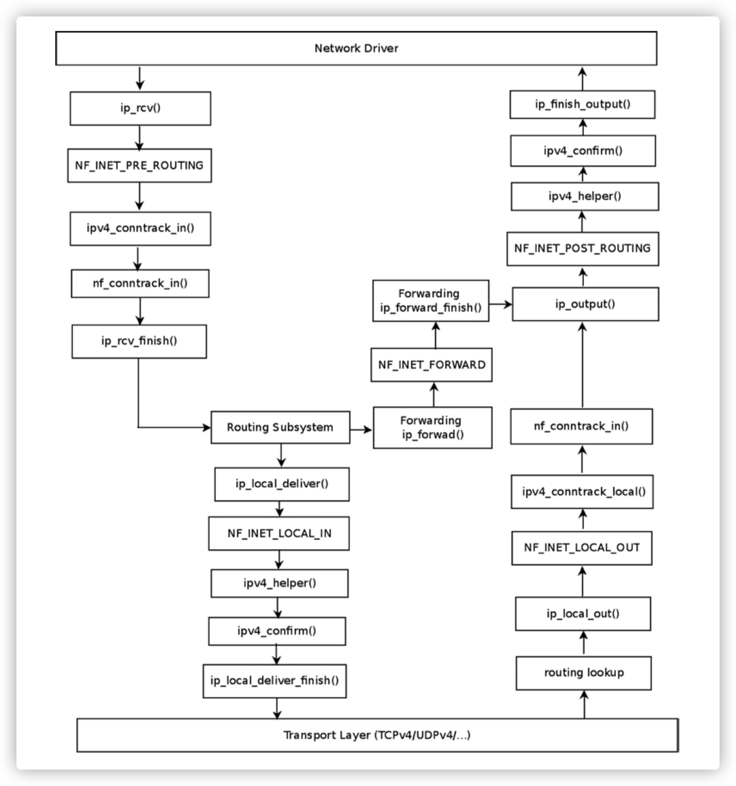
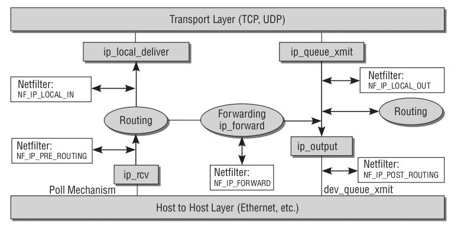
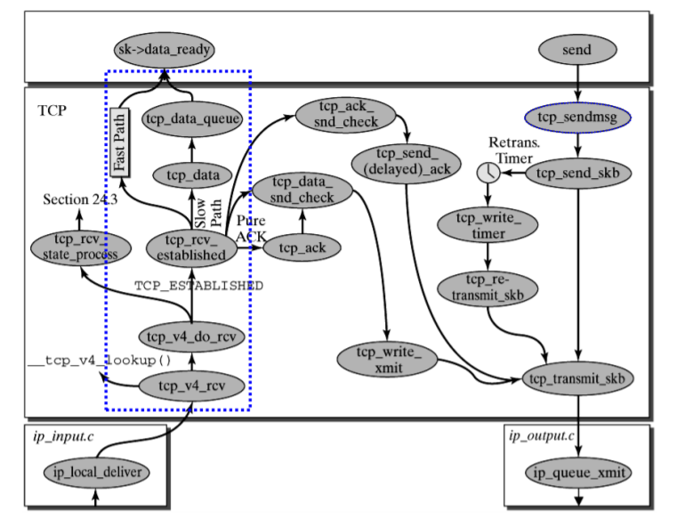
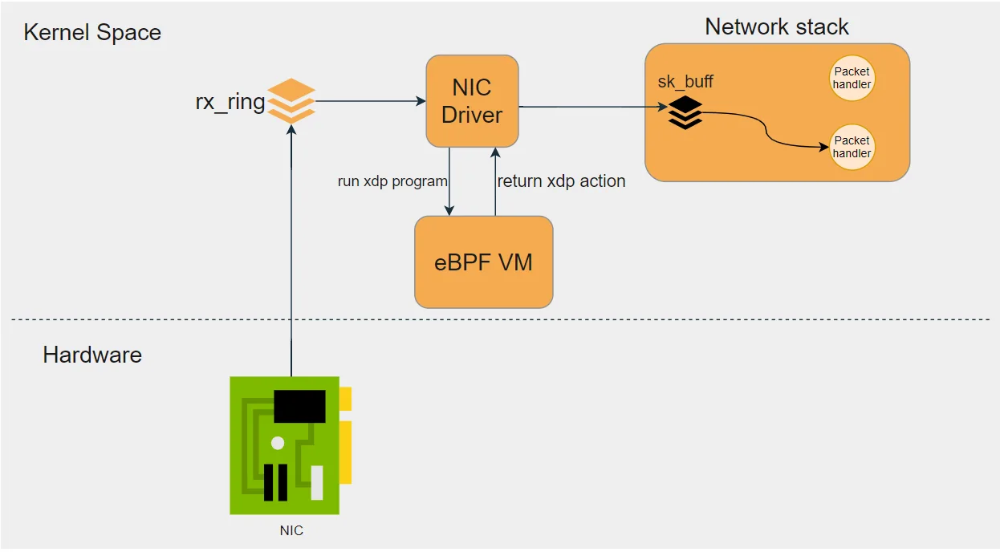
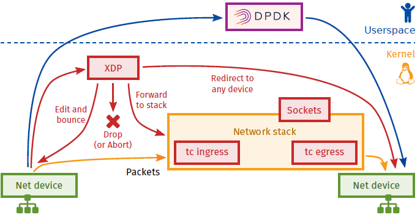

## 网络包接收过程

### 文档原因 -- "理解了实现 再谈网络性能" [[1]]
 - 目标: 容器网络性能优化
 - 路径: 基础网络包 发送/接收路径 --> 基于kube-ovn做CNI的网络包 发送/接收路径 --> 搞清路径才能搞清性能瓶颈点 --> 有针对性优化

无论是定位问题，还是性能优化，理解包的接收/发送过程是前提.

### 文档内容
- 网络包接收过程的一些技术点: nic driver，hard/soft IRQ，ringbuffer，DMA，skb，slow/fast path，dpdk, sriov, offload, 就问你晕不晕 
- 再补充几个问题:
  - 啥是多队列，多队列 四元组 hash，buffersize，软中断绑核
  - tcpdump 是在哪个环节抓到包的
  - tc qdisc 在哪里生效  
  - netfilter/iptabels的 hooks 加在哪个环节
  - conntrack 是咋回事
  - ebpf 作用在哪个环节
  - xdp 又是啥
  - 有了ovs之后，包处理过程有什么变化，ovs userspace 的vswitchd 和 kernelspace module 分别如何工作
  - ovs-dpdk的原理

上面只是产品里相关的问题，Linux网络相关的知识包含更庞杂的内容，本文内容只聚焦上面列出的内容和问题，因水平和时间有限不会深入某个点 重点是理清脉络，文档内容作为后续解决问题的参考手册


### 整体流程



图片是参照了几个文档, 自己理解之后的一张图，主要参照的图(觉得画得清楚准确的)有


这张图重点描述device driver代码(内核协议栈之前)阶段完成的事情，推荐的点:
- RingBuffer画得很清晰，即 ring 和 buffer 区分开了，ring存的是实际packet的索引(descriptor)




这两张图都来自 [图解Linux网络包接收过程](https://zhuanlan.zhihu.com/p/256428917)
- 清晰的阐明了 ```napi_skb_finish, 这个函数主要就是调用了netif_receive_skb.  在netif_receive_skb中，数据包将被送到协议栈中```
- 这篇博文 是我搜到介绍 关于包接收过程 最详实、最清晰、最推荐的中文blog
- blog作者还有 更NB的"修炼内功"系列文章 也出了书，值得一键三连

文字描述如下 [The Journey of a Frame through a Linux Based System](https://www.fir3net.com/UNIX/Linux/the-journey-of-a-frame-through-a-linux-based-system.html)
- Frame is received by the network adapter.
- Frame is moved (via DMA) to a RX ring buffer in kernel memory*.
- The NIC notifies the system of that there is a new frame ready for processing by raising a hardware interrupt (IRQ)**.
- The IRQ is cleared on the NIC and the kernel executes the device driver which drains the RX ring via SoftIRQs.
- The SoftIRQs place the frames into a kernel data structure called an sk_buff or “skb” (i.e socket buffer).
- The frame is passed up through the networking stack for further processing.
- The packet finally arrives at the receive socket buffer (also known as the receive window).
- Application calls the read system call. The area is changed to the kernel area and the data in the socket buffer is copied to the userspace of the application.

### 关键环节
以上环节, 笔者在理解过程有几个模糊的点，反复通过几篇blog交叉验证
- ringbuffer 其实有两部分 [[2]]
  - a ring ( fixed-size circular queue ) of descriptor / address which points to memory regions holding data
  - The “buffer” or memory part is quite a hidden place for us, which is handled by kernel in the background
  
- 网卡多队列是不是就应该有 多个ringbuffer以及多个ksoftirqd 处理包
  - ```简单说就是现在支持 RSS 的网卡内部会有多个 Ring Buffer，NIC 收到 Frame 的时候能通过 Hash Function 来决定 Frame 该放在哪个 Ring Buffer 上，触发的 IRQ 也可以通过操作系统或者手动配置 IRQ affinity 将 IRQ 分配到多个 CPU 上。这样 IRQ 能被不同的 CPU 处理，从而做到 Ring Buffer 上的数据也能被不同的 CPU 处理，从而提高数据的并行处理能力```[[3]]

- 关于NAPI schedule, 网卡驱动注册的poll(), softirq balance 这一块链接中的文章也有介绍, 因为生产中暂未遇到相关问题 这里没有继续深入看

### 回答文章开始的问题

- 网卡多队列确实能提高网络吞吐，这个在分析过程中理论清晰，在EKS网络性能的问题里也已经验证
- 数据包分散到多个多列 前提是四元组hash之后结果不同，所以多队列测性能需要注意这一点
- lspci, ethtool 命令查看 网卡多队列信息 [[4]]
  
- 是否应该增加ringbuffer size
```
[root@node-3 ~]# ethtool -g ens1f0np0
Ring parameters for ens1f0np0:
Pre-set maximums:
RX:		8192
RX Mini:	0
RX Jumbo:	0
TX:		8192
Current hardware settings:
RX:		8192
RX Mini:	0
RX Jumbo:	0
TX:		8192

ethtool -G ens1f0np0 rx <new value>
```
- tcpdump 在哪里生效 [[1]]
```
static int __netif_receive_skb_core(struct sk_buff *skb, bool pfmemalloc)
{
    ......

    //pcap逻辑，这里会将数据送入抓包点。tcpdump就是从这个入口获取包的
    list_for_each_entry_rcu(ptype, &ptype_all, list) {
        if (!ptype->dev || ptype->dev == skb->dev) {
            if (pt_prev)
                ret = deliver_skb(skb, pt_prev, orig_dev);
            pt_prev = ptype;
        }
    }
```

- iptables 在哪里生效
  
  - 在 netif_receive_skb() -> ip_rvc() 之后 [In-depth understanding of netfilter and iptables](https://www.sobyte.net/post/2022-04/understanding-netfilter-and-iptables/)
  

  - 上面是整个network dirver和IP layer的交互点，以及IP layer层的函数，下面是netfilter的部分 [[5]]
  
    
  - 下来是 IP layer 到 TCP layer [[5]]
    
    

- tc qdisc 在哪里生效
  - tc 规则主要作用在egress阶段, 更多内容会放到[发送过程](TX.md)里讲
  - 生效位置可以参照这张[netfiler wiki](https://en.wikipedia.org/wiki/Netfilter#/media/File:Netfilter-packet-flow.svg) 里的经典图
    alloc_skb()之后 ip_rcv()之前
    


- xdp/eBPF 在哪里生效
  - 参照上面的图，xdp在 alloc_skb()之前 所以肯定在 ip_rcv() kernel stack 之前
  - 参照[下面的图](https://www.seekret.io/blog/a-gentle-introduction-to-xdp/) 能帮助理解 xdp/eBPF的关系
    xdp是网卡驱动中的一个hook点, 自定的eBPF代码可以在这个hook点加入对包的处理逻辑
    
  - 关于xdp的[疑问](https://mp.weixin.qq.com/s?__biz=MzkyMTIzMTkzNA==&mid=2247511570&idx=1&sn=18d5f1045b7ed6e27e1c8fb36302c3f9&chksm=c1845943f6f3d055c2533d580acb2d4258daf2a84ffba30e2cc6376b3ffdb1687773ed4c19a3&cur_album_id=1843108380194750466&scene=190#rd) 还没理解
    ```
    XDP 不是内核旁路。它是内核协议栈的快速路径
    XDP 不替代TCP/IP 协议栈。与协议栈协同工作
    ```
    上面这两条应该是成立的，对应着[cilium的图](https://cilium.io/blog/2021/05/11/cni-benchmark/) 也能看出来，经过xdp，绕过了netfilter的表和链，但可以继续使用kernel stack的 Routing system
        
   
  - eBPF的工作机制是在一些hook点加入自己实现的处理逻辑，且支持多种语言，重点可以看下哪些地方可以[hook](https://ebpf.io/what-is-ebpf/)
    

- ovs 流表规则在哪里生效，是否需要进入host network ns
  - ovs里 ```type: internal``` 这种type的interface 在host上是能看到的，像 ovn0、br-mgmt这些设备，只有这些设备可以接入host network kernel stack的设备
  - 像vm的 tap设备，container 的veth设备 是不会接入network kernel stack的？(kube-ovn pod 访问svc 只能通过 ovn的 LB rule？) kube-ovn support [internal port](https://github.com/kubeovn/kube-ovn/wiki/%E4%BD%BF%E7%94%A8ovs-internal-port-%E5%AE%9E%E7%8E%B0Pod-NIC) 又是为了啥

- dpdk/ovs-dpdk 规则在哪里生效
  - dpdk是完全的 kernel bypass, 都交到userspace做事情, [dpdk](https://mp.weixin.qq.com/s?__biz=MzkyMTIzMTkzNA==&mid=2247523649&idx=1&sn=5bcdd0efff2d2322df4af877ea61bfcd&chksm=c1846a10f6f3e3061cb336a623a28ec04cedb002f5bf5293175412b0973119d4625fac868870&cur_album_id=1843108380194750466&scene=190#rd) 是个大topic
  

### RX调优

文章一开始的目的就是为了 调优，那根据上面RX的介绍，对应的我们可以在各个环节进行调优.

具体怎么调整呢, 我没有实践经验，可参照 [Linux 网络栈接收数据（RX）：配置调优](https://mp.weixin.qq.com/s/iDlngjHZ0oA9KgA0WoX36Q)

[1]: https://zhuanlan.zhihu.com/p/256428917
[2]: https://medium.com/coccoc-engineering-blog/linux-network-ring-buffers-cea7ead0b8e8
[3]: https://ylgrgyq.github.io/2017/07/23/linux-receive-packet-1
[4]: http://xusenqi.site/2018/11/23/%E7%BD%91%E5%8D%A1%E5%A4%9A%E9%98%9F%E5%88%97%E6%80%BB%E7%BB%93/
[5]: https://mp.weixin.qq.com/s?__biz=MzkyMTIzMTkzNA==&mid=2247510568&idx=1&sn=79f335aaab5c0a36c0a66c5bfb1619ae&chksm=c1845d79f6f3d46f81b6fd24335eb8994c9daf21b6846d80af2cad73d9f638c5dda48b02892c&scene=21#wechat_redirect