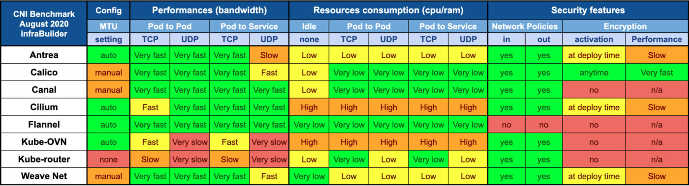

## flannel vs kuryr-kubernetes vs kube-ovn 

|  | kube-ovn  | kuryr-kubernetes | calico | cilium |  flannel |
|  ----  | ----  | ----  | ----  | ----  | ----  | 
| 网络模式 | geneve vlan | 依赖neutron 网络模式 | vxlan/IPIP  BGP | vxlan/geneve  BGP | vxlan  host-gw |
| 租户网络隔离  | 支持  | 支持 | 不支持 |  不支持 | 不支持 |
| network policy  | 支持  | 支持 | 支持 |  支持 | 不支持 |
| 固定IP | 支持  | 不支持 | 支持[[1]] |  不支持 | 不支持 |
| FIP 访问 | 支持  | 支持 | 不支持 |  不支持 | 不支持 |
| QoS | 支持  | 支持 | 支持 |  不支持 | 支持 |
| Traffic Mirror | 支持  | 不支持 | 不支持 |  不支持 | 不支持 |

### 性能 

- cni benchmark [[2]]
  
  
- 支撑集群规模/pods密度
  
- 单节点并发创建CNI消耗时间
  * kuryr-kubernetes 25s
  * kube-ovn <3s
  * flannel 1s
  * calico 1s
  * cilium 1s
  
[1]: https://docs.projectcalico.org/networking/use-specific-ip
[2]: https://itnext.io/benchmark-results-of-kubernetes-network-plugins-cni-over-10gbit-s-network-updated-august-2020-6e1b757b9e49