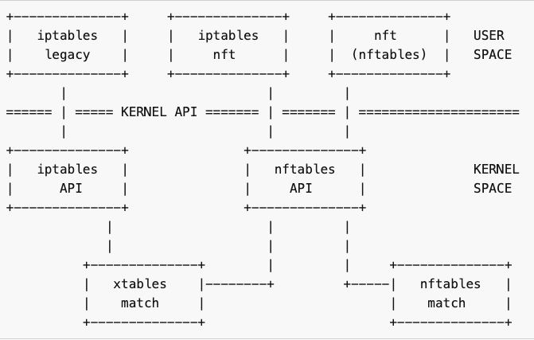
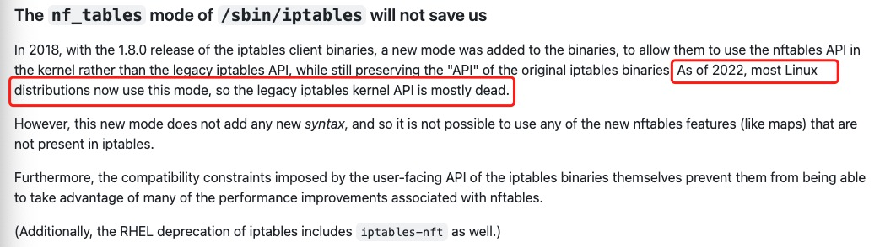
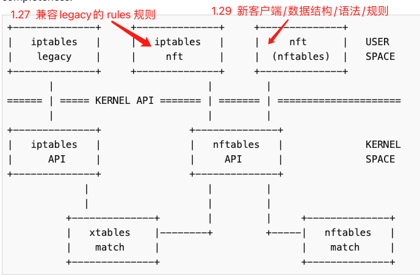
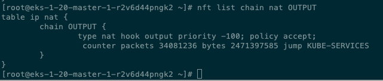

### iptables vs. nftables in Linux

Linux iptables 大家多少都有了解, nftables是Linux中iptables的successor，可以理解为下一代iptables.

和所有其他软件升级迭代一样, iptables迭代升级到nftables需要一个平滑的过程, Linux里解决这个问题的思路如下图
- user space, 提供迭代过渡的兼容工具 iptables-nft, 兼容legacy 和 nft 两种下发规则的语法, 直到过渡到nft 命令
- kernel space, 提供 nftables Kernel API, 向下兼容legacy的 xtables match匹配逻辑




### nftables in kubernetes

k8s 1.29 支持 [nftables-based kube-proxy backend](https://github.com/kubernetes/enhancements/blob/master/keps/sig-network/3866-nftables-proxy/README.md)

这个支持是指 kube-proxy全面切换到nftable，和iptables legacy使用方式是不兼容的，主要区别如下
1. nftable 不在像legacy一样要在预定的 table/chain上加规则，可以自定义table、chain、priority
2. svc 的NAT映射，legacy是基于 链式的rule 一条条匹配O(N)匹配，nftable采用map数据结构，基于 dest ip+port的映射是hash 在O(1)时间内找到

以 svc为例，假设192.168.1.100 映射 到101/102/103
legacy规则语法 需要三条设置概率值
```
iptables -t nat -A PREROUTING -d 192.168.1.100 -p tcp --dport 80 -j DNAT --to-destination 192.168.1.101
iptables -t nat -A PREROUTING -d 192.168.1.100 -p tcp --dport 80 -j DNAT --to-destination 192.168.1.102
iptables -t nat -A PREROUTING -d 192.168.1.100 -p tcp --dport 80 -j DNAT --to-destination 192.168.1.103
```

nft 规则大概是
```
nft add rule ip daddr 192.168.1.100 tcp dport 80 dnat to { 192.168.1.101:80, 192.168.1.102:80, 192.168.1.103:80 }
```

kube-proxy代码实现上，对应不同使用方式代码实现上 封装起来肯定差异包括: 数据结构、更新规则的方法. 所以对应着proxy目录下 iptables、ipvs、nftables 三个不同的实现目录.

所以, OS支持nftable和k8s使用nftable是两回事, 对于k8s<1.29版本(或者>1.29 但没配置kube-proxy使用nftable)的环境, 即使user space 工具是nftable, kube-proxy还是走iptables的代码实现, 既[The nf_tables mode of /sbin/iptables](https://github.com/kubernetes/enhancements/blob/master/keps/sig-network/3866-nftables-proxy/README.md)





### 混用引发的问题


legacy 和 nf_tables 都会在 netfilter 框架的hook里注册流量规则，注册时会设置[priority](https://unix.stackexchange.com/questions/596493/can-nftables-and-iptables-ip6tables-rules-be-applied-at-the-same-time-if-so-wh)。

legacy 默认是0，nf_tables 可以查看优先级  优先级比 legacy 高，所以 同时存在的话 legacy的规则是不生效的。



在不同版本的Linxu Release上, user space 可能提供(或者同时提供) iptables(legacy) 和 iptables(nft) 两个用户态工具。

在kubernetes的环境上, 这个问题可能更加明显, 因为不同container的rootfs 不同，携带的 iptables 工具也会不同。例如
- flannle pod里会有 iptables工具, 下发NAT规则. flannel image里同时携带 iptables(legacy) 和 iptables(nft) 两个用户态工具, 启动时会根据环境情况[做选择](https://github.com/kubernetes-sigs/iptables-wrappers)
- kube-proxy里也有 iptables, 下发svc到ep的映射规则

上面两个pods都是hostNetwork模式, 加上host上的iptables工具的使用, 所以可能存在不同版本iptables 工具在同一个 network namespace下 下发规则.


笔者实际工作中, 遇到过以下一些问题
- kube-proxy使用的是 iptables(nft) 版本, host上是 iptables(legacy) 版本, 导致host上 ```iptables -t nat -L -nv```看不到kube-proxy相关的规则, 需要 exec到kube-proxy中查看. 
- kube-proxy中 iptables v1.8.7 (legacy)下发的规则，host上iptables v1.4.21 能看到，但是iptables-save reload时, [v1.4.21版本无法识别v1.8.7的规则](https://easystack.atlassian.net/browse/EAS-100190)
- kube-proxy因为升级回滚，先后使用了 legacy、nft、legacy下发规则, 但是从nft切换回legacy之后, 再下发的规则不生效了. 即使 -F -X清楚规则, 依然不生效.


