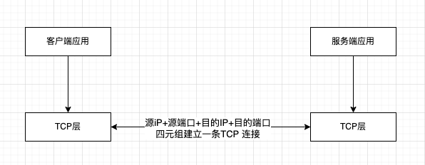
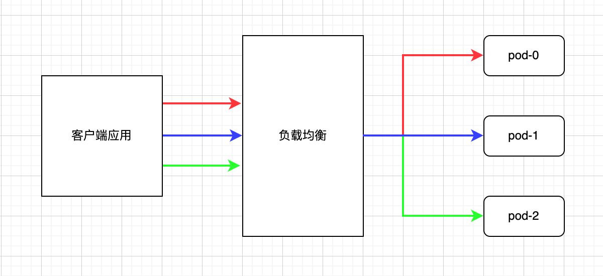
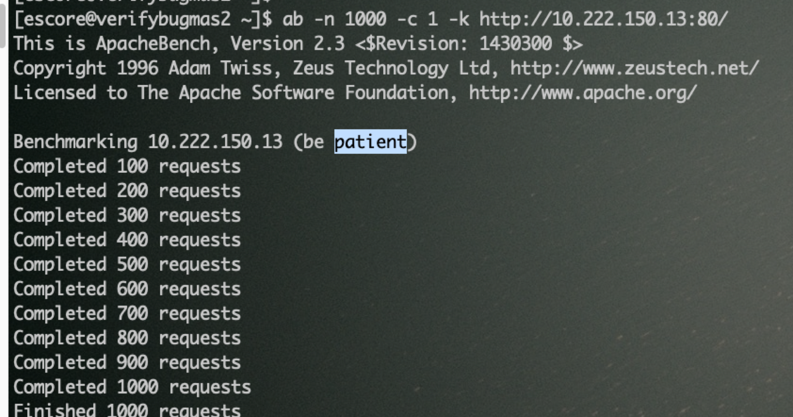
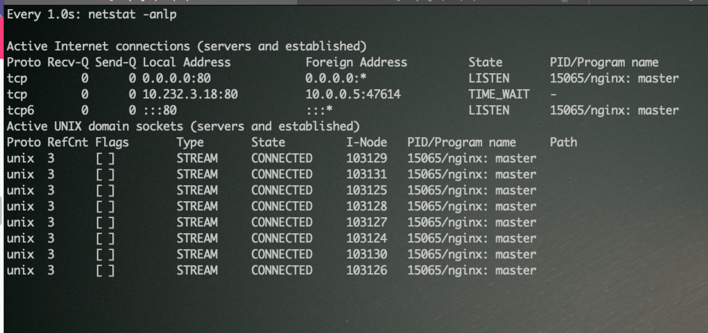
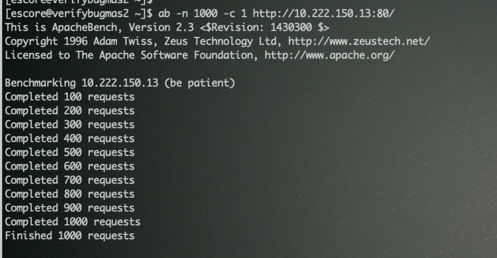
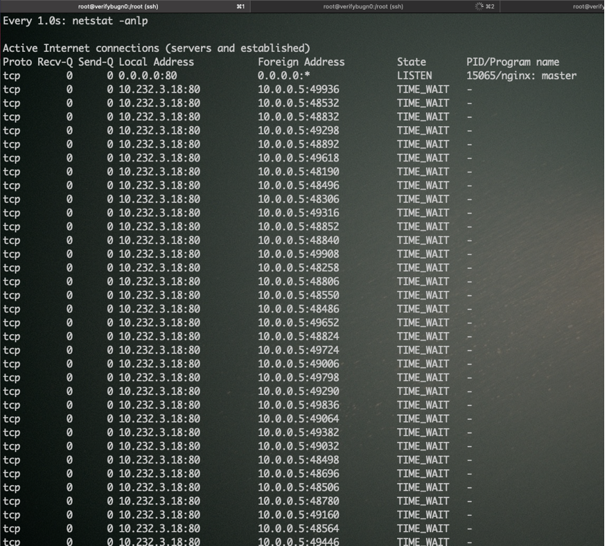
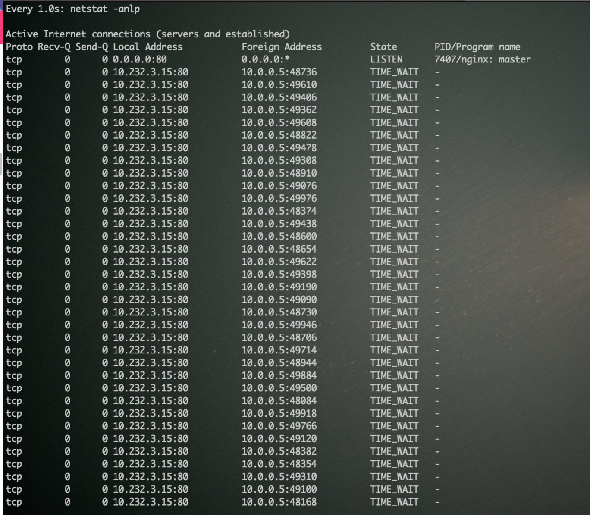
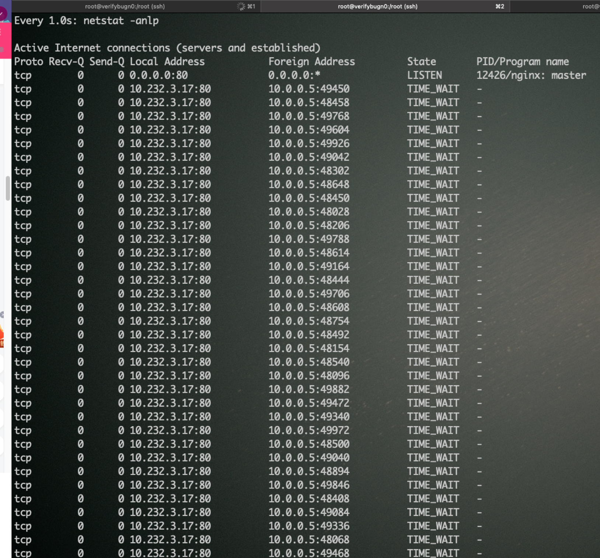

## 多个副本pods间流量不均衡问题分析

### 已知信息汇总
- 客户端 访问 服务端使用了长连接模式(复用已建立的TCP连接)
- 访问链路: 客户端 --> 硬件负载均衡器(四层LB) --> k8s节点(四层LB) --> 服务端(三副本)。
- 在server pods里，通过容器日志看 一段时间内只有部分pods有日志输出；但长时间运行后 pods里通过 netstat 查看tcp连接数量，整体上三个副本pods间连接数量在同一个数量级。

### TCP连接说明
基于TCP协议的通信，需要先建立连接。服务端通过socket建立一个对指定端口号的监听，比如8090。 客户端通过目标ip和端口就可以和服务端建立一个连接，然后进行数据传输。源IP地址、目标IP地址、源端口号、目标端口号四元组 确定标识一个TCP连接。TCP通信双方基于已经建立的连接 进行双向数据传输。

### TCP负载均衡分析

服务端应用多副本后，客户端与服务端中间引入 负载均衡(四层LB) 实现业务流量打散到多个副本上。基于TCP建立连接的工作机制，上图中 红色、蓝色、绿色分别表示不同的三条TCP连接，具体的数据传输过程有几种情况：
- 如果是新的客户端(新的源IP地址)发起访问，因为不存在已经建立TCP连接，则会新建立连接，经过负载均衡会 分配到 三个pods中的一个，达到负载均衡的效果。
- 如果已存在的客户端(同样的源IP地址)发起新的TCP连接，即重新调用 socket connect()系统调用，会使用新的源端口，这样经过负载均衡也会分配到 三个pods中的一个，达到负载均衡的效果。
- 如果是已存在的客户端 基于已经建立的TCP连接，持续发送数据包，则只会在同一个pod上接收到数据。
  假设每次发送数据 不走已经建立的TCP连接，则会出现第N个数据包到了 pod-0，接下来第N+1个数据包 可能到了pod-1。那么pod-1 没有之前的第N个数据包内容，则在网络协议栈的TCP层和应用层都会出错:
  - 在TCP层， 只有第N+1个数据包 没有第N个数据包因为seq number不对会触发TCP层面的重传；
  - 在应用层，一个完整业务逻辑需要的数据可能超过一个TCP报文大小，会在发生端被切割到多个TCP报文，服务端如果不走到同一个pod，则pod也拿不到TCP层拼装好的完整业务数据，即应用层也无法处理不完整的数据。

所以，因为客户端和服务端使用长连接模式，根据以上TCP通信机制分析，已经建立TCP连接后，双方只会基于已建立连接通信，否则反而会出错。
三副本pods中短时间内看到的日志不均衡现象，其实是当前这一条TCP连接中持续有数据通信，如果客户端发起新的连接(新的源IP或者新的源端口)，会触发负载均衡机制，打散调度到三个pods中。

### 测试验证

http是基于tcp的上层协议，可以部署基于http的简单web应用做验证,  使用ab工具模拟客户端访问   指定-k参数 即复用已经建立的TCP连接，不指定 -k 参数即每次建立新的TCP连接。测试内容及结果如下。

- 客户端添加-k参数，复用TCP连接，请求三副本情况下，只有一个pod的内建立了一条tcp连接

  

- 客户端不添加-k参数，每次创建新TCP连接，三个pod内都创建了大量的tcp连接

### 如何解决
- L4层负载均衡, 无论什么LB算法, 无论是硬件LB还是k8s的iptables, 只能对建立TCP连接这一建立过程做负载均衡 本质只是做了DNAT和SNAT, 对于已经建立的TCP连接不会再做任何处理 [Load balancing and scaling long lived connections in Kubernetes](https://learnk8s.io/kubernetes-long-lived-connections), 因为无法介入L5-L7做业务层面的负载均衡。所以L4负载均衡性能也是最好的, 也就是QPS测试看到 nodeport结果要优于 ingress-controller。
- 基于客户端使用长连接访问方式，如果想进一步实现流量均衡打散到pods，可以修改客户端访问服务端的逻辑 例如: 每个客户端建立3*N个连接且业务请求尽量分散到不同的连接上，或者服务端增加主动释放TCP连接的逻辑。
- 引入L7代理, L7代理承接所有客户端请求, 基于L7层信息 维护和upstream server pods的连接以及请求分散。例如:
  - ingress-controller 作为集群内pods的 http L7代理。
  - linkerd 作为grpc的L7层代理: [grpc-load-balancing-on-kubernetes-without-tears](https://kubernetes.io/blog/2018/11/07/grpc-load-balancing-on-kubernetes-without-tears/)