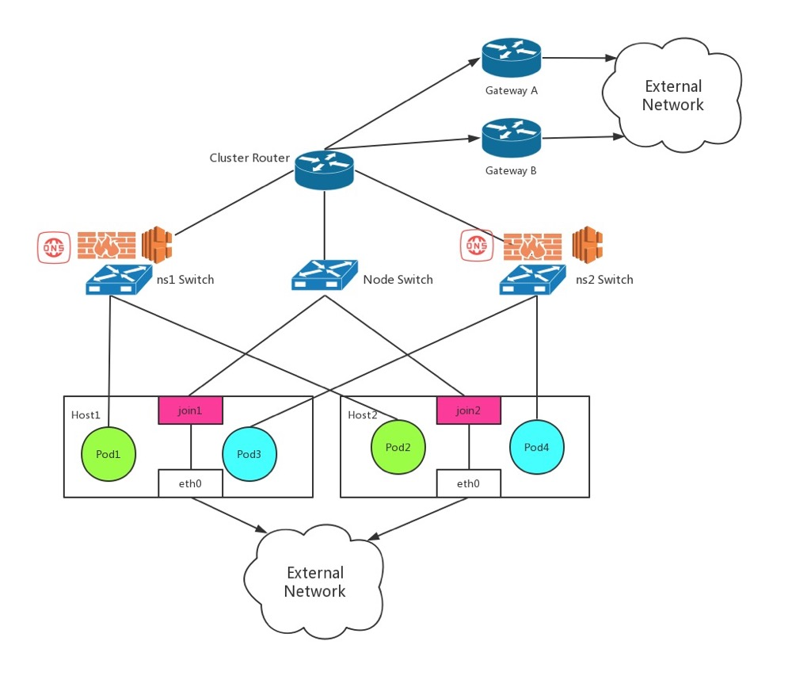

### kube-ovn 原理


- 第一印象: golang版本的 kuryr-kubernetes
  
- 对比kuryr-kubernetes
  * list-watch: 基于client-go/informers
  * IPAM: kube-ovn实现, 直接调用ovn, 不依赖neutron(kuryr)
  * CNI: netlink.LinkAdd(), ovs.Exec(), 不依赖ovs-agent(kuryr)
    
- 更稳定, 更高效

### kube-ovn 网络拓扑



- 上图是默认VPC(router)的网络拓扑

- 多个VPC网络拓扑

### kube-ovn 功能

- 功能列表可以参考 [[5]], 功能上确实是把传统IaaS的网络能力赋能给k8s平台, 但还有一些大坑 
  
  * subnet隔离(private=true) 和 EIP/SNAT 功能有冲突, 原因是ACL规则配置的不合理
  * 多VPC下, service功能不work, 需要为将LB绑定到VPC的switch上
    ```kubectl ko nbctl ls-lb-add c3288d04-85ab-45a3-b4ae-32fe9e840ba3 90d447f9-b77a-4afa-bdd8-0d5648bbecc8```
  * 多VPC下, Pod和节点网络不通, 导致:
    * 探针问题: Add TCP/HTTP/network requests to the CRI API [[6]] [[7]]
    * hostnetwork Pod问题

  * 多VPC下, Pod和节点网络如果互通, 不同VPC subnet CIDR重叠问题


### multus-cni+flannel+kube-ovn

- 引入multus-cni 通常是为Pod分配多块网卡, 当前产品里使用multus-cni还是作为网卡选择器来使用: 不同节点选择不同CNI

- multus-cni本身比较简单, 主要搞清几个关键配置 以及 如何log调试，参照: [`multus-cni`](./multiple-cni.md)

- kube-ovn 定义为 net-attach-def 如下，目前使用起来没啥坑
```
{
    "cniVersion": "0.3.1",
    "name": "kube-ovn",
    "plugins": [
        {
            "type": "kube-ovn",
            "server_socket": "/run/openvswitch/kube-ovn-daemon.sock"
        },
        {
            "type": "portmap",
            "capabilities": {
                "portMappings": true
            }
        }
    ]
}
```

### kube-ovn 峰会 FAQ [[8]]

### kube-ovn for kata

- kata想找一个能简化当前kata网络链接拓扑, 提升网络性能的CNI: https://github.com/kubeovn/kube-ovn/issues/837
  
- kata和kubevirt面临一样的问题: 要兼容k8s CNI, 又要解决qemu VM只能使用tap设备的问题
  * veth vs. tap [[2]]
  * qemu不能直接使用 veth-pair的一端 [[1]]
  * veth vs ovs internal port [[3]]
  * 容器如何使用 ovs internal port [[4]]
    
[1]: https://lists.gnu.org/archive/html/qemu-discuss/2015-10/msg00002.html
[2]: https://linux-blog.anracom.com/2016/02/02/fun-with-veth-devices-linux-virtual-bridges-kvm-vmware-attach-the-host-and-connect-bridges-via-veth/
[3]: http://flavioleitner.blogspot.com/2015/05/open-vswitch-internal-ports-and-linux.html
[4]: https://arthurchiao.art/blog/ovs-deep-dive-6-internal-port/
[5]: https://github.com/kubeovn/kube-ovn#features
[6]: https://github.com/kubernetes/kubernetes/issues/102613
[7]: https://groups.google.com/g/kubernetes-sig-network/c/nIo6ffat7TI
[8]: https://xie.infoq.cn/article/4b1a9c82be1318fd8cd823d3c