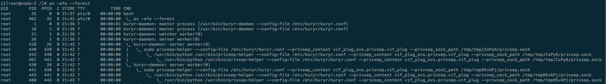

## kuryr-kubernetes

- kuryr, 捷克语, 对应英文courier, 信使/快递员. 项目就是解决leverage neutron为kubernetes提供网络服务
  
- 使用方式:
  * nested, Magnum的场景, 即: k8s集群node(VM)的网络是neutron创建的，VM里nested的containers的网络也是neutron作driver. 打开VM neutron trunk port.
  * openshift, 支持配置kuryr-kubernets(nested) 作为network driver[[1]]
  * standalone, EOS安全容器场景
  
- kuryr-kubernetes handlers:
  * CNI plugin
  * K8s Service
  * Network Policy


### kuryr-kubernetes 原理

 

- 上图是创建Pod的场景里, 各个组件非常详细的交互流程图[[2]]

- kuryr-controller, operator:
  * 监听创建(Pod, service)事件
  * call neutron create port
  * annotate Pod vif info
  * while port.status != Active: show port
  * port.status == Active: annotate port

- /opt/cni/bin/kuryr-cni, golang binary, 向上作为kubelet(CRI)的CNI plugin, 向下Call kuryr-cni-daemon

- kuryr-cni-daemon, python flask server, 多进程:
  * service manager, 多进程管理
    ```$xslt
            self.manager = multiprocessing.Manager()
            registry = self.manager.dict()  # For Watcher->Server communication.
    ```
    
  * Server, 作为CNI cmdAdd() cmdDel()的server, 以 self.plugin.add()为例
    * 2层: os_vif.plug(), 把ovs port 插到 br-int上
    * 3层: _configure_l3(), 配置routes
    * loop check registry, 返回cmdAdd()结果
 
  * Watcher, operator，监听Pod MODIFIED 事件(annotate), 更新Pod port状态到registry


### kuryr-daemon 进程模型问题



- [`kuryr-daemon 孤儿进程问题`](../operating-system/process.md)

### kuryr-kubernetes operator 问题

- [`Operator Deep Dive`](../operator.md)


[1]: https://github.com/openshift/cluster-network-operator#configuring-kuryr-kubernetes
[2]: https://docs.openstack.org/kuryr-kubernetes/train/devref/kuryr_kubernetes_design.html
[3]: https://bugs.launchpad.net/kuryr-kubernetes/+bug/1842689
