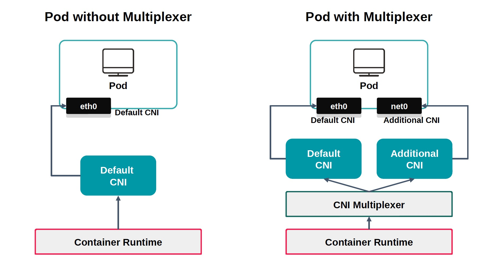
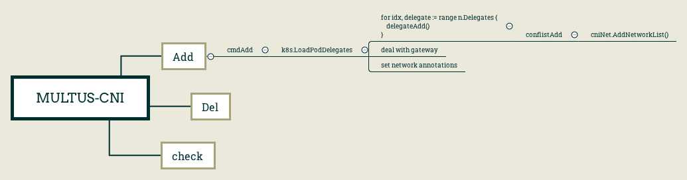

## multus-cni


### 为什么Pod需要多网卡

- 应用的网络隔: 管理网、数据网
- 高性能网络: SR-IOV
- 容器+虚机网络互通: 相同网络、统一网络方案


### Pod多网卡方案选型

- multus-cni, intel开源方案, 迁到 [[5]]. 文档清晰，上手方便，部署简单，很容易支持多cni，star更多, github有持续更新
- cni-genie, 华为开源方案，star少，最后一个commit是2019年2月

- 备注: 上面是2020年初调研时还能看到不同的开源方案。到2021再看，基本Pod多网卡方案只会讨论multus-cni了

### "multus"这个单词 -- 拯救强迫症患者
- 拉丁语, “许多”的意思
- kubernetes, 希腊语, helmsman or pilot
- kuryr, 捷克语, courier, 信使/快递员


### multus-cni 原理





- multus-cni 本身是个二进制CNI，作为节点cni plugin入口，依赖daemonset Pod做初始化
  * copy cni binary 到/opt/cni/bin
  * re-generate(基于当前的configfile) cni configfile 到 /etc/cni/net.d/
  * /etc/cni/net.d/multus.d/multus.kubeconfig, multus-cni call k8s API
  
- 读取Pod annotation中网络配置, 为不同Pod配置执行不同的CNI配置


### multus-cni 配置 [[1]]

- NetworkAttachmentDefinition, Namespace Scoped(新版本里有开关控制), 通过CR定义多个不同CNI config
```$xslt
apiVersion: k8s.cni.cncf.io/v1
kind: NetworkAttachmentDefinition
metadata:
  name: kuryr
  namespace: secure-container
spec:
  config: '{
"cniVersion": "0.3.1",
"name": "kuryr",
"debug":true,
"plugins":[
  {"type": "kuryr-cni"}
]
}'
```

- 配置机制灵活:
  * 配置文件里的定义会作为全局默认配置
  * Pod Annotations里为某个Pod 单独定义

- 主要配置
  * clusterNetwork(string, required), v1.multus-cni.io/default-network: 容器默认网卡
  * defaultNetworks ([]string, required), k8s.v1.cni.cncf.io/networks: 容器其他网卡
  * delegates ([]map,required), 定义在multus cni 配置文件
  * If you use clusterNetwork/defaultNetworks, delegates is ignored
  
```$xslt
[root@node-4 ~]# cat /etc/cni/net.d/00-multus.conf | python -m json.tool
{
    "capabilities": {
        "bandwidth": true,
        "portMappings": true
    },
    "cniVersion": "0.3.1",
    "delegates": [
        {
            "cniVersion": "0.3.1",
            "name": "cni0",
            "plugins": [
                {
                    "delegate": {
                        "forceAddress": true,
                        "hairpinMode": true,
                        "isDefaultGateway": true
                    },
                    "type": "flannel"
                },
                {
                    "capabilities": {
                        "portMappings": true
                    },
                    "type": "portmap"
                },
                {
                    "capabilities": {
                        "bandwidth": true
                    },
                    "type": "bandwidth"
                }
            ]
        }
    ],
    "kubeconfig": "/etc/cni/net.d/multus.d/multus.kubeconfig",
    "name": "multus-cni-network",
    "type": "multus"
}
```


### multus-cni 问题

- 调试 [[2]]
  * logLevel
  * logFile

- ARM multus-cni, 插入两条 network-status 到 pod annotations [[3]]

- delete pod, 会调用几次 CNI cmdDelete? [[4]]

- cni not working的情况下, delete Pod，Pod会处于什么状态 Terminating or Deleted？
 

[1]: https://github.com/k8snetworkplumbingwg/multus-cni/blob/master/docs/configuration.md
[2]: https://easystack.atlassian.net/browse/EAS-64028
[3]: https://github.com/k8snetworkplumbingwg/multus-cni/issues/426
[4]: https://github.com/kubernetes/kubernetes/issues/20379
[5]: https://github.com/k8snetworkplumbingwg/multus-cni