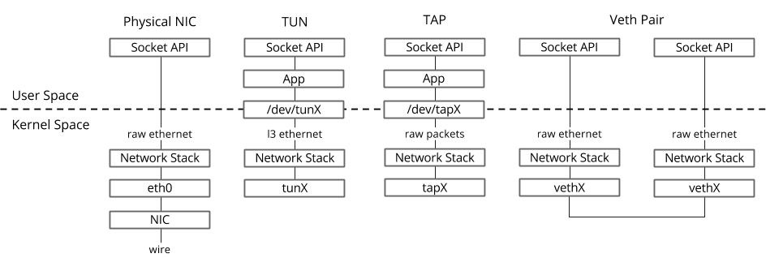
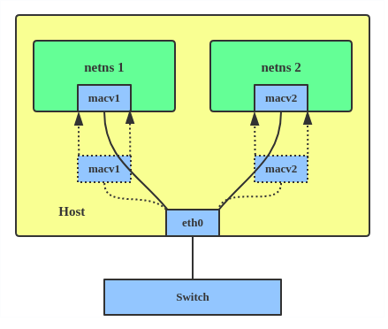
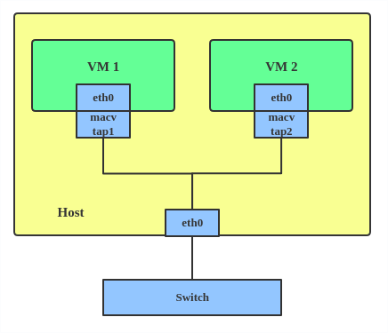

## 网络基础 -- 从入门到劝退

众所周知网络基本上算是云计算里最复杂的一块了, 谈到网络, 就建议大家直接放弃了, 再见，本期到此结束

言归正传, 面对未知的技术大山: 
 - 先分解, 庖丁解牛逻辑上划分清楚范围
 - 按捺住冲动，放弃暂时不需要搞懂的部分
 - 聚焦, 依次攻克通往下一步必须要搞清楚的问题

这里介绍的"范围", 主要针对搞清楚k8s CNI相关的网络知识

所谓"基础"是指浅尝辄止了, 笔者水平无法支撑深入Deep Dive

### 虚拟设备 [[7]]

下图是单节点，虚机(tap)、容器(veth)连接拓扑图

- veth
  * veth pair成对出现, pair之间可以理解为网线直连, 通常用于连接两个ns
  * hairpin mod, bridge的某个端口打开hairpin mode后允许从这个端口收到的包仍然从这个端口发出, 具体问题参见[[5]]
    
- tap
  * qemu不能直接使用veth-pair [[6]], 所以kata-container、kubevirt这两个向上对接k8s，向下依赖qemu的项目，网络方案上就要veth<-->tap, 具体参照 [`kata-network`](../kata-container/network.md)
  * 普通的网卡通过网线收发数据包，但是 TAP 设备通过一个文件收发数据包。所有对这个文件的写操作会通过 TAP 设备转换成一个数据包送给内核; 当内核发送一个包给 TAP 设备时，通过读这个文件可以拿到包的内容。
  * tap设备单个出现, 可以连在bridge上

- macvlan

  * macvlan, 内核模块，支持为网卡绑定多个IP+MAC地址, 即原地将一个网卡虚拟为多块网卡来使用
  * macvlan CNI [[9]]
  * kuryr-kubernetes 支持macvlan模式, 作为EKS CNI [[8]]
  * ipvlan, 和macvlan类似，都是从一个主机接口虚拟出多个虚拟网络接口，区别就是所有的虚拟接口都有相同的macv地址，terway使用了ipvlan
    
- macvtap

  * macvtap是对macvlan的改进，把macvlan+tap的综合产物
  * 对qemu的场景，bridge+tap 可以替换为 macvtap [[10]]

### overlay [[11]]

- ipip: calico
- vxlan: cilium, calico, flannel
- geneva: ovn, cilium

### SR-IOV网卡给容器使用
依赖 https://github.com/k8snetworkplumbingwg 三个组件:
  - sriov-network-operator： 做sriov网卡的初始化配置
  - sriov-network-device-plugin： 发现节点上sriov网卡的VF设备
  - sriov-cni: CNI为workload分配网卡

### InfiniBand（直译为“无限带宽”技术，缩写为IB）
  - IB与以太网、光纤通道竞争, 用于计算机与计算机之间的数据互连。InfiniBand也用作服务器与存储系统之间的直接或交换互连，以及存储系统之间的互连.
  - Infiniband是一种专为RDMA设计的网络, RDMA是一种直接存储器访问技术，它将数据直接从一台计算机的内存传输到另一台计算机，无需双方操作系统的介入。这允许高通量、低延迟的网络通信，尤其适合在大规模并行计算机集群中使用。
  - SR-IOV + InfiniBand
     * howto-configure-sr-iov-for-connectx-3-with-kvm--infiniband-x [[3]]
     * ib-sriov-cni [[4]]
  
### DPDK
  - ovs-dpdk [[1]]
  - ovs-dpdk CNI [[2]]

[1]: https://feisky.gitbooks.io/sdn/content/dpdk/ovs-dpdk.html
[2]: https://github.com/intel/userspace-cni-network-plugin
[3]: https://community.mellanox.com/s/article/howto-configure-sr-iov-for-connectx-3-with-kvm--infiniband-x
[4]: https://github.com/openshift/ib-sriov-cni
[5]: https://silenceper.com/blog/202004/bridge-hairpin-mod/
[6]: https://lists.gnu.org/archive/html/qemu-discuss/2015-10/msg00002.html
[7]: https://developers.redhat.com/blog/2018/10/22/introduction-to-linux-interfaces-for-virtual-networking#
[8]: https://docs.openstack.org/kuryr-kubernetes/latest/installation/devstack/nested-macvlan.html
[9]: https://github.com/containernetworking/plugins/tree/master/plugins/main/macvlan
[10]: https://linuxnatives.net/2012/virtualized-bridged-networking-with-macvtap
[11]: https://developers.redhat.com/blog/2019/05/17/an-introduction-to-linux-virtual-interfaces-tunnels#