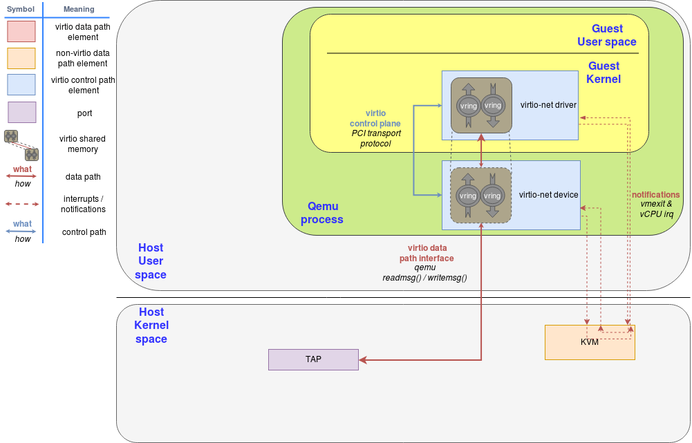
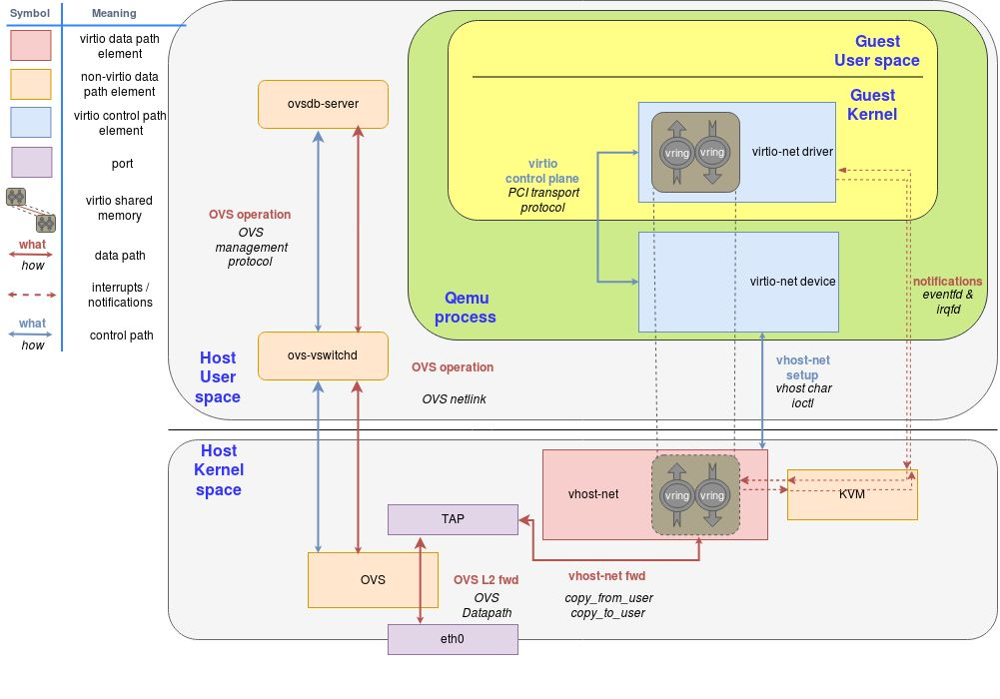
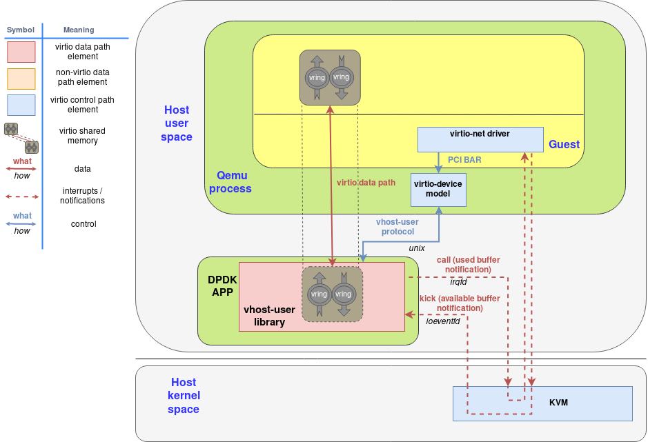

## network in vm

前面介绍的网络内容都没特殊考虑VM的场景, 但实际产品中通常还会套一层VM(virtio-net), 例如:

- VM based EKS集群: flannel vxlan性能差的一匹, 容器的网卡如何复用IaaS网络能力
- kata-container, container外面套了一层vm， 网络拓扑是啥样的，性能有啥影响
- kubevirt, vm外面套了一层container，网络拓扑是啥样的，性能有啥影响

### virtio-net [Virtio网络的演化之路](https://cloud.tencent.com/developer/article/1540284)

virtio是通用标准接口, IO半虚拟化通用方案, Guest需要知道自己运行在虚拟化环境中，进而根据Virtio标准和Hypervisor协作，从而提高IO性能。

- virtio-net
  
  
  - 在virtio 网络中，所谓的前端即是虚拟机中的virtio-net网卡驱动。而后端的实现多种多样，后端的变化往往标志着virtio网络的演化。 
  - 图中的后端即是QEMU的实现版本，也是最原始的virtio-net后端（设备）

- vhost-net

  
  - QEMU实现的virtio网络后端带来的网络性能并不如意，究其原因是因为频繁的上下文切换，低效的数据拷贝、线程间同步等。于是，内核实现了一个新的virtio网络后端驱动，名为vhost-net。
  - 与之而来的是一套新的vhost协议。vhost协议可以将允许VMM将virtio的数据面offload到另一个组件上，而这个组件正是vhost-net。
  
- vhost-user

  
  - vhost-user就是结合DPDK的各方面优化技术得到的用户态virtio网络后端
  - 基于vhost协议，DPDK设计了一套新的用户态协议，名为vhost-user协议，这套协议允许qemu将virtio设备的网络包处理offload到任何DPDK应用中（例如OVS-DPDK）  
  - vhost-user协议和vhost协议最大的区别其实就是通信信道的区别。Vhost协议通过对vhost-net字符设备进行ioctl实现，而vhost-user协议则通过unix socket进行实现。
    
### kata-container

 - many hypervisors or VM Managers (VMMs) such as virt-manager cannot handle veth interfaces. Typically, TAP interfaces are created for VM connectivity.
 - To overcome incompatibility between typical container engines expectations and virtual machines, Kata Containers networking transparently connects veth interfaces with TAP ones using Traffic Control
 - 社区关于简化kata-container的网络拓扑:
   - [RFC Direct Attachable CNIs For Kata Containers](https://github.com/kata-containers/kata-containers/issues/1922)
   - [Support disable_new_netns with Kube-OVN CNI.](https://github.com/kata-containers/kata-containers/issues/4914) 
    
### kubevirt

- 怎么样, 这个网络连接拓扑 是不是 有点复杂, simple is beautiful so...
- kubevirt的网络定义分为 backend和frontend, 对应pod的网络和vm的网络，详见[kubevirt user-gide](https://kubevirt.io/user-guide/virtual_machines/interfaces_and_networks/)
- kubevirt vm重启要求ip和mac不变, 对应kube-ovn cni支持这个功能，[details](https://easystack.atlassian.net/browse/EAS-93642), 对来自客户需求的及时支持是kube-ovn日益活跃的一个关键原因
  > 现在的 Kube-OVN 中还在做很多这种看起来不云原生，甚至反云原生的功能，例如多租户网络支持，例如一边倒的为 KubeVirt 提供定制化的增强能力。因为之前的事情让我们了解到，当我们主观意识中认为的正确和客观存在的需求发生冲突时，那么应该发下主观的正确，多去向客观需求学习，而不是反过来。
  > --- from kube-ovn author