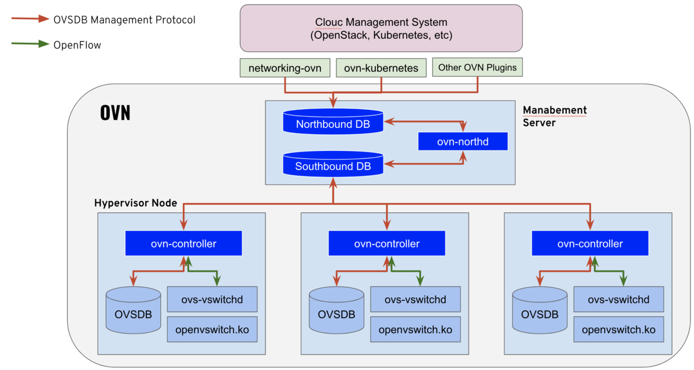

### 工欲善其事必先利其器

kube-ovn从k8s看是个cni, 从代码实现看是个operator，从ovn来看是个CMS. 但kube-ovn的核心(基础)还是底层的ovn/ovs,

所以，kube-ovn能发挥多大作用取决于对ovn/ovs的掌握程度, 至少要理解工作原理 + 常见问题排查思路, 这一篇就是总结常用的命令.


### 整体架构

 [图的来源][1]

ovn中包含三个数据库: ovn north db、ovn south db、ovsdb. 三个数据库其实是三种数据模型, 不同数据模型的转换分别是由不同进程 northd、ovn-controller完成
- 关于业务层的**数据模型**, 推荐阅读[我非要捅穿这 Neutron 上层资源模型](https://www.cnblogs.com/jmilkfan-fanguiju/p/10589718.html#Network_6), 对理解neutron中对provider network的抽象与封装很有帮助, 举一反三 理解其他问题的数据模型也建议这样做, 即抓住本质 一眼看到底, 做到真理解.
- north db(nb), 存储ls、lr、ACL、port等信息，目前基于ovsdb-server，未来可能会支持etcd v3 [[2]]
- south db(sb), 比较特殊它同时接受两边的"写入" [[3]]
  - sb中的流表是ovn-northd进程修改的，ovn-northd会"监听"nb的改变，把逻辑交换机、路由器的定义转换成流表（Flow）写入到sb数据库
  - ovn-controller启动之后会去主动连接到sb，把自己的IP地址（Chassis），本机的OVS状态（Datapath_Binding）写入到sb，同时ovn-controller还"监听"sb中流表的变化 去更新本地的OVS数据库，也就是流表下发。
    
- 如图 红线是**ovsdb协议**, 是三个db之间同步/转换数据的协议; 绿色是**openflow协议**, 是给ovs-vswitchd下发规则的协议


无论手动执行 还是 kube-ovn代码执行的命令，从内容上大概可以分为两类
- 设备, 集中的逻辑设备(lr、ls), 节点上的设备(br-int、port、veth)
- 规则, 集中的(lr-route-add、lr-nat-add), 节点上(vlan、bond)


### 常用命令

ovn-nbctl常用查询操作
```cgo
//policy路由
ovn-nbctl lr-policy-list ovn-cluster

//lb 查询
()[root@ovn-tool-0 /]# ovn-nbctl lb-list
UUID                                    LB                  PROTO      VIP                    IPs
4c0c0e82-4acb-4f70-8528-2c56b96307a8    cluster-tcp-load    tcp        10.222.0.1:443         10.42.1.4:6443,10.42.1.5:6443,10.42.1.6:6443
                                                            tcp        10.222.169.170:9402    10.16.0.9:9402
                                                            tcp        10.222.68.132:443      10.16.0.15:10250
()[root@ovn-tool-0 /]# ovn-nbctl ls-lb-list 34e84f83-9c81-4c8d-8b3e-f3f2ed0bd9db
UUID                                    LB                  PROTO      VIP                    IPs
4c0c0e82-4acb-4f70-8528-2c56b96307a8    cluster-tcp-load    tcp        10.222.0.1:443         10.42.1.4:6443,10.42.1.5:6443,10.42.1.6:6443
                                                            tcp        10.222.169.170:9402    10.16.0.9:9402
                                                            tcp        10.222.68.132:443      10.16.0.15:10250
()[root@ovn-tool-0 /]#

// list操作, 查看资源属性
ovn-nbctl list logical_router
ovn-nbctl list logical_switch ovn-default  
```

dump-flows操作, 查看当前的流表规则, 排查问题常用, 如[route priority问题](https://github.com/kubeovn/kube-ovn/issues/1216)
  - [priority问题内部JIRA](https://easystack.atlassian.net/browse/EAS-93407)
  - [策略路由不生效问题JIRA](https://easystack.atlassian.net/browse/EAS-111767)  
  - [ovn路由器流表梳理](https://easystack.atlassian.net/wiki/spaces/NETWORK/pages/1605043927/OVN)
```cgo
//dump router 流表
ovn-sbctl dump-flows ovn-cluster

//dump switch 流表
ovn-sbctl dump-flows ovn-default

//节点上查看 vswitchd的流表
ovs-ofctl dump-flows br-int
```

trace操作, 动态排查问题手段, 类似代码里加log. [trace介绍](https://easystack.atlassian.net/wiki/spaces/NETWORK/pages/1236078792/ovn+ovs+trace)

```cgo
//ovs trace
ovs-appctl ofproto/trace br-int in_port=33,tcp,dl_src=fa:16:3e:55:4a:8f,dl_dst=fa:16:3e:4a:d6:bc,nw_src=192.168.222.168,nw_dst=169.254.169.254,tp_dst=80 trace ping 8.8.8.8

//ovn trace
ovn-trace --detailed 234c1f60-b4c8-471c-9db5-bdbb0409fe7f 'inport == "kata-ovn-busybox.default" && icmp && eth.src == 00:00:00:FD:08:43 && ip4.src == 10.16.0.8 && eth.dst == 00:00:00:C1:27:99 && ip4.dst == 192.168.100.5 && ip.ttl==32 && icmp4.type==8'
```

查看bond设备的主备
```cgo
ovs-appctl bond/show
```

ip命令的bridge操作 [[5]]
```cgo
ip link show type bridge
```

有使用underlay网络的port之后, 查看br-int和br-ipsan之间的peer关系
```cgo
ovs-vsctl list-ports br-int
```

### 修改logical_switch到logical_router的连接关系
kube-ovn里初始化连接ls到lr的过程中出现过问题, 导致join 和 ovn-default连接到了错误的lr，需要删除后手动重新建立连接

```cgo
lsp-add join join-neutron-8dafb6f1-ca65-4a65-9011-06c236ae4c7b -- set logical_switch_port join-neutron-8dafb6f1-ca65-4a65-9011-06c236ae4c7b type=router -- lsp-set-addresses join-neutron-8dafb6f1-ca65-4a65-9011-06c236ae4c7b router -- set logical_switch_port join-neutron-8dafb6f1-ca65-4a65-9011-06c236ae4c7b options:router-port=neutron-8dafb6f1-ca65-4a65-9011-06c236ae4c7b-join -- set ogical_switch_port join-neutron-8dafb6f1-ca65-4a65-9011-06c236ae4c7b external_ids:vendor=kube-ovn
lrp-add neutron-8dafb6f1-ca65-4a65-9011-06c236ae4c7b neutron-8dafb6f1-ca65-4a65-9011-06c236ae4c7b-join
```

### 配置underlay网络
高性能使用安全容器的underlay网络, 手动配置过程 [[4]]

- 创建physical network
```
  ovs-vsctl add-br br-ipsan
  ovs-vsctl add-port br-ipsan br-ipsan--br-Bond1 -- set interface br-ipsan--br-Bond1 type=patch -- set interface br-ipsan--br-Bond1 options:peer=br-Bond1--br-ipsan
  ovs-vsctl add-port br-Bond1 br-Bond1--br-ipsan -- set interface br-Bond1--br-ipsan type=patch -- set interface br-Bond1--br-ipsan options:peer=br-ipsan--br-Bond1
  ovs-vsctl set port br-ipsan tag=1260

```

- 配置ip地址
```cgo
  ip address add 35.168.100.10/24 dev br-ipsan
  ip link set up  dev br-ipsan
```  

- 配置physical net 和 provider network的mapping关系
```cgo 
  ovs-vsctl set Open_vSwitch . external-ids:ovn-bridge-mappings=physnet1:br-ex,physnet2:br-prv,physnet20:br-vm-roller,physnet21:br-vm-mgmt,physnet22:br-vm-storpub,ipsan:br-ipsan
``` 

- 手动设置vlan网络localnet port的options, 使得vlan网络和physical net建议正确mapping 关系
```cgo
ovn-nbctl set logical_switch_port localnet.storagepub-pod-net options:network_name=physnet22

()[root@ovn-tool-0 /]# ovn-nbctl list logical_switch_port localnet.storagepub-pod-net
_uuid               : c1759edf-0767-4e98-884a-0da766fc46de
addresses           : [unknown]
dhcpv4_options      : []
dhcpv6_options      : []
dynamic_addresses   : []
enabled             : []
external_ids        : {vendor=kube-ovn}
ha_chassis_group    : []
name                : localnet.storagepub-pod-net
options             : {network_name=vm-storpub}
parent_name         : []
port_security       : []
tag                 : 1260
tag_request         : []
type                : localnet
up                  : false
()[root@ovn-tool-0 /]#
```


[1]: https://rheb.hatenablog.com/entry/openshift42ovn
[2]: https://tonydeng.gitbooks.io/sdn/content/ovs/ovn.html
[3]: https://www.cnblogs.com/weiduoduo/p/11121731.html
[4]: https://easystack.atlassian.net/browse/EAS-112292
[5]: https://serverfault.com/a/989852

