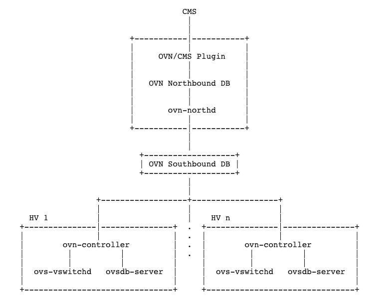
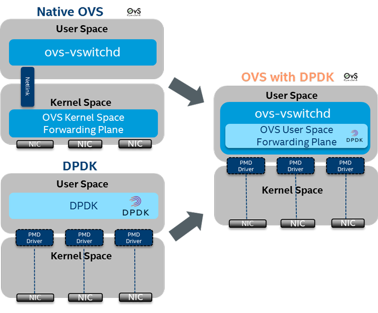
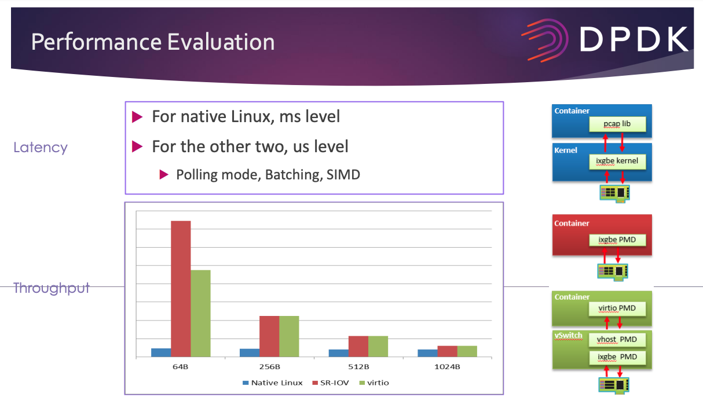

## ovs/ovn 介绍

谈到SDN, 我就google了一下 ```Top open source SDN```, 从搜到的内容来看, openvswitch的相对热度还是很高的

### ovn/ovs 架构、原理




- 上面两张图分别是 [ovn](https://man7.org/linux/man-pages/man7/ovn-architecture.7.html) 和 [ovs](https://arthurchiao.art/blog/ovs-deep-dive-0-overview/) 的架构图
- 通过这张图，能出 ovs和ovn的关系，前者是单机的vswitch，主要是SDN的dataplane 处理数据包; ovn是SDN的controlplane 负责flow规则的翻译/下发
- ovs deep dive series [[1]]

### ovs包路径

ovs通过流表规则处理包的转发, 和linux TCP/IP协议栈的L2/L3转发是不同路径, 那就会有下面的疑问

- 问题: 网卡收到包经过驱动代码处理完之后, 怎么判断是送达tcp/ip协议栈处理 还是 经过ovs 的datapath 处理呢？
- 回答: br-pub下联的物理网卡因为是ovs纳管的，所以包经过物理网卡之后 ovs有hook可以判断是走ovs流表 还是 host tcp/ip, 判断依据就是目的地址是否是 internal port
- [deep dive internal port](https://arthurchiao.art/blog/ovs-deep-dive-6-internal-port/), 简单理解 ovs bridge上的 internal port 可以配置ip，作为ovs以外的access port
- internal port 相比veth的性能优势, kube-ovn实现internal port, kata不支持internal port [[2]]

### datapath


 - datapath是ovs的组件之一, 根据上面的图二，通过ovs-vswitchd查找OpenFlow实现转发的路径称为slow-path，通过OVS datapath直接转发的路径称为fast-path.
 - 简单理解, datapath是一种机制, 可以有kernel space 和 userspace两种实现, ovs-dpdk就是一种userspace的实现

### ovs-dpdk

[dpdk解决的网络问题](https://www.cnblogs.com/goldsunshine/p/14260941.html):
 - 内存copy, dpdk技术是重载网卡驱动，直接将数据传递给用户态的应用程序，避免了中间环节的经过TCP/IP协议栈，内核空间到用户空间的copy
 - 终端处理, 同时针对网卡频繁的中断，应用程序可以使用轮询的方式获取网卡上的数据，避免中断造成的场景切换和恢复浪费的时间
 - 局部性失效, 一个数据包的处理可能跨多个 CPU 核心 [[6]]

ovs-dpdk

DPDK加速的OVS与原始OVS的区别在于，从OVS连接的某个网络端口接收到的报文不需要openvswitch.ko内核态的处理，报文通过DPDK PMD驱动直接到达用户态ovs-vswitchd里。

我们产品里目前引入dpdk主要解决三个问题 [[3]], 其实就是解决 kernel space的 datapath性能差的问题
- 基于Kernel的OVS Datapath无法支持高性能FloatingIP、SNAT、路由
- 基于Kernel的OVS Datapath无法支撑裸金属网关节点对性能的要求
- DLB/NAT网关等VNF云产品的性能依赖平台网络的pps指标

### ovs-dpdk for container

google相关内容不多, 而且资料内容基本都是intel在峰会上的介绍, 时间集中在2017年和2018年 [[4]] [[5]], 最近的是2019 kubecon的一个session [[7]]

容器在物理机上, 两种模型/思路
  

- 南北向优化, VF pass-through, 如果网卡支持SRIOV，可以使用支持DPDK的SRIOV插件将VF绑定为DPDK port直接分配给容器内的PMD应用
- 东西向优化, vswith, 对于一般物理网卡，可以在物理主机上安装OVS-DPDK，将物理网卡绑定到这个OVS，然后建立一系列OVS-DPDK port作为vhost-user后端，容器内[改进的virtio-user](https://doc.dpdk.org/guides/howto/virtio_user_for_container_networking.html) 前端为容器虚拟出来的NIC可以直接为DPDK PMD应用使用，使得容器内PMD经由virtio共享内存中转之后经由OVS-DPDK到达物理网卡或者OVS上的其它容器。
  
- virtio_user 其实就是reuse 虚机使用的 virtio PMD, 基础上进行了少量修改形成的，简单来说，就是添加大页共享的部分逻辑，并精简了整块共享内存部分的逻辑。

- 两种模型的性能比较 [Scalable High-Performance User Space
  Networking for Containers](https://www.dpdk.org/wp-content/uploads/sites/35/2016/08/Day02-Session02-Steve-Liang-DPDKUSASummit2016.pdf)
  
  
- 网络性能提升包括两个维度: 一个是平台网络转发能力(包括南北向、东西向)，另外一个是应用本身. 
  - 在我们的产品里 网络节点上ovs-dpdk 是解决南北向转发能力 相当于把网络通道打开, 提升vm/容器的pps
  - 应用本身做dpdk改造, 可以理解为基于一些 userspace TCP/IP stack 如[ANS](https://github.com/ansyun/dpdk-ans), 应用自己实现处理数据的逻辑，如 nginx-dpdk、redis-dpdk

### ovn/ovs 定位调试问题

参照 [ovn/ovs 常用命令](./ovn-cheat-sheet.md)

[1]: https://arthurchiao.art/blog/ovs-deep-dive-0-overview/
[2]: https://easystack.atlassian.net/browse/EAS-93036
[3]: https://easystack.atlassian.net/wiki/spaces/AR/pages/1647772394/DPDK
[4]: https://www.intel.com/content/www/us/en/developer/articles/technical/accelerate-container-networking-with-dpdk.html
[5]: https://blog.csdn.net/cloudvtech/article/details/80408099
[6]: https://zhuanlan.zhihu.com/p/428728980
[7]: https://kccncna19.sched.com/event/Uacf/running-high-performance-user-space-packet-processing-apps-in-kubernetes-abdul-halim-intel-peng-liu-red-hat