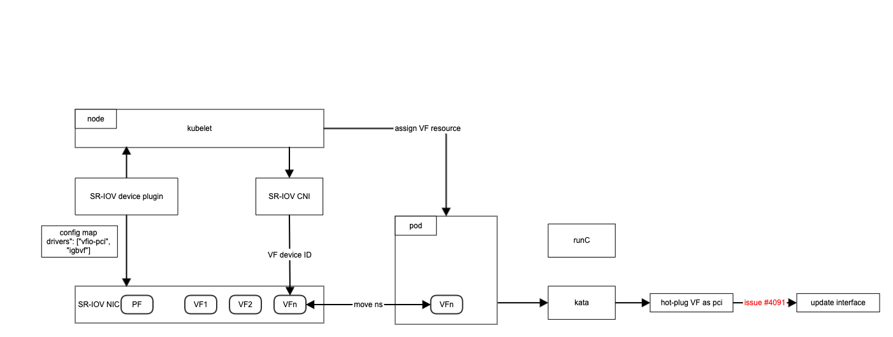
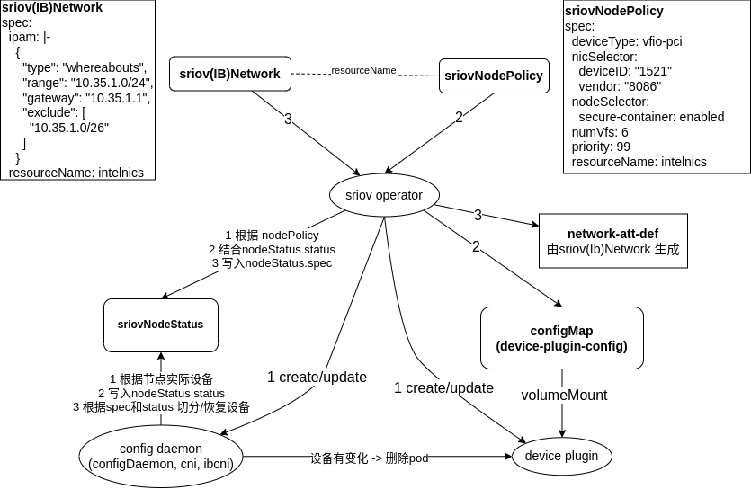

## 容器使用SRIOV网卡

### 整体架构

参照之前搞GPU的经验, 整理了下面的这张图

- device-plugin 负责 vf资源上报
- sriov-cni 负责处理网卡


图中遗留的问题:
- PF到VF的切分谁来处理
- runc和kata 使用VF需要不同的driver, 怎么配置

以上两个问题被 sriov-network-operator 完美 完美 解决

[盗图](https://easystack.atlassian.net/wiki/spaces/AR/pages/1758101667)



- 用户定义CR SriovNetworkNodePolicy, 配置对那些PF、如何做切割、resourceName是啥，operator 监听SriovNetworkNodePolicy reconcile 生成 cm device-plugin-config 给 device-plugin 用
- 用户定义CR SriovNetwork, 配置 ip cidr、gateway、ipam、使用哪个resource资源，operator 监听SriovNetwork 生成对应的 net-attach-def 给pod用
- sriov-operator 维护 两个ds sriov-config-daemon、sriov-device-plugin

综上，sriov-operator 真 operator, 啥活都干了


### 没有用的小知识

关键套件 sriov-network-operator、sriov-device-plugin、sriov-cni 有两个repo
- https://github.com/k8snetworkplumbingwg/sriov-network-operator
- https://github.com/openshift/sriov-network-operator

这两个repo啥关系呢，k8snetworkplumbingwg/sriov-network-operator的ReadMe文档 还是在说 openshift cluster，所以应该openshift发起的，然后donate到了更中立的org。 multus-nci也是一样，最早是intel维护，现在也是k8snetworkplumbingwg下面。

从 commits数量、更新频率、issues/pr数量 看，确实中立的 k8snetworkplumbingwg repo 更领先


### 上手实操

- lspci 查看网卡是否具有SR-IOV能力
```
lspci -nn | grep Eth

[root@node-1 ~]# lspci -s 3b:00.0 -vvv | grep Capabilities
pcilib: sysfs_read_vpd: read failed: Input/output error
	Capabilities: [40] Power Management version 3
	Capabilities: [50] MSI: Enable- Count=1/1 Maskable+ 64bit+
	Capabilities: [70] MSI-X: Enable+ Count=64 Masked-
	Capabilities: [a0] Express (v2) Endpoint, MSI 00
	Capabilities: [e0] Vital Product Data
	Capabilities: [100 v1] Advanced Error Reporting
	Capabilities: [140 v1] Device Serial Number 00-00-ed-ff-ff-00-ed-00
	Capabilities: [150 v1] Alternative Routing-ID Interpretation (ARI)
	Capabilities: [160 v1] Single Root I/O Virtualization (SR-IOV)
```

- lspci 查看网卡pf vf信息, 如下能看到vendorID 8086, PF ID 10fb，VF ID 10ed，这三个和 sriov-operator使用的 cm supported-nic-ids 对应
```
lspci -nn | grep -i eth
3b:00.0 Ethernet controller [0200]: Intel Corporation 82599ES 10-Gigabit SFI/SFP+ Network Connection [8086:10fb] (rev 01)
3b:00.1 Ethernet controller [0200]: Intel Corporation 82599ES 10-Gigabit SFI/SFP+ Network Connection [8086:10fb] (rev 01)
3b:10.0 Ethernet controller [0200]: Intel Corporation 82599 Ethernet Controller Virtual Function [8086:10ed] (rev 01)
3b:10.1 Ethernet controller [0200]: Intel Corporation 82599 Ethernet Controller Virtual Function [8086:10ed] (rev 01)
3b:10.2 Ethernet controller [0200]: Intel Corporation 82599 Ethernet Controller Virtual Function [8086:10ed] (rev 01)
3b:10.3 Ethernet controller [0200]: Intel Corporation 82599 Ethernet Controller Virtual Function [8086:10ed] (rev 01)
3b:10.4 Ethernet controller [0200]: Intel Corporation 82599 Ethernet Controller Virtual Function [8086:10ed] (rev 01)
3b:10.5 Ethernet controller [0200]: Intel Corporation 82599 Ethernet Controller Virtual Function [8086:10ed] (rev 01)
```  

- ip命令看到的网卡 和 lspci看到的设备 对应关系
```cgo
[root@node-1 ~]# ip a | grep enp
6: enp59s0f0: <BROADCAST,MULTICAST,UP,LOWER_UP> mtu 1600 qdisc mq master ovs-system state UP group default qlen 1000
7: enp59s0f1: <BROADCAST,MULTICAST,UP,LOWER_UP> mtu 1600 qdisc mq master ovs-system state UP group default qlen 1000
8: enp98s0f0: <BROADCAST,MULTICAST,UP,LOWER_UP> mtu 1500 qdisc mq master ovs-system state UP group default qlen 1000
9: enp98s0f1: <BROADCAST,MULTICAST,UP,LOWER_UP> mtu 1500 qdisc mq master ovs-system state UP group default qlen 1000

# 通过bus-info 可以找到设备编号
[root@node-1 ~]# ethtool -i enp59s0f0
driver: ixgbe
version: 5.1.0-k-rh8.1.0
firmware-version: 0x800000cb
expansion-rom-version:
bus-info: 0000:3b:00.0
supports-statistics: yes
supports-test: yes
supports-eeprom-access: yes
supports-register-dump: yes
supports-priv-flags: yes
```

- 使用sriov网卡作为 第二块网卡
```
apiVersion: v1
kind: Pod
metadata:
  name: sriov-rune-pod
  annotations:
    k8s.v1.cni.cncf.io/networks: eks-managed/nics
    #v1.multus-cni.io/default-network: eks-managed/kube-ovn
    io.katacontainers.config.runtime.enable_sriov: "true"
spec:
  runtimeClassName: rune
  containers:
  - name: container1
    image: docker.io/library/nginx:latest
    imagePullPolicy: IfNotPresent
    resources:
      requests:
        ecnf.io/intelnics: '1'
      limits:
        ecnf.io/intelnics: '1'
```


### 遗留问题
- sriov网卡性能测试
- whereabouts 看起来很好用呀
- multus-cni 需要改啥
- kata-container 如何获取到 sriov网卡信息