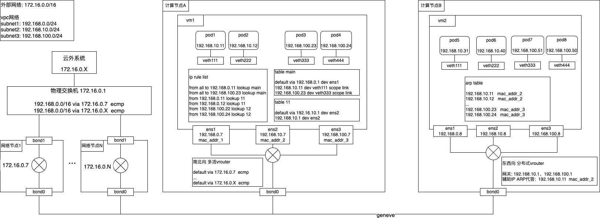
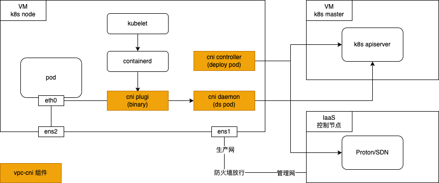

## VPC-CNI 方案

### 需求

性能上, vpc-cni将vpc网络(underlay网络)直接给容器使用, pod->svc/pod的性能指标(pps、bandwidth)几乎等于pod所在节点间的网络性能测试指标.

功能上
- 支持Pod配置使用不同subnet
- 支持Pod固定IP功能
- network policy 功能
- kubernetes service加速功能

### 技术选型

kubernetes service加速 && network policy, 实现这两个需求的最佳方案就是cilium(ebpf)了, 所以 容器数据面需要cilium提供的能力.

### 网络拓扑

### 组件介绍

