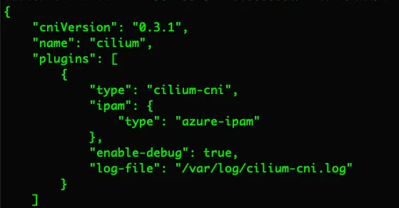

## VPC-CNI 方案


### 需求

性能上, vpc-cni将vpc网络(underlay网络)直接给容器使用, pod->svc/pod的性能指标(pps、bandwidth)几乎等于pod所在节点间的网络性能测试指标.

功能上
- 支持Pod配置使用不同subnet
- 支持Pod固定IP功能
- network policy 功能
- kubernetes service加速功能


### 技术选型

- 数据面, kubernetes service加速 && network policy, 实现这两个需求的最佳技术方案就是ebpf了, 所以 容器数据面功能/性能需求 通过cilium提供的ebpf能力实现.
- IPAM, 因为数据面需要集成cilium的ebpf能力, 也就是需要cilium-agent 给容器网卡attach ebpf prog的能力, 所以 参照了cilium现有的IPAM方案, 主要分为两大类.
  - in-tree的代码方式, 对接 OpenStack, [Add OpenStack ipam operator](https://github.com/cilium/cilium/pull/25698). 参照cilium 社区已有的 对接aws、 alibaba的方式提了PR
  - 上面的PR, 社区反馈cilium 不在想维护对接cloud的IPAM代码了, 想想也合理.
    

- out-of-tree具体如何搞呢, cilium社区结合[CNI spec](https://github.com/containernetworking/cni/blob/main/SPEC.md) 当前支持两种方式: chain 和 delegated plugin

```cgo
There are some operations that, for whatever reason, cannot reasonably be implemented as a discrete chained plugin. Rather, a CNI plugin may wish to delegate some functionality to another plugin. One common example of this is IP address management.
```
- chain, 多个plugins依次各自完整地完成cni command的工作
  - [aws-vpc-cni chain模式介绍](https://www.linkedin.com/posts/activity-7049752624467755008-abi6?utm_source=share&utm_medium=member_desktop)
  - [terway 通过chain mode集成cilium](https://github.com/cilium/cilium/pull/14436)
  - 体现到cni config(以terway为例)上就是
  ```cgo
      {
        "plugins": [
          {
            "type": "terway"
          },
          {
            "type": "cilium-cni"
          },
          {
            "type": "portmap",
            "capabilities": {"portMappings": true},
            "externalSetMarkChain":"KUBE-MARK-MASQ"
          }
        ]
      }
  ```
  
- delegated IPAM plugin, 多个plugins分工协作共同完成cni command的工作
  - [azure delegated 模式介绍](https://medium.com/@amitmavgupta/cilium-where-are-my-ip-addresses-in-aks-on-azpc-b8f567a2ce68)
  - [cilium 社区的PR](https://github.com/cilium/cilium/pull/19219)
  - cni conf
    
  
    

- ipvlan vs. veth, 节点内部 容器网卡的具体实现可以通过veth pair 也可以是ipvlan. 
  - cilium 社区文档对两种方式的比较: [veth-based versus ipvlan-based datapath](https://docs.cilium.io/en/v1.8/concepts/ebpf/lifeofapacket/?from_wecom=1#veth-based-versus-ipvlan-based-datapath)
  - cilium社区在旧版本中支持过ipvlan, 当前版本中只支持generic veth. [Remove IPVLAN support](https://github.com/cilium/cilium/pull/20453)
  - terway 即支持veth 也支持 ipvlan, 在社区文档中有体现. 对两种方式的比较[相关issue](https://github.com/AliyunContainerService/terway/issues/458#issuecomment-1596377352)  


    

### 网络拓扑


- vpc-cni:  IPAM，policy route management
- sdn:  辅助IP ARP代答

### 组件介绍


- cni controller，中心控制器 以多副本deploy方式运行，需要访问k8s API 和 neutron API，完成网卡创建/删除，辅助IP创建/删除/绑定.
- cni daemon，节点agent 以daemonset 方式运行，需要访问k8s API，完成Pod的IP分配与回收工作，设备创建、路由规则配置、ebpf attach等功能.