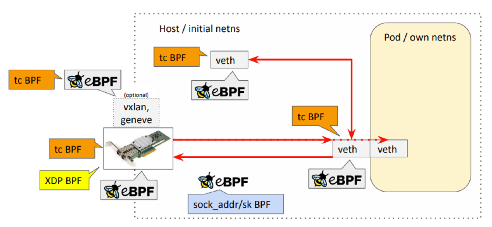
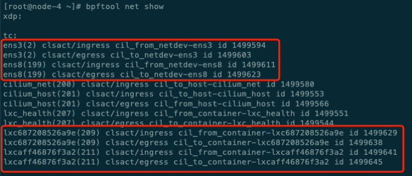
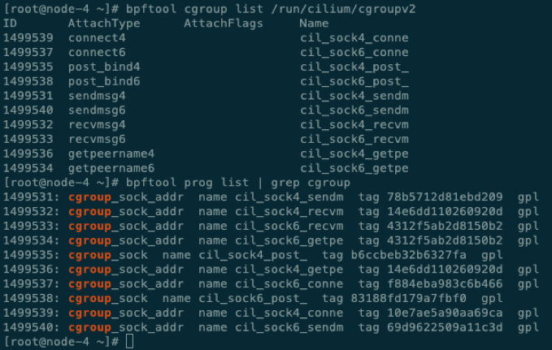
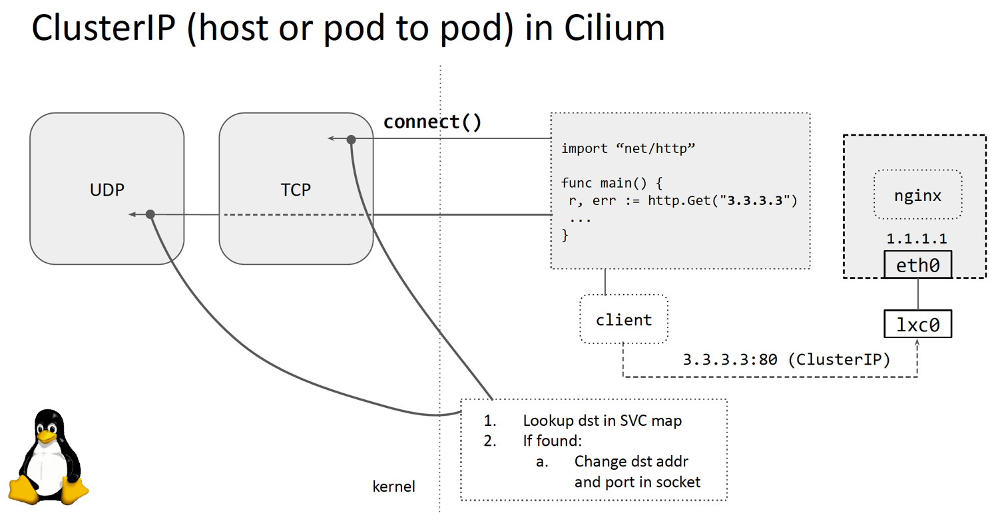

## cilium

### IPAM

cilium的IPAM逻辑还是挺复杂的, 几个关键点
- operator 分配IP
- agent 消费IP
- operator 和 agent如何通过 CiliumNode同步信息
- IP Release过程, operator 和 agent的[三次握手]( https://github.com/cilium/cilium/pull/17939)

### DataPath

datapath, 因为当前实现是通过generic veth, 所以核心包括两块
- 节点上处理不同数据网卡的 策略路由, 可参照 [`vpc-cni 方案`](./vpc-cni-2.md)中的网络拓扑图.
- ebpf prog

cilium 中主要的ebpf hook点在: tc、socket

- network policy, 作用在容器网卡的veth tc(host ns)

  

- k8s svc相关的分为两类
  - cluster-ip(E-W):  进程级别的 cgroup/connect, cgroup/sendmsg，cgroup/recvmsg 三个系统调用
  - nodeport(S-N):  节点网卡的netdev tc

cilium通过ebpf代替kube-proxy实现k8s svc这块会涉及到很多 detail的ebpf实现, 推荐阅读 cilium官方文档中 [Further Readings](https://docs.cilium.io/en/stable/network/kubernetes/kubeproxy-free/#further-readings).

这里只搬运一个关于ClusterIP svc(TCP访问)的场景
- for TCP, 只需要在connect() syscall 做一次ebpf 的ip/port 转换
- 因为是在network stack tcp layer之前，所以无需做DNAT

