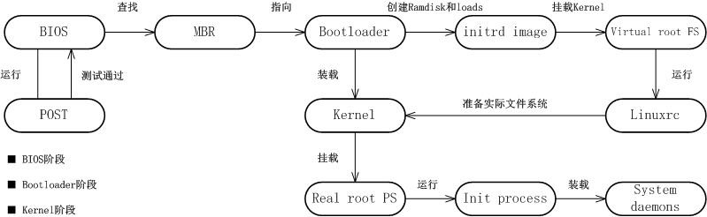
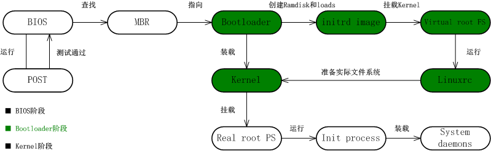
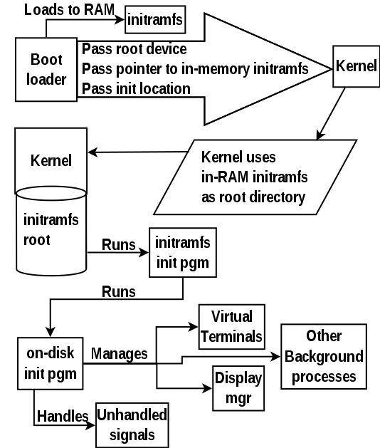
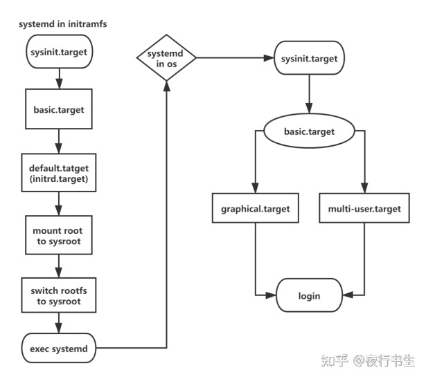

### 启动过程概述

Linux启动过程可以分为三阶段: [原文](1) [中文](2)
 - BIOS Stage 
 - Boot Loader Stage 
 - Kernel Stage



### Boot Loader Stage

这篇文章主要想搞清楚Boot Loader Stage的过程, 包括: kernel、initramfs、正式的roofs三者之间关系.



以一台安装好的Linux机器为例, boot load 阶段涉及到以下三个文件
- ```20M /boot/ vmlinuz -> /boot/vmlinuz-5.4.0+```, 可加载执行的内核压缩文件
- ``` 44M /boot/initramfs-5.4.0+.img```, 可被加载到内存的临时文件系统
  - initramfs的意义是: 为保持kernel的简洁和轻量, 将非kernel核心scope的 工具/驱动 解耦到initramfs来维护, 便于按需要重新修改编译
  - kernel加载 initramfs 到内存作为文件系统以完成后续动作, 以下文字ref [[1]]
  > The initrd is used by the Linux kernel as a temporary filesystem in the memory. <br>
  > It contains tools and kernel modules which will continue the boot process including mounting a virtual root file system temporarily.
  - initramfs通过linuxrc(一个可执行文件)，用于探测存储在磁盘上的硬件并找到合适的内核模块来驱动它们, 进而顺利 启动```/```这个真正的文件系统.
  - initramfs(kernel>=2.6) 是 initrd 的技术迭代版本, 基于tmpfs, 目前大部分系统都是使用initramfs, 某些文档里会继续使用initrd这个词.

- ```/```, 用户真正使用的根文件系统, 这里面是用户自定义安装/修改后的跟文件系统


下面是另外一个文章的启动图 [[3]], 可以作为参照对比. 这张图里包含了 boot loader stage 和 kernel stage.



### Kernel Stage

在用户真正使用的根文件系统sysroot启动之前，内核用先启动initramfs（虚根）文件系统systemd，systemd完成启动后会挂载sysroot（逻辑根目录），然后切换到根文件系统，再次执行systemd。

Tips：使用命令man bootup 可以查看系统内systemd启动流程的手册原文。

两次执行的systemd流程类似，如下图 [[4]]:



另外, 推荐一篇汇总文章 [[5]]

[1]: https://www.golinuxcloud.com/linux-boot-process-explained-step-detail/
[2]: https://www.rultr.com/tutorials/vps/3577.html
[3]: http://www.troubleshooters.com/linux/diy/howboot.htm
[4]: https://zhuanlan.zhihu.com/p/567076094
[5]: https://jaminzhang.github.io/linux/Linux-boot-process/

