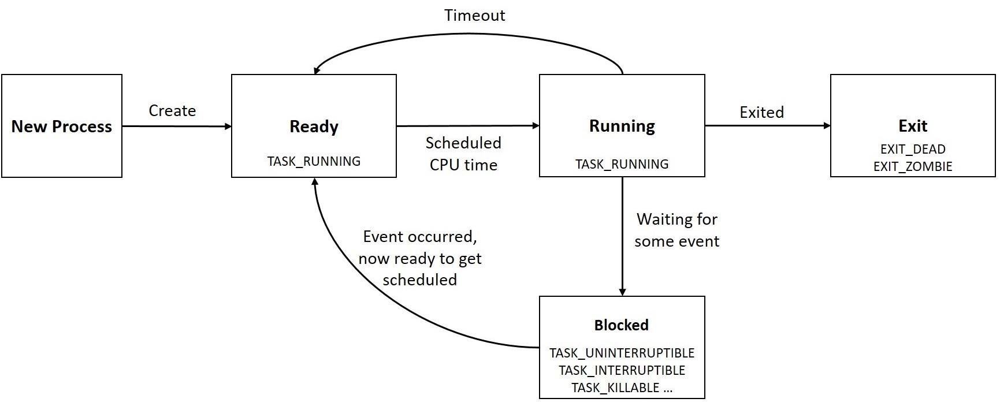
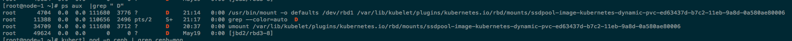

## 进程

- 进程状态
```bigquery
PROCESS STATE CODES
    Here are the different values that the s, stat and state output specifiers (header "STAT" or "S") will display to describe the state of a process:
    D    uninterruptible sleep (usually IO)
    R    running or runnable (on run queue)
    S    interruptible sleep (waiting for an event to complete)
    T    stopped by job control signal
    t    stopped by debugger during the tracing
    W    paging (not valid since the 2.6.xx kernel)
    X    dead (should never be seen)
    Z    defunct ("zombie") process, terminated but not reaped by its parent
    I    idle, was introduced in version 4.14 of the Linux kernel
```

- 状态机 [[3]]
  

- D状态: uninterruptible sleep (usually IO)
  * 为什么因为IO导致: 避免进程与设备交互的过程被打断，造成设备陷入不可控的状态(数据损坏/不一致)，类似上锁
  * 恢复D状态进程的办法: 恢复IO.
  * umount D状态
    
  * fsck D状态
  ```bigquery
    [root@node-1 ~]# ps aux | grep fsck
    root     21973  0.0  0.0 123468  1336 ?        S    Jan14   0:00 fsck -a /dev/rbd3
    root     21979  0.0  0.0 121272  1388 ?        D    Jan14   0:00 fsck.ext4 -a /dev/rbd3
    root     25814  0.0  0.0 123728  1136 ?        D    11:06   0:00 fsck -a /dev/rbd3
    root     59653  0.0  0.0 123728  1136 ?        D    10:38   0:00 fsck -a /dev/rbd3
  ```
  * 以上两个ceph导致的D问题, 找到/重启ceph-osd [[1]]
  
- D状态影响
  * ps 命令hang住，ps读 /proc/<pid>/* 时会卡住，strace ps能看到
  * pvc map/mount失败 --> Pods启动失败
  * D状态会导致 cpu load 高吗？ -- yes 
    * When the system load average is relatively high, we first need to identify whether it is a CPU problem or an IO problem.[[3]]
    * load averages reflected demand for disk resources and not just CPUs [[2]]
  * D状态会导致 iowait 高吗？ -- no, D状态的进程没有分到cpu时间片，没有cpu时间花在iowait上
  * D状态影响节点performance吗？-- no [[4]], cpu还在schedule, disk/network IO是否持续有问题

- defunct(zombie) [[5]]:
  * a process that has completed execution (via the exit system call) but still has an entry in the process table
  * entry in process table: is needed to allow parent process to read child's exit status via the wait system call
  * reap: the zombie's entry is removed from the process table and it is said to be "reaped".
  * 所有进程结束前的中间状态: A child process always first becomes a zombie before being removed from the resource table.
  * zombie processes: take no memory or CPU only process table entry -- PID
    * harbor: 父进程D状态, liveness脚本的子进程exit后无法被reaped, 导致子进程变为defunct [[7]]
    
- orphan process
  * process that is still executing, but whose parent has died
  * the orphaned child process is adopted by init (process ID 1)
  * An orphan is just a process. It will use whatever resources it uses  
  * 父进程exit 不会kill子进程吗？-- 应该发了signal，但子进程不一定能结束
    * kuryr-daemon-cni: flask作为父进程, 执行network setup操作通过python启动子进程
    * 子进程使用的pyroute2包有问题, 没有释放netns FD，导致父进程退出时, 子进程不会退出变为orphan process [[8]]
    * 节点上反复创建Pods，导致大量orphan process残留, 导致Pod oom [[6]]
    
- dumb-init
  * simple process supervisor and init system designed to run as PID 1 inside container
  * 不用dumb-init, 容器业务进程就是PID 1, 可能导致两类问题 [[9]]:
    * signals won't be handled properly: 举不出例子... 这个好像是个例子 [[10]] 
    * responsible for wait()-ing on orphaned zombie processes: kuryr-daemon-cni
    * harbor的问题是另外一种场景, postgresql 本有能力作为PID 1 reap child processes, 但D了

- busybox里看到很多ppid=0的进程, 当容器pid namespace内进程的父进程不在此pid namespace里时，那么ppid显示为0 。这里有两种情况[[11]]:
  * 1、父进程为容器外部的进程，例如docker的主进程。
  * 2、通过setns进入到namespace内部的进程。也就是docker exec注入到容器内部的进程。

## 常用命令

- ```ps -afe --forest```, 容器内查看进程间关系 很直观
- ```ps -mo pid,tid,%cpu,psr,%mem -p <pid>```, 查看<pid>的所有threads(tid)的资源使用情况，包括落在哪个核
- ```top -H -p```, top threads view, 功能类似上面功能
- ```ps -eo pid,lstart,cmd```，查看进程启动时间，v5判断dockerd containerd 退出问题
  * 已知pid: ```ps -p <pid> -o lstart```


[1]: https://easystack.atlassian.net/wiki/spaces/ESK/pages/917636657/prometheus-0+POD+fsck+hang
[2]: https://www.brendangregg.com/blog/2017-08-08/linux-load-averages.html
[3]: https://www.programmersought.com/article/16415204831/
[4]: https://community.oracle.com/tech/developers/discussion/4278766/interesting-question-on-cpu-usage-for-d-state-processes
[5]: https://en.wikipedia.org/wiki/Zombie_process
[6]: https://easystack.atlassian.net/browse/EAS-67095
[7]: https://easystack.atlassian.net/browse/EAS-74793
[8]: https://github.com/svinota/pyroute2/issues/623
[9]: https://github.com/Yelp/dumb-init#why-you-need-an-init-system
[10]: https://easystack.atlassian.net/browse/ECS-4714
[11]: https://developer.aliyun.com/article/672992