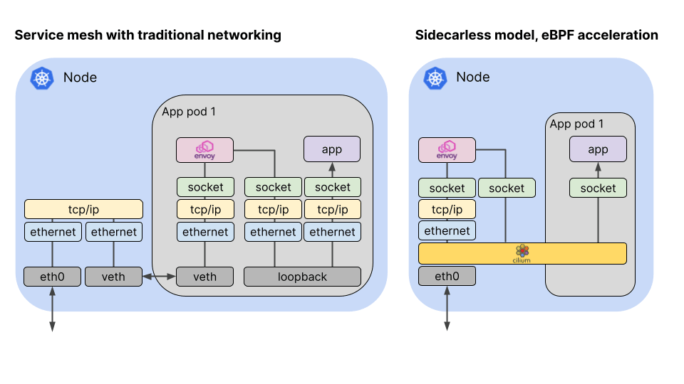
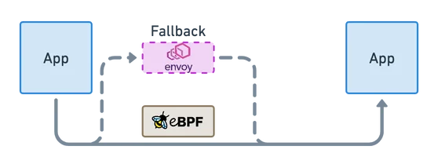
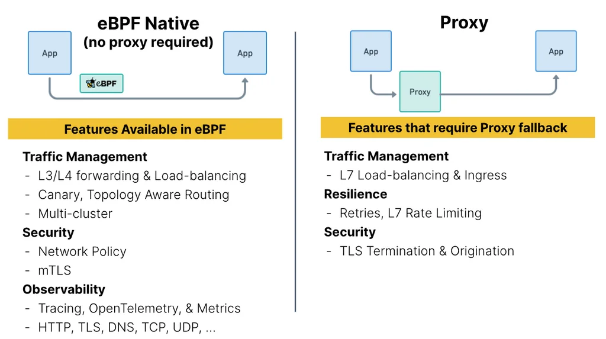

## Cilium Service Mesh

[Cilium Service Mesh – Everything You Need to Know](https://isovalent.com/blog/post/cilium-service-mesh/). 22年Jul 20, cilium发布了第一个 service mesh版本, v.12 releas

### 原理介绍

搞service mesh前, cilium 调研了市场需求, 确定了以下两个设计原则:
- Kubernetes-native
- Reduce Complexity & Overhead

下图来自[Try eBPF-powered Cilium Service Mesh - join the beta program!](https://cilium.io/blog/2021/12/01/cilium-service-mesh-beta/), 这篇博客在v1.12发布之前, 果然都是PR先行, PPT造车.
这张图看来确实很"拉风", 即sidecarless又ebpf加速, "ambient、merbridge...都别忙了, 我cilium一下都搞定了"

因为ebpf很难做L7层的traffic management [[1]] && [译文](https://jimmysong.io/blog/ebpf-sidecar-and-service-mesh/) (中文译文下面其他用户的留言对ebpf sidecareless 趋势的判断)。
那cilium如何做L7的流量治理呢? 下面是摘自文章的文字和截图, 大概理解是依赖ebpf+proxy, 同时有个fallback机制. 
> When possible, the processing is performed in eBPF at a fraction of the cost. If eBPF is not capable of processing the request, for example...,the handling falls back to Envoy running in either a sidecar or sidecar-free model. 
> This gives the best of both worlds – eBPF processing when possible for increased performance and reduced latency, with the ability always to fall back to Envoy as needed.

>What can be done in eBPF? When is a Proxy needed?

控制面支持集成Istio, 但当前只支持sidecar-based模式
> Istio is the existing service mesh control plane that is supported. It currently requires to be run with the sidecar-based datapath. We are considering bringing the sidecar-free datapath to Istio if there is interest.

### cilium vs istio

- cilium service mesh强依赖于cilium cni, 1+1>2 一体化的体验. istio是cni无感知的
- cilium的latency性能测试数据比merbridge的数据是要好看

更多的分析可参照 [云原生网络利器--Cilium Service Mesh](https://mp.weixin.qq.com/s/taPzBp6uDKRv9FGbbVVPhA)

[1]: https://www.solo.io/blog/ebpf-for-service-mesh/
[2]: 