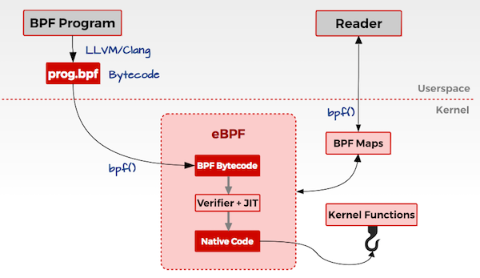
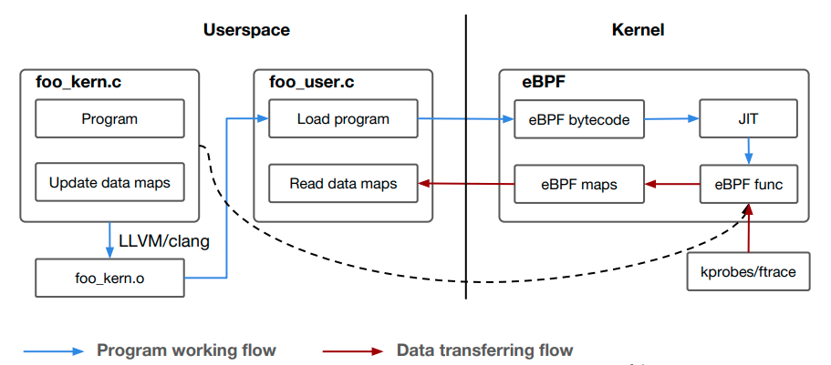
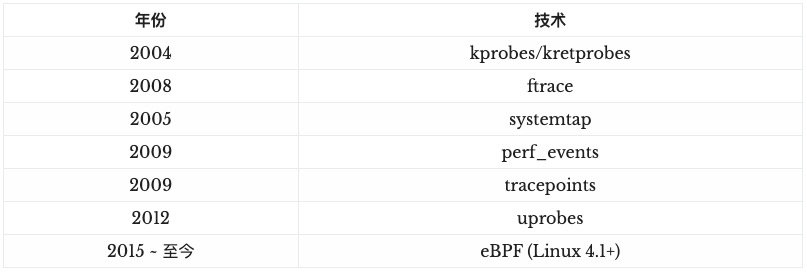

### merbridge 数据面加速原理分析

istio+envoy的架构下, 数据面默认是通过iptables实现流量的劫持, 对单个Pod的流量劫持如下图, [Istio 服务网格的现状与未来](https://jimmysong.io/blog/beyond-istio-oss/)


假设现在有一个服务 A 想要调用非本地主机上的另一个 pod 中的服务 B，可以看到整个调用流程中经过四次 iptables, 会损失不少性能.


借助eBPF的 sockops 和 redir能力，去代替iptables为Istio进行加速, 可以高效的处理数据包. 
- 非同节点服务A 访问 服务B, 经过两次iptables
- 同节点服务A 访问 服务B, 可以不经过iptables，socket之间直达

更多内容参照 [merbridge 官方blog](https://merbridge.io/zh/blog/2022/03/01/merbridge-introduce/), 包括
- 入口流量的处理
- 出口流量的处理
- 测试数据

### ebpf 原理

merbridge的核心是ebpf, ebpf作为当前linux kernel领域最火热的技术, 各种公众号纷纷表示认识好久了, 今天咱们也终于和这个网红见面了，开心.

网上介绍ebpf的文章很多, 原理图选了下面几张, 比较有代表性, 图来自 [[2]] [[3]] [[4]] 




几点理解:
- 内核中实现了一个验证、编译、执行 ebpf bytecode的虚拟机
- ebpf代码执行是event-driven，执行的hook点是代码里定义的, 虚拟机把ebpf attach到hook, hook包括:system calls, function entry/exit, kernel tracepoints, network events, and several others.  
- 内核中的bpf代码通过BPF Maps与用户态程序进行通讯，实现把结果返回给用户态程序. 遗留问题: ebpf 不会产生/减少 内核态与用户态的上下文切换（context switch)？[[6]]

### ebpf hello world

下面通过一个具体的ebpf 代码例子[[1]]，来进一步理解ebpf, 代码在[ebpf-kill-example](https://github.com/niclashedam/ebpf-kill-example)




代码主要包括两个部分:
- foo_kern.c, 这个就是ebpf功能代码, 编译成bpf bytecode(elf格式), 最终在BPF的虚拟机中执行
- foo_user.c, 这个完成两个动作(通过系统调用 bpf() ): load编译后的bpf bytecode到内核; 通过eBPF maps从内核中读取数据吐给用户态程序

foo_kern.c 代码片段如下:
```cgo
#include <bpf/bpf_helpers.h>

struct {
  __uint(type, BPF_MAP_TYPE_HASH);
  __type(key, long);
  __type(value, char);
  __uint(max_entries, 64);
} kill_map SEC(".maps");

SEC("tracepoint/syscalls/sys_enter_kill")
int ebpf_kill_example(struct syscalls_enter_kill_args *ctx) {
  // Mark the PID as killed in the map
  bpf_map_update_elem(&kill_map, &key, &val, BPF_NOEXIST);
}  

char _license[] SEC("license") = "GPL";
```

foo_kern.c 中的关键点:
- BPF Program Types, 内核代码支持的hook的枚举定义[bpf_prog_type](https://github.com/torvalds/linux/blob/v5.4/include/uapi/linux/bpf.h#L149),   ```SEC("tracepoint/syscalls/sys_enter_kill")``` 这个定义了ebpf代码在内核中的哪个hook点执行以及对应的传参.
- BPF Maps, 内核代码支持的map的枚举定义[bpf_map_type](https://github.com/torvalds/linux/blob/v5.4/include/uapi/linux/bpf.h#L112), 用于eBPF内核态程序之间，或者内核态程序与用户态程序之间的数据通讯.
- BPF Helpers, [ebpf-helpers](https://man7.org/linux/man-pages/man7/bpf-helpers.7.html), ebpf代码中可调用的函数列表, 上面例子中是用到了```bpf_map_update_elem```实现向map里记录数据. merbridge里实现数据包在应用的socket之间传递 是用了 ```bpf_msg_redirect_hash```

实测

- 内核/代码的编译依赖的工具记录到下面的toolchain里, 这里记录下这个代码的实测效果
- 启动ebpf代码, 监控环境中被 ```kill -9``` 的进程
```cgo
root@ecnf-ubuntu-vm:~/ebpf-kill-example# pwd
/root/ebpf-kill-example
root@ecnf-ubuntu-vm:~/ebpf-kill-example# ./src/ebpf-kill-example
eBPF will listen to force kills for the next 30 seconds!

```
- 启动nginx, 并触发 ```kill -9```
```cgo
root@ecnf-ubuntu-vm:~# docker run -it --rm -d -p 8080:80 --name web nginx
4ee3fd7e92c5085a893593ba0501cb8e8b99c175244f41ace32297454d0ab5d4
root@ecnf-ubuntu-vm:~# ps -ef | grep nginx
root     3175 3154  0 08:26 pts/0    00:00:00 nginx: master process nginx -g daemon off;
systemd+ 3233 3175  0 08:26 pts/0    00:00:00 nginx: worker process
systemd+ 3238 3175  0 08:27 pts/0    00:00:00 nginx: worker process
systemd+ 3239 3175  0 08:27 pts/0    00:00:00 nginx: worker process
systemd+ 3240 3175  0 08:27 pts/0    00:00:00 nginx: worker process
root     3247 1395  0 09:10 pts/0    00:00:00 grep --color=auto nginx
root@ecnf-ubuntu-vm:~# kill -9 3233
root@ecnf-ubuntu-vm:~# kill -9 3238
root@ecnf-ubuntu-vm:~# kill -9 3239
```
- ebpf返回监控结果
```cgo
root@ecnf-ubuntu-vm:~/ebpf-kill-example# ./src/ebpf-kill-example
eBPF will listen to force kills for the next 30 seconds!

3239 was forcefully killed!
3238 was forcefully killed!
3233 was forcefully killed!
root@ecnf-ubuntu-vm:~/ebpf-kill-example#
```

### ebpf toolchain

- Kernel Prereqs，主要检查内核编译选项里BPF需要的hooks有没有打开. [检查脚本](https://amedee.me/2020/06/17/bpf-on-ubuntu-20/). 如果不支持, 只能重新编译内核[[5]]
  - [change-kernel-config-without-compiling](https://askubuntu.com/questions/557010/change-kernel-config-without-compiling)
- Clang/LLVM, 在Linux里，最常用的GCC编译器不支持生成eBPF bytecode，所以这里必须要用 Clang/LLVM 来编译，编译后的文件就是kern.o
- libbpf, [独立repo](https://github.com/libbpf/libbpf), 也在[kernel代码里](https://github.com/torvalds/linux/blob/v5.4/tools/lib/bpf/libbpf.h), ebpf原理图2中的C library, 供用户态程序(foo_user.c)调用, 主要功能: 解析ebpf bytecode文件; 封装系统调用 bpf()
- bcc、bpftrace, 都是iovisor下面的项目, 类似libbpf 但封装更好的工具集, 可以直接使用的系统排查工具 [[3]] [[4]]

### ebpf 可以利用的hook 

前面提到关于ebpf代码在内核虚拟机上执行的hook点(BPF Program Types), 包括: kprobe、uprobe、tracepoint...到底有哪些呢, 他们之间又是什么关系? 搞清楚这个问题, 要先理清楚Linux tracing技术, 这里推荐两篇博文

[Linux 系统动态追踪技术介绍](https://blog.arstercz.com/introduction_to_linux_dynamic_tracing/)


[Linux tracing systems & how they fit together](https://jvns.ca/blog/2017/07/05/linux-tracing-systems/#kernel-tracepoints)


可以将tracing相关的概念/技术划分为三类
- Data Sources: kprobes、uprobes、tracepoint
- Ways to extract data: perf、ebpf、ftrace、systemtap
- Frontends: bcc、perf、systemtap

ebpf可以执行的hook点, 其实就是依赖上面的data source的技术, 具体应用场景包括:
- System calls
- Linux kernel function calls (which functions in my TCP stack are being called?)
- Userspace function calls (did malloc get called?)

如果是快速定位问题, 推荐直接使用 [BCC trace](https://github.com/iovisor/bcc) 或 Brendan Gregg 封装的 [perf-tools](https://github.com/brendangregg/perf-tools).
这里我们介绍ebpf 和 梳理linux tracing的历史, 是为了了解前因后果, 帮助了解生态, 帮助理解原理.


### ebpf 应用
- tcpdump
- systemtap


[1]: https://learn.lianglianglee.com/%E4%B8%93%E6%A0%8F/%E5%AE%B9%E5%99%A8%E5%AE%9E%E6%88%98%E9%AB%98%E6%89%8B%E8%AF%BE/%E5%8A%A0%E9%A4%9005%20eBPF%EF%BC%9A%E6%80%8E%E4%B9%88%E6%9B%B4%E5%8A%A0%E6%B7%B1%E5%85%A5%E5%9C%B0%E6%9F%A5%E7%9C%8B%E5%86%85%E6%A0%B8%E4%B8%AD%E7%9A%84%E5%87%BD%E6%95%B0%EF%BC%9F.md
[2]: https://kernel.0voice.com/forum.php?mod=viewthread&tid=920
[3]: https://www.brendangregg.com/ebpf.html
[4]: https://ebpf.io/what-is-ebpf/
[5]: https://www.jianshu.com/p/2e89435e839f
[6]: https://elinux.org/images/d/dc/Kernel-Analysis-Using-eBPF-Daniel-Thompson-Linaro.pdf

